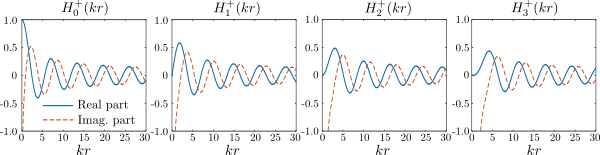
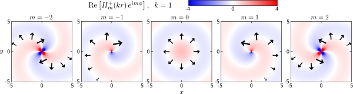

# Circular and Spherical Waves {#sec-appendix-a}

This Appendix describes the mathematics of circular waves and
spherical waves, and their uses in 2D and 3D scattering problems.

## The Helmholtz equation {#sec-helmholtz}

Consider a non-relativistic particle moving in $d$-dimensional space
with zero potential.  This is the case, for example, in a scattering
problem at positions far from the scatterer (Chapter 1).  The
time-independent Schrödinger equation is
$$-\frac{\hbar^2}{2m}\nabla^2 \psi(\mathbf{r}) = E \psi(\mathbf{r}),$${#eq-appA-tise}
where $\nabla^2$ denotes the $d$-dimensional Laplacian and $E > 0$ is
the particle's energy.

@eq-appA-tise can be re-written as a differential equation called
the **Helmholtz equation**:
$$\Big(\nabla^2 + k^2\Big) \psi(\mathbf{r}) = 0,$${#eq-appA-helmholtz}
where
$$k = \sqrt{\frac{2mE}{\hbar^2}} \;\in\; \mathbb{R}^+.$${#eq-appA-kparm}
A well-known class of solutions consists of plane waves of the form
$$\psi(\mathbf{r}) = \psi_0 \, \exp\left(i\mathbf{k}\cdot\mathbf{r}\right),$${#eq-appA-planewaves}
where $\psi_0 \in \mathbb{C}$ and $\mathbf{k}$ is a $d$-component
wave-vector with $|\mathbf{k}| = k$.

When studying the scattering problem in Chapter 1, we saw that
scattered wavefunctions should be "outgoing"---i.e., they should
propagate outward from the scatterer, to infinity.  However, a plane
wave like @eq-appA-planewaves is neither outgoing, nor incoming.  This
indicates that we should look for a different type of solution to
@eq-appA-helmholtz.  In
[@sec-circular-waves]--[@sec-spherical-waves], we will discuss the
nature of these solutions for the $d=2$ and $d=3$ cases, and in
[@sec-partial-waves]--[@sec-sphere] we will talk about how
they can used to solve scattering problems.

## Circular Waves in 2D {#sec-circular-waves}

In 2D, we can express $\mathbf{r}$ using polar coordinates $(r,
\phi)$, and write the wavefunction as
$$\psi(\mathbf{r}) = \psi(r,\phi).$$
This should obey periodic boundary conditions in the azimuthal
direction, $\psi(r,\phi + 2\pi) = \psi(r, \phi)$.  Hence, we can
express the $\phi$-dependence via the Fourier basis, and focus on
solutions of the form
$$\psi(r,\phi) = \Psi_m(r)\, e^{im\phi}, \;\;\;m \in\mathbb{Z}.$${#eq-appA-psi-circular}
These is called a **circular wave**, and the integer $m$
describes its angular momentum.  For example, for $m > 0$, the phase
of $\psi$ increases with $\phi$, so the wave rotates in the $+\phi$
direction.

By plugging @eq-appA-psi-circular into the Helmholtz equation
@eq-appA-helmholtz, and expressing the 2D Laplacian in polar
coordinates, we arrive at the following ordinary differential equation
for $\Psi_m(r)$:
$$r \frac{d}{dr}\!\left(r \frac{d\Psi_m}{dr} \right)
  + \Big(k^2 r^2 - m^2 \Big)\, \Psi_m(r) = 0.$${#eq-appA-besseleq}
This is the **Bessel equation**, which supports the following
solutions:
$$\Psi_m(r) \propto \begin{cases}
    J_m(kr) &\text{(Bessel function of the 1st kind)} \\
    Y_m(kr) &\text{(Bessel function of the 2nd kind)} \\
    H_m^+(kr) \equiv J_m(kr) + i Y_m(kr) &\text{(Hankel function of the 1st kind)} \\
    H_m^-(kr) \equiv J_m(kr) - i Y_m(kr) &\text{(Hankel function of the 2nd kind)}.
  \end{cases}$$
(These functions are implemented in [Scientific Python](https://scipy.org/).)

The Bessel functions $J_m$ and $Y_m$ are real-valued, whereas the
Hankel functions $H_m^+$ and $H_m^-$ are complex-valued.  These two
sets of functions are related by
$$\left\{
  \begin{aligned}
    H_m^+ &= J_m + i Y_m \\
    H_m^- &= J_m - i Y_m
  \end{aligned}\right.
  \;\;\;\Leftrightarrow\;\;\;
  \left\{
  \begin{aligned}
    J_m &=  \frac{1}{2}\left( H_m^+ + H_m^- \right)\\
    Y_m &=  \frac{1}{2i}\left( H_m^+ - H_m^- \right),
  \end{aligned}\right.$${#eq-appA-JYHrelation}
which is very similar to the relationship between the exponential and
trigonometric functions:
$$\left\{
  \begin{aligned}
  e^{iz} &= \cos z + i \sin z \\
  e^{-iz} &= \cos z - i \sin z.
  \end{aligned}\right.
  \;\;\;\Leftrightarrow\;\;\;
  \begin{aligned}
    \cos z  &= \frac{1}{2} \left(e^{iz} + e^{-iz}\right) \\
    \sin z &= \frac{1}{2i} \left(e^{iz} - e^{-iz}\right).
  \end{aligned}$${#eq-appA-sincos}
Importantly, the various Bessel and Hankel functions satisfy different
boundary conditions:

- For $kr \rightarrow 0$, $J_m(kr)$ is finite, whereas $Y_m$,
  $H_m^+$, and $H_m^-$ diverge.

- For $kr \rightarrow \infty$, they have the following asymptotic forms:

$$\left.
  \begin{aligned}
    J_m(kr) &\rightarrow
    \sqrt{\frac{2}{\pi kr}} \cos\!\left(kr - \frac{m\pi}{2} - \frac{\pi}{4}\right) \\
    Y_m(kr) &\rightarrow
    \sqrt{\frac{2}{\pi kr}} \sin\!\left(kr - \frac{m\pi}{2} - \frac{\pi}{4}\right) \\
    H_m^\pm(kr) &\rightarrow
    \sqrt{\frac{2}{\pi kr}}
    \exp\left[\pm i\left(kr - \frac{m\pi}{2} - \frac{\pi}{4}\right)\right] \\
  \end{aligned}\;\;
  \right\}
  \; \text{for}\;\, -\pi < \mathrm{arg}[kr] < \pi.$${#eq-appA-Jasymptote}
These further cement the analogy with @eq-appA-sincos.  Moreover,
from the last line in @eq-appA-Jasymptote, we see that $H_m^+$
describes *outward* propagation (i.e., in the direction of
increasing radial distance $r$), whereas $H_m^-$ describes
*inward* propagation.  This indicates that using $H_m^+$ in
@eq-appA-psi-circular yields an outgoing circular wave---precisely
what we need for describing scattered wavefunctions.

Let us examine the $H_m^+$ functions in more detail.  (You are welcome
to check the properties of the $H_m^-$ counterparts.)  Below, we plot
the real and imaginary parts for $m = 0, 1, 2, 3$:

{fig-align="center" width="600" fig-alt="Plots of the real and imaginary parts of the Hankel functions H_m^+ for m = 0, 1, 2, 3, versus kr"}

For large $kr$, the functions behave as decaying complex sinuoidals,
in accordance with @eq-appA-Jasymptote.  In the asymptotic form
@eq-appA-Jasymptote, the decay factor of $1/\sqrt{r}$ satisfies the
conservation of flux in the $r$ direction in 2D (see Chapter 1,
Sec.~1.4); moreover, the Hankel functions for different $m$'s are all
normalized to carry the same flux.

For small $kr$, the value of $H_m^+(kr)$ diverges (specifically, its
imaginary part, which is $Y_m$).  This is also consistent with flux
conservation: as the circumference vanishes with $r$, the flux density
must diverge as $1/r$ to keep the total flux constant.

The figure below shows 2D plots for a few outgoing circular waves.
The real part of the wavefunction is plotted, using red and blue
colors to represent positive and negative values, while black arrows
indicate the direction of propagation of the wave at a few selected
points:

{fig-align="center" width="600" fig-alt="2D density plots of the real parts of outgoing circular waves for m = -2, -1, 0, 1, 2, showing clockwise, isotropic, and counterclockwise propagation"}

We see that the wave travels outward in a clockwise spiral ($m < 0$),
isotropically ($m = 0$), or in a counterclockwise spiral ($m > 0$).

Like plane waves, circular waves can be used as a basis for expressing
arbitrary waveforms.  However, when writing a waveform as a
superposition of circular waves, we must choose the right set of
circular waves by considering the boundary conditions.  For example,
for a purely outgoing wave like a scattered wavefunction, the
decomposition naturally has the form
$$\psi_s(\mathbf{r}) = \sum_{m=-\infty}^\infty c_m^+ H_m^+(kr) \, e^{im\phi},
   \quad c_m^+ \in \mathbb{C},$$
involving only the $H_m^+$ functions.

Even a plane wave can be expressed as a superposition of circular
waves.  For a plane wave of wave-vector $\mathbf{k}_z = k \hat{z}$,
one can show (using mathematical manipulations whose details we will
skip) that
$$e^{i\mathbf{k}_z \cdot \mathbf{r}} =
  e^{ikr\cos\phi} = \sum_{m=-\infty}^\infty i^m \, J_m(kr)\, e^{im\phi}.$${#eq-appA-eikrcosphi}
The sum involves $J_m$-type circular waves, consistent with our
earlier assertion that plane waves are neither purely outgoing nor
incoming.

## Spherical Waves in 3D {#sec-spherical-waves}

In 3D, we can express $\mathbf{r}$ using spherical coordinates $(r,
\theta, \phi)$.  Proceeding by analogy with the 2D case of
@sec-circular-waves, we look for solutions to the 3D Helmholtz
equation of the form
$$\psi(r,\theta,\phi) = \Psi(r) \, f(\theta, \phi),$${#eq-appA-psi3d0}
which exhibit a separation of variables between $r$ and
$(\theta,\phi)$.  Observing that $\theta$ and $\phi$ are angular
variables, we can specialize further to solutions of definite angular
momentum,
$$\psi(r,\theta,\phi) = \Psi_{\ell m}(r) \,Y_{\ell m}(\theta, \phi).$${#eq-appA-psi3d}
The [spherical harmonic function](https://docs.scipy.org/doc/scipy/reference/generated/scipy.special.sph_harm.html) $Y_{\ell m}(\theta,\phi)$ acts as a
generalization of the $\exp(im\phi)$ factor in the 2D ansatz
@eq-appA-psi-circular.  It is indexed by two integers $\ell$ and $m$,
which are the quantum numbers corresponding to the total angular
momentum and the $z$-component of the angular momentum, respectively.
If we take
$$\ell \ge 0 \;\;\mathrm{and}\; -\ell\le m \le \ell,$${#eq-appA-ellm}
it can be shown that $Y_{\ell m}(\theta,\phi)$ is a well-behaved
function of the anglular coordinates $\theta$ and $\phi$; i.e.,
periodic in $\phi$ and regular at the coordinate poles $\theta = \{0,
\pi\}$.

By plugging @eq-appA-psi3d into the Helmholtz equation and
expressing the 3D Laplacian in spherical coordinates, we arrive at the
**spherical Bessel equation**
$$\frac{d}{dr}\left(r^2 \, \frac{d\Psi_{\ell m}}{dr}\right)
  + \Big[k^2r^2 - \ell(\ell+1)\Big] \Psi_{\ell m}(r) = 0.$${#eq-appA-sphbessel}
Remarkably, this turns out to involve only $\ell$, not $m$.  The
solution thus only depends on $\ell$, and we henceforth write it as
$\Psi_\ell(r)$.  Now, @eq-appA-sphbessel has the following
solutions:
$$\Psi_\ell(r) \propto \begin{cases}
    j_\ell(kr) &\text{(Spherical Bessel function of the 1st kind)} \\
    y_\ell(kr) &\text{(Spherical Bessel function of the 2nd kind)} \\
    h_\ell^+(kr) \equiv j_\ell(kr) + i y_\ell(kr) &\text{(Spherical Hankel function of the 1st kind)} \\
    h_\ell^-(kr) \equiv j_\ell(kr) - i y_\ell(kr) &\text{(Spherical Hankel function of the 2nd kind)}.
  \end{cases}$${#eq-appA-sphcases}
Their boundary conditions are closely analogous to the 2D circular
waves from @sec-circular-waves:

- For $kr \rightarrow 0$, $j_\ell(kr)$ is finite, while $y_\ell$,
  $h_\ell^+$, and $h_\ell^-$ are divergent.

- For $kr \rightarrow \infty$, they have the following asymptotic forms:

$$\left.
  \begin{aligned}
    j_\ell(kr)\; &\rightarrow \; \frac{\sin(kr-\frac{\ell\pi}{2})}{kr} \\
    y_\ell(kr)\; &\rightarrow \; - \frac{\cos(kr-\frac{\ell\pi}{2})}{kr} \\
    h_\ell^\pm(kr)\; &\rightarrow \; \pm \frac{\exp\left[\pm i(kr-\frac{\ell\pi}{2})\right]}{ikr}
  \end{aligned}\;\;
  \right\}
  \; \text{for}\;\, -\pi < \mathrm{arg}[kr] < \pi.$${#eq-appA-sphJasymptote}
Hence, the spherical Hankel functions of the first and second kind
describe outgoing and incoming waves, respectively.  The $1/r$
prefactors are consistent with flux conservation in 3D: spherical
wavefronts are spread over an area $4\pi r^2$, so $|\Psi_{\ell
  m}(r)|^2 \cdot 4\pi r^2$ is $r$-independent.  The spherical Hankel
functions for different $\ell, m$ are normalized to carry the same
flux.

Similar to the 2D case, we can express a plane wave as a superposition
of spherical waves.  This is accomplished via the identity
$$e^{i\mathbf{k}_i \cdot \mathbf{r}}
  = \sum_{\ell=0}^\infty \sum_{m=-\ell}^\ell 4 \pi j_{\ell}(kr) e^{i\ell\pi/2} \,
  Y_{\ell m}^*(\hat{\mathbf{k}}_i) \, Y_{\ell m}(\hat{\mathbf{r}}),$${#eq-appA-plane-wave-decomp}
where $\hat{\mathbf{k}}_i$ denotes the angular components (in
spherical coordinates) of the incident wave-vector $\mathbf{k}_i$, and
$\hat{\mathbf{r}}$ denotes the angular components of the position
vector $\mathbf{r}$.

## Partial wave analysis {#sec-partial-waves}

Circular waves (@sec-circular-waves) and spherical waves
(@sec-spherical-waves) play an important role in the analysis
of scattering problems.

Let $\psi(\mathbf{r})$ be the wavefunction in the exterior region of a
scattering experiment, where the scattering potential vanishes.  It
obeys the Helmholtz equation, so we can expand it as a superposition
of incoming and outgoing circular waves (for 2D) or spherical waves
(for 3D):
$$\psi(\mathbf{r}) =
  \left\{
  \begin{aligned}
    &\sum_{m=-\infty}^\infty
    \Big[c_m^+ H_m^+(kr) + c_m^- H_m^-(kr)\Big] \, e^{im\phi}
    & (\textrm{2D})
    \\
    &\sum_{\ell = 0}^\infty \sum_{m = - \ell}^\ell
    \Big[c_{\ell m}^+ h_\ell^+(kr) + c_{\ell m}^- h_\ell^-(kr)\Big] \,
    Y_{\ell m}(\theta, \phi). & (\textrm{3D})
  \end{aligned}\right.$${#eq-appA-psirdecomp}
Since the individual circular or spherical waves satisfy the Helmholtz
equation, which is linear, any such linear superposition automatically
satisfies the Helmholtz equation.  For simplicity, let us denote the
coefficients by $\{c_\mu^\pm\}$, where $\mu \equiv m$ for 2D and $\mu
\equiv (\ell, m)$ for 3D.  Each $\mu$ is called a **scattering
  channel**.  The approach of dividing a scattering problem into
different scattering channels is called **partial wave
  analysis**.

The circular and spherical waves are appropriately normalized such
that the energy flux in each scattering channel $\mu$ is directly
proportional to $|c_\mu^\pm|^2$.  This follows from the normalization
choice in the definitions of the Hankel and spherical Hankel
functions, as noted in @sec-circular-waves and
@sec-spherical-waves).

In a scattering problem, the incoming coefficients $c_\mu^-$ and the
outgoing coefficients $c_\mu^+$ are not independent.  If we vary any
individual $c_\mu^-$, there should be a corresponding linear variation
in every $c_\mu^+$ (the variation is linear since the Schrödinger
wave equation is linear).  Hence, there exists a set of linear
relations
$$c_{\mu}^+ = \sum_{\nu} S_{\mu \nu} \, c_{\nu}^-, \;\;\;\text{for all}\;\;\mu.$${#eq-appA-srelation}
Here, the outgoing wave coefficients are on the left, and the incoming
coefficients on the right.  The complex matrix $S$, called the
**scattering matrix**, is determined by the scattering potential
$V(\mathbf{r})$ and energy $E$.  It specifies how the scatterer
converts incoming waves into outgoing waves.  Due to flux
conservation, the scattering matrix must be unitary:
$$\left(S^{-1}\right)_{mm'} = S_{m'm}^*.$${#eq-appA-Sunitary}

Do not confuse the "incoming" and "outgoing" waves of
@eq-appA-psirdecomp with the "incident" and "scattered" waves
defined in the scattering problem.  As discussed in Chapter 1, a
scattering experiment typically has an incident wave that is a plane
wave, of the form
$$\psi_i(\mathbf{r}) = \Psi_i \, e^{i\mathbf{k}_i\cdot\mathbf{r}} \;\;\;
  \mathrm{where}\;\; |\mathbf{k}_i| = k.$$
However, relative to a given coordinate origin ($r = 0$), a plane wave
is neither purely incoming nor outgoing!  For 2D, we can use
@eq-appA-eikrcosphi to decompose the plane wave as
$$\psi_i(\mathbf{r})
  = \frac{\Psi_i}{2} \sum_{m=-\infty}^\infty i^m e^{im \Delta\phi} \,
  \left[H_m^+(kr) + H_m^-(kr)\right],$${#eq-appA-psii-2d}
where $r = |\mathbf{r}|$ and $\Delta \phi =
\cos^{-1}\left[(\mathbf{k}_i\!\cdot\!\mathbf{r})/kr\right]$.
Likewise, for 3D we can use @eq-appA-plane-wave-decomp to write
$$\psi_i(\mathbf{r})
  = 2\pi \Psi_i \sum_{\ell=0}^\infty \sum_{m=-\ell}^\ell
  \left[h_{\ell}^+(kr) + h_{\ell}^-(kr) \right] \, e^{i\ell\pi/2} \,
  Y_{\ell m}^*(\hat{\mathbf{k}}_i) \, Y_{\ell m}(\hat{\mathbf{r}}),$${#eq-appA-psii-3d}
where $\hat{\mathbf{k}}_i$ and $\hat{\mathbf{r}}$ denote the angular
components of $\mathbf{k}_i$ and $\mathbf{r}$ respectively.  In both
cases, the incident plane wave is evidently a superposition of
incoming *and* outgoing waves.

Using @eq-appA-psii-2d and @eq-appA-psii-3d, we can relate the
scattering matrix to the formulation of the scattering problem
discussed in Chapter 1.  Let us go through the details for 3D, leaving
the 2D case as an [exercise](#sec-appendix-a-exercises).

Focusing on 3D, a comparison of @eq-appA-psirdecomp and
@eq-appA-psii-3d allows us to determine the spherical wave coefficients
for the incident wave:
$$c^{\pm}_{i, \ell m} = 2 \pi e^{i\ell\pi/2} \,
  Y_{\ell m}^*(\hat{\mathbf{k}}_i)\; \Psi_i.$${#eq-appA-cilm}
The total wavefunction consists of $\psi_i(\mathbf{r})$ plus the
scattered wavefunction $\psi_s(\mathbf{r})$.  By assumption, the
latter is a superposition of only outgoing waves, so denote its
coefficients by $c^+_{s,\ell m}$.  Next, re-express the scattering
matrix equation @eq-appA-srelation using these coefficients:
$$c^+_{i,\ell m} + c^+_{s,\ell m}
  = \sum_{\ell, m, \ell', m'} S_{\ell m, \ell'm'} c^-_{i,\ell'm'}.$$
Note that the scattered wave does not contribute to the right side
because it has no incoming components.  Moving $c_{i,\ell m}^+$ to the
right side of the equation, and using @eq-appA-cilm, gives
$$c^+_{s,\ell m} = 2 \pi \sum_{\ell' m'} \Big(S_{\ell m, \ell' m'}
  - \delta_{\ell \ell'}\delta_{mm'}\Big) e^{i\ell'\pi/2} \,
  Y_{\ell' m'}^*(\hat{\mathbf{k}}_i)\; \Psi_i.$$
Hence, the scattered wavefunction is
$$\begin{aligned}\psi_s(\mathbf{r}) &= \sum_{\ell m} c^+_{s,\ell m} h_{\ell}^+(kr) \, Y_{\ell m}(\hat{\mathbf{r}}) \\ &= \Psi_i \sum_{\ell m} \sum_{\ell' m'} 2 \pi \Big(S_{\ell m, \ell' m'} - \delta_{\ell \ell'}\delta_{mm'}\Big) e^{i\ell'\pi/2} \, Y_{\ell' m'}^*(\hat{\mathbf{k}}_i)\; h_{\ell}^+(kr) \, Y_{\ell m}(\hat{\mathbf{r}}).\end{aligned}$$
For large $r$, we can simplify the spherical Hankel functions using
@eq-appA-sphJasymptote, obtaining
$$\psi_s(\mathbf{r}) \overset{r\rightarrow\infty}{\longrightarrow} \, \Psi_i \frac{e^{ikr}}{r} \; \left[ \frac{2 \pi}{ik}\, \sum_{\ell m} \sum_{\ell' m'} \Big(S_{\ell m, \ell' m'} - \delta_{\ell \ell'}\delta_{mm'}\Big) \, e^{-i(\ell-\ell')\pi/2} \, Y_{\ell' m'}^*(\hat{\mathbf{k}}_i)\; Y_{\ell m}(\hat{\mathbf{r}})\right].$$
The quantity in square brackets is the scattering amplitude (Section
1.5):
$$f(\mathbf{k}_i \rightarrow k\hat{\mathbf{r}}) =  \frac{2 \pi}{ik}\, \sum_{\ell m} \sum_{\ell' m'} \Big(S_{\ell m, \ell' m'} - \delta_{\ell \ell'}\delta_{mm'}\Big) \, e^{-i(\ell-\ell')\pi/2} \, Y_{\ell' m'}^*(\hat{\mathbf{k}}_i)\; Y_{\ell m}(\hat{\mathbf{r}}).$${#eq-appA-3dfrelation}

## Scattering from a uniform sphere {#sec-sphere}

As a concluding example, we will use the results from the preceding
sections to derive the scattering amplitudes for a spatially uniform
3D sphere.  The scattering potential is
$$V(\mathbf{r}) = \begin{cases}-U &\mathrm{for}\;\; |\mathbf{r}| < R, \\
    \;\;\; 0 & \mathrm{for}\;\; |\mathbf{r}| > R,\end{cases}$${#eq-appA-vsphere}
where $R$ is the radius of the well and $U$ is its depth.  For
simplicity, we assume an attractive potential, $U > 0$.  (The
interested reader can work through the repulsive case, $U < 0$, which
is almost the same, except that the wavefunction inside the scatterer
is an evanescent wave.)

This scattering potential is isotropic, so angular momentum is
conserved.  There must therefore exist solutions where both the
incident and scattered wavefunctions have definite angular momentum
$\ell, m$.  The total wavefunction takes the form
$$\psi(r,\theta,\phi) = A_{\ell m}(r) \, Y_{\ell m}(\theta, \phi)$${#eq-appA-sphere-ansatz0}
everywhere (i.e., inside and outside the scatterer).  The existence of
such solutions implies that the scattering matrix is diagonal; in
other words, the scattering channels can be considered independently
of each other.  Moreover, the diagonal entries turn out to depend on
only the principal angular momentum quantum number $\ell$ (see below),
so
$$S_{\ell m, \ell' m'} \,=\, s_{\ell} \; \delta_{\ell \ell'} \, \delta_{mm'}.$${#eq-appA-Sdiagonal}
We also know from @eq-appA-Sunitary that the scattering matrix is
unitary.  For a matrix that is both diagonal and unitary, each
diagonal matrix element must have magnitude 1.  Hence,
$$s_{\ell} = e^{i\Delta_{\ell}},$${#eq-appA-sell}
for some real phase $\Delta_{\ell}$.  This has a simple physical
intepretation: since each scattering channel is independent and
flux-conserving, the outgoing wave in that channel must have the same
magnitude as the incoming wave.  It can only vary by a phase shift.

Let us plug the ansatz @eq-appA-sphere-ansatz0 into the Schrödinger
equation.  This gives
$$\frac{d}{dr}\left(r^2\frac{dA_{\ell m}}{dr}\right)
  + \Big[K^2(r)\, r^2 - \ell(\ell+1)\Big] A_{\ell m}(r) = 0,$${#eq-appA-sphericalschrod}
where $r = |\mathbf{r}|$ and
$$K(r) = \sqrt{\frac{2m\big[E-V(r)\big]}{\hbar^2}}.$$
Since the differential equation does not involve $m$, the solution
only depends on $\ell$.  We therefore replace $A_{\ell m}(r)$ with
$A_\ell(r)$ in @eq-appA-sphere-ansatz0:
$$\psi(r,\theta,\phi) = A_{\ell}(r) \, Y_{\ell m}(\theta, \phi).$$

In the exterior region $r > R$, @eq-appA-sphericalschrod reduces to
the spherical Bessel equation @eq-appA-sphbessel, with $K(r)
\rightarrow k$, and we can write
$$A_{\ell}(r) = c^-_\ell h^-_\ell(kr) + c^+_\ell h^+_\ell(kr),$${#eq-appA-aell}
for some coefficients $c^+_\ell$ and $c^-_\ell$ obeying the scattering
relation @eq-appA-srelation.  The fact that $A_{\ell}$ does not depend
on $m$ justifies our prior assertion, in @eq-appA-Sdiagonal, that
the scattering matrix entries do not depend on $m$.  Using
@eq-appA-Sdiagonal and @eq-appA-sell, we can simplify this to
$$A_\ell(r) = c^-_\ell \Big(h^-_\ell(kr) + e^{i\Delta_\ell}\, h^+_\ell(kr)\Big),
   \quad \textrm{for}\,\;r > R.$${#eq-appA-Aoutside}

Next, consider the region inside the scatterer, $r < R$.  Here, the
Schrödinger wave equation reduces to the Helmholtz equation, with
$k$ replaced by
$$q = \sqrt{\frac{2m(E+U)}{\hbar^2}}.$$
Given that $U > 0$, we have $q \in \mathbb{R}^+$ for all $E > 0$.  As
discussed in @sec-spherical-waves, the solutions are spherical
Bessel functions (of the first and second kind) or spherical Hankel
functions (of the first and second kind).  But the interior region
includes the point $r = 0$, and the wavefunction must be finite, so we
cannot use the $y_\ell$ or $h_\ell^\pm$ functions, which diverge at $r
= 0$.  This leaves only the spherical Bessel function of the first
kind:
$$A_{\ell}(r) = \alpha_\ell \, j_\ell(qr)
   \quad \textrm{for}\,\;r < R.$${#eq-appA-Ainside}

To proceed, we compare the exterior solution @eq-appA-Aoutside and the
interior solution @eq-appA-Ainside at $r = R$.  Matching both the
wavefunction and its first derivative, we obtain two equations:
$$\begin{aligned} \alpha_\ell\, j_\ell(qR)
    &=\;\; c^-_\ell \Big(h^-_\ell(kR) \,
    + e^{i\Delta_\ell} h^+_\ell(kR)\Big) \\
    \alpha_\ell\, q j_\ell'(qR)
    &= c^-_\ell k \Big({h^-_\ell}'(kR) + e^{i\Delta_\ell} {h^+_\ell}'(kR)\Big).\end{aligned}$$
Here, $j_\ell'$ denotes the derivative of the spherical Bessel
function, and likewise for ${h_\ell^\pm}'$.  Taking the ratio of these
two equations eliminates $\alpha_\ell$ and $c_\ell^-$.  Then a bit of
rearrangement yields
$$e^{i\Delta_\ell} = - \frac{k{h_\ell^-}'(kR) j_\ell(qR) - qh_\ell^-(kR)j_\ell'(qR)}{k{h_\ell^+}'(kR) j_\ell(qR) - qh_\ell^+(kR)j_\ell'(qR)}.$$
On the right-hand side, the numerator and denominator are complex
conjugates of one another, since $j_\ell$ is real and $(h_\ell^+)^* =
h_\ell^-$; hence, the expression has magnitude 1, matching the
left-hand side.  We thus obtain
$$\Delta_\ell
  = \frac{\pi}{2} - \mathrm{arg}\!\left[k{h_\ell^+}'(kR) j_\ell(qR) - qh_\ell^+(kR)j_\ell'(qR)\right].$${#eq-appA-slresult}

This result can then be plugged into the scattering amplitude formula
@eq-appA-3dfrelation:
$$f(\mathbf{k}_i\rightarrow k\hat{\mathbf{r}}) = \frac{2 \pi}{ik}\, \sum_{\ell =0}^\infty \big(e^{2i\Delta_\ell} - 1\big) \, \sum_{m=-\ell}^\ell \,Y_{\ell m}^*(\hat{\mathbf{k}}_i)\; Y_{\ell m}(\hat{\mathbf{r}}).$$
This can be further simplified with the aid of the following addition
theorem for spherical harmonics:
$$P_\ell(\hat{\mathbf{r}}_1\cdot\hat{\mathbf{r}}_2) = \frac{4\pi}{2\ell+1} \sum_{m=-\ell}^{\ell} Y_{\ell m}^*(\hat{\mathbf{r}}_1) Y_{\ell m}(\hat{\mathbf{r}}_2).$$
where $P_\ell(\cdots)$ denotes a [Legendre polynomial](https://en.wikipedia.org/wiki/Legendre_polynomials).  Finally, we obtain
$$\begin{aligned}f(\mathbf{k}_i \rightarrow k\hat{\mathbf{r}}) &= \frac{1}{2ik}\, \sum_{\ell =0}^\infty \big(e^{2i\Delta_\ell} - 1\big) \big(2\ell+1\big)\, P_{\ell}(\hat{\mathbf{k}}_i\cdot \hat{\mathbf{r}}) \\ \Delta_\ell &= \frac{\pi}{2} - \mathrm{arg}\!\left[k{h_\ell^+}'(kR) \, j_\ell(qR) - qh_\ell^+(kR)\, j_\ell'(qR)\right] \\ k &= |\mathbf{k}_i| = \sqrt{2mE/\hbar^2}, \;\; q = \sqrt{2m(E+U)/\hbar^2}.\end{aligned}$${#eq-appA-fresult}
Evidently, $f(\mathbf{k}_i \rightarrow k\hat{\mathbf{r}})$ depends on
two variables: $E$, the conserved particle energy, and $\Delta \theta
= \cos^{-1}(\hat{\mathbf{k}}_i\cdot \hat{\mathbf{r}})$, the deflection
angle between the incident and scattered directions.

The formulas in @eq-appA-fresult are used to generate the exact
scattering amplitude plots shown in Chapter 1, Section 1.8.

## Exercises {#sec-appendix-a-exercises}

1. In @sec-partial-waves, we
   derived an expression for the 3D scattering amplitudes in terms of
   the scattering matrix $S$, @eq-appA-3dfrelation.  Starting from
   @eq-appA-psii-2d, derive the corresponding relation for the 2D
   scattering amplitudes.
