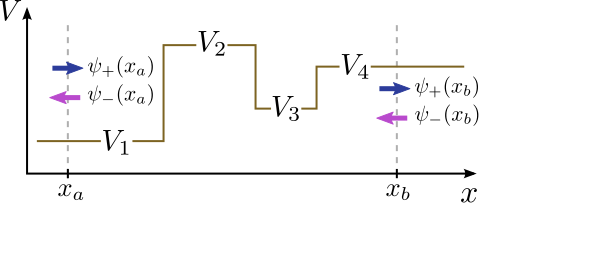
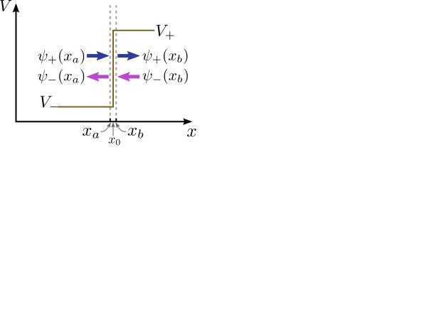
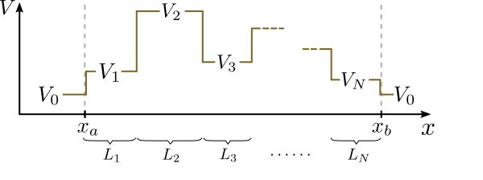
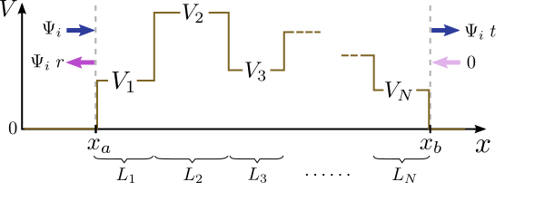

# The Transfer Matrix Method {#sec-appendix-b}

The **transfer matrix method** is a numerical method for solving
the 1D Schrödinger equation, and other similar equations.  In this
method, the wavefunction at each point is decomposed into two complex
numbers, called wave components.  The wave components at any two
points are related by a complex $2\times2$ matrix, called the
**transfer matrix**.

## Wave components in 1D

For a 1D space with spatial coordinates $x$, the Schrödinger wave
equation is
$$-\frac{\hbar^2}{2m}\frac{d^2\psi}{dx^2} + V(x) \psi(x) = E\psi(x),$$
where $m$ is the particle mass, $\psi(x)$ is the wavefunction, $V(x)$
is the potential function, and $E$ is the energy.  We treat $E$ as an
adjustable parameter (e.g., the energy of the incident particle in a
scattering experiment).

Within any region of space where $V$ is constant, the Schrödinger
equation reduces to a 1D Helmholtz equation, whose general solution is
$$\psi(x) = A\, e^{ik x} + B\, e^{-ik x}, \;\;\; \mathrm{where}\;\; k = \sqrt{\frac{2m[E-V(x)]}{\hbar^2}}.$$
If $E > V$, then the wave-number $k$ is real and positive, and
$\exp(\pm ikx)$ denotes a right-moving ($+$) or left-moving ($-$)
wave.  If $E < V$, then $k$ is purely imaginary, and we choose the
branch of the square root so that it is a positive multiple of $i$, so
that $\exp(\pm ikx)$ denotes a wave that *decreases*
exponentially toward the right ($+$) or toward the left ($-$).

We can re-write the two terms on the right-hand side as
$$\psi(x) = \psi_+(x) + \psi_-(x).$$
At each position $x$, the complex quantities $\psi_\pm(x)$ are called
the **wave components** .

The problem statement for the transfer matrix method is as follows.
Suppose we have a **piecewise-constant potential function**
$V(x)$, which takes on values $\{V_1, V_2, V_3, \dots\}$ in different
regions of space, as shown in the figure below:

{fig-align="center" width="600" fig-alt="Diagram of a piecewise-constant 1D potential, with wave components psi_plus and psi_minus at two positions x_a and x_b"}

Given the wave components $\{\psi_+(x_a),\psi_-(x_a)\}$ at one
position $x_a$, we seek to compute the wave components
$\{\psi_+(x_b),\psi_-(x_b)\}$ at another position $x_b$.  In general,
these are related by a linear relation
$$\Psi_b = \mathbf{M}(x_b,x_a) \, \Psi_a,$$
where
$$\Psi_b = \begin{bmatrix}\psi_+(x_b) \\ \psi_-(x_b)\end{bmatrix}, \; \Psi_a = \begin{bmatrix}\psi_+(x_a) \\ \psi_-(x_a)\end{bmatrix}.$$
The $2\times2$ matrix $\mathbf{M}(x_b,x_a)$ is called a
**transfer matrix**.  Take note of the notation in the
parentheses: we put the "start point" $x_a$ in the right-hand input,
and the "end point" $x_b$ in the left-hand input.  We want to find
$\mathbf{M}(x_b,x_a)$ from the potential and the energy $E$.

## Constructing the transfer matrix

Consider the simplest possible case, where the potential has a single
constant value $V$ everywhere between two positions $x_a$ and $x_b$,
with $x_b > x_a$.  Then, as we have just discussed, the solution
throughout this region takes the form
$$\psi(x) = A e^{ik x} + B e^{-ik x}, \;\;\; \mathrm{where}\;\; k = \sqrt{\frac{2m(E-V)}{\hbar^2}},$$
for some $A, B\in\mathbb{C}$.  The wave components at the two
positions are
$$\Psi_a = \begin{bmatrix} A e^{ik x_a} \\ B e^{ikx_a} \end{bmatrix}, \;\; \Psi_b = \begin{bmatrix} A e^{ik x_b} \\ B e^{ikx_b} \end{bmatrix}.$$
Each component of $\Psi_b$ is $\exp[ik(x_b-x_a)]$ times the
corresponding component of $\Psi_a$.  We can therefore eliminate $A$
and $B$, and write
$$\Psi_b = \mathbf{M}_0(k, x_b-x_a) \Psi_a, \;\;\;\mathrm{where}\;\;\; \mathbf{M}_0(k,L) \equiv \begin{bmatrix}e^{ikL} & 0 \\ 0 & e^{-ikL}\end{bmatrix}.$$
The $2\times2$ matrix $\mathbf{M}_0(k,L)$ is the transfer matrix
across a segment of constant potential.  Its first input is the
wave-number within the segment (determined by the energy $E$ and
potential $V$), and its second input is the segment length.

Next, consider a potential step at some position $x_0$, as shown in
the figure below:

{fig-align="center" width="500" fig-alt="Diagram of a potential step at position x_0, with potential V_minus to the left and V_plus to the right"}

Let $x_a$ and $x_b$ be two points that are infinitesimally close to
the potential step on either side (i.e., $x_a = x_0 - 0^+$ and $x_b =
x_0 + 0^+$, where $0^+$ denotes a positive infinitesimal).  To the
left of the step, the potential is $V_-$; to the right, the potential
is $V_+$.  The corresponding wave-numbers are
$$k_\pm = \sqrt{\frac{2m(E-V_\pm)}{\hbar^2}}.$$

There are two important relations between the wavefunctions on the two
sides of the step.  Firstly, any quantum mechanical wavefunction must
be continuous everywhere (otherwise, the Schrödinger equation would
not be well-defined); this includes the point $x_0$, so
$$\psi_+(x_a) + \psi_-(x_a) = \psi_+(x_b) + \psi_-(x_b).$$

Secondly, since the potential is non-singular at $x_0$ the derivative
of the wavefunction should be continuous at that point (this can be
shown formally by integrating the Schrödinger across an
infinitesimal interval around $x_0$).  Hence,
$$ik_-\, \left[\psi_+(x_a) - \psi_-(x_a)\right] = ik_+\, \left[\psi_+(x_b) - \psi_-(x_b)\right].$$
These two equations can be combined into a single matrix equation:
$$\begin{bmatrix}1 & 1 \\ k_- & - k_-\end{bmatrix}\begin{bmatrix}\psi_+(x_a) \\ \psi_-(x_a) \end{bmatrix} = \begin{bmatrix}1 & 1 \\ k_+ & - k_+\end{bmatrix} \begin{bmatrix}\psi_+(x_b) \\ \psi_-(x_b) \end{bmatrix}.$$
After doing a matrix inversion, this becomes
$$\Psi_b = \mathbf{M}_s(k_+,k_-) \, \Psi_a, \;\;\;\mathrm{where}\;\; \mathbf{M}_s(k_+,k_-) = \frac{1}{2} \begin{bmatrix}1+\frac{k_-}{k_+} & 1-\frac{k_-}{k_+} \\ 1-\frac{k_-}{k_+} & 1+\frac{k_-}{k_+}\end{bmatrix}.$$
The $2\times2$ matrix $\mathbf{M}_s(k_+,k_-)$ is the transfer matrix
to go rightward from a region of wave-number $k_-$, to a region of
wave-number $k_+$.  Note that when $k_- = k_+$, this reduces to the
identity matrix, as expected.

Using the above results, we can find the transfer matrix for any
piecewise-constant potential.  Consider the potential function shown
below.  It consists of segments of length $L_1, L_2, \dots L_N$, with
potential $V_1, V_2, \dots, V_N$; outside, the potential is $V_0$:

{fig-align="center" width="600" fig-alt="Diagram of a piecewise-constant potential consisting of N segments of lengths L_1, ..., L_N and potentials V_1, ..., V_N, surrounded by a region of potential V_0"}

Let $x_a$ and $x_b$ lie right beyond the first and last segments
(where $V = V_0$), with $x_b > x_a$.  We can compute $\Psi_b$ by
starting with $\Psi_a$, and left-multiplying by a sequence of transfer
matrices, one after the other.  These transfer matrices consist of the
two types derived in the previous sections: $\mathbf{M}_0$ (to cross a
uniform segment) and $\mathbf{M}_s$ (to cross a potential step).  Each
matrix multiplication "transfers" us to another point to the right,
until we reach $x_b$.

The overall transfer matrix between the two points is
$$\mathbf{M}(x_b, x_a) = \mathbf{M}_s(k_0,k_N)\; \mathbf{M}_0(k_N,L_N) \; \mathbf{M}_s(k_N, k_{N-1}) \cdots \mathbf{M}_0(k_2,L_2) \; \mathbf{M}_s(k_2, k_1) \; \mathbf{M}_0(k_1,L_1) \; \mathbf{M}_s(k_1,k_0),$${#eq-appB-Mtotal}
$$\mathrm{where}\;\;\; \mathbf{M}_0(k,L) = \begin{bmatrix}e^{ikL} & 0 \\ 0 & e^{-ikL}\end{bmatrix}, \quad \mathbf{M}_s(k_+,k_-) = \frac{1}{2} \begin{bmatrix}1+\frac{k_-}{k_+} & 1-\frac{k_-}{k_+} \\ 1-\frac{k_-}{k_+} & 1+\frac{k_-}{k_+}\end{bmatrix}, \quad k_n = \sqrt{\frac{2m(E-V_n)}{\hbar^2}}.$$
The expression for $\mathbf{M}(x_b,x_a)$ should be read from right to
left.  Starting from $x_a$, we cross the potential step into segment
1, then pass through segment 1, cross the potential step from segment
1 to segment 2, pass through segment 2, and so forth.  (Note that as
we move left-to-right through the structure, the matrices are
assembled right-to-left; a common mistake when writing a program to
implement the transfer matrix method is to assemble the matrices in
the wrong order, i.e.~right-multiplying instead of left-multiplying.)

## Reflection and transmission coefficients

The transfer matrix method is typically used to study how a 1D
potential scatters an incident wave.  Consider a 1D scatterer that is
confined within a region $x_a \le x \le x_b$:
$$V(x) = 0 \;\;\;\mathrm{for}\;\;x < x_a \;\textrm{or}\; x > x_b.$$
The total wavefunction consists of an incident wave and a scattered
wave,
$$\psi(x) = \psi_i(x) + \psi_s(x).$$
The incident wave is assumed to be incident from the left:
$$\psi_i(x) = \Psi_i \, \exp[ik_0(x-x_a)], \;\;\;\textrm{where}\;\;\; k_0 = \sqrt{\frac{2mE}{\hbar^2}}.$$
We have inserted the extra phase factor of $\exp(-ik_0x_a)$ to ensure
that $\psi_i(x_a) = \Psi_i$, which will be convenient.  The wave is
scattered as it meets the structure, and part of it is reflected back
to the left, while another part is transmitted across to the right.
Due to the linearity of the Schrödinger wave equation, the total
wavefunction must be directly proportional to $\Psi_i$.  Let us
write the wave components at $x_z$ and $x_b$ as
$$\Psi(x_a) = \begin{bmatrix}\psi_+(x_a) \\ \psi_-(x_a) \end{bmatrix} = \Psi_i \begin{bmatrix}\,\,1\, \\ r \end{bmatrix}, \qquad \Psi(x_b) = \begin{bmatrix}\psi_+(x_b) \\ \psi_-(x_b) \end{bmatrix} = \Psi_i \begin{bmatrix}\,\,t\,\, \\ 0 \end{bmatrix}.$$
The complex numbers $r$ and $t$ are called the **reflection
  coefficient** and the **transmission coefficient**,
respectively.  Their values do *not* depend on $\Psi_i$, since
they specify the wave components for the reflected and transmitted
waves *relative* to $\Psi_i$.  Note also that there is no
$\psi_-$ wave component at $x_b$, as the scattered wavefunction
must be purely outgoing.

{fig-align="center" width="600" fig-alt="Diagram of a 1D scattering setup, showing an incident wave from the left, a reflected wave, and a transmitted wave to the right"}

From the reflection and transmisison coefficients, we can also define
the real quantities
$$R = |r|^2, \;\;\; T = |t|^2,$$
which are called the **reflectance** and **transmittance**
respectively.  These are directly proportional to the total current
flowing to the left and right.

According to the transfer matrix relation,
$$\begin{bmatrix}\,t\, \\ 0 \end{bmatrix} = \mathbf{M}(x_b,x_a) \begin{bmatrix}\,1\, \\ r \end{bmatrix}.$$
Hence, $r$ and $t$ can be expressed in terms of the components of the
transfer matrix:
$$r = \frac{M_{21}}{M_{22}}, \quad t = \frac{M_{11} M_{22} - M_{12}M_{21}}{M_{22}} = \frac{\det(\mathbf{M})}{M_{22}}.$$
