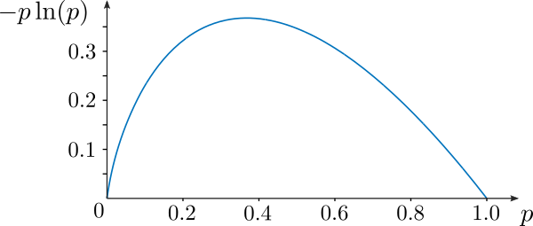

# Entropy {#sec-appendix-c}

"Entropy" is a concept used in multiple fields of science and
mathematics to quantify one's lack of knowledge about a complex
system.  In physics, its most commonly-encountered form is
**thermodynamic entropy**, which describes the uncertainty about the
microscopic configuration, or "microstate", of a large physical
system.  In the field of mathematics known as information theory,
**information entropy** (also called Shannon entropy after its
inventor, Claude Shannon) describes the uncertainty about the contents
of a transmitted message.  One of the most profound developments in
theoretical physics in the 20th century was the discovery by
E. T. Jaynes that statistical mechanics can be formulated in terms of
information theory; hence, the thermodynamics-based and
information-based concepts of entropy are one and the same [@jaynes;
@jaynes2].

This appendix summarizes the definition of entropy in classical
physics, and how it is related to other physical quantities.

## Definition {#sec-entropy-definition}

Suppose a system has $W$ discrete microstates labeled by integers
$\{1,2,3,\dots, W\}$.  These microstates are associated with
probabilities $\{p_1, p_2, p_3, \dots, p_W\}$, subject to the
conservation of total probability
$$\sum_{i=1}^W p_i = 1.$$
We will discuss how these microstate probabilities are chosen later
(see @sec-entropy-thermodynamics).  Given a set of these probabilities,
the entropy is defined as
$$S = - k_b \, \sum_{i=1}^W p_i \ln(p_i).$${#eq-appC-Sdef}
Here, $k_b$ is Boltzmann's constant, which gives the entropy units of
$[E/T]$ (energy per unit temperature); this is a remnant of entropy's
origins in 19th century thermodynamics, and is omitted by
mathematicians.

It is probably not immediately obvious why @eq-appC-Sdef is useful.
To understand it better, consider its behavior under two extreme
scenarios:

- Suppose the microstate is definitely known, i.e., $p_k = 1$ for
  some $k$.  Then $S = 0$.

- Suppose there are $W$ possible microstates, each with equal
  probabilities
  $$p_i = \frac{1}{W} \;\;\forall i \in \{1,2,\dots,W\}.$$
  This describes a scenario of complete uncertainty between the
  possible choices.  Then
  $$S \,=\, -k_b W \frac{1}{W} \ln(1/W) \;=\; k_b \ln W.$$

The entropy formula is designed so that any other probability
distribution---i.e., any situation of *partial*
uncertainty---yields an entropy $S$ between $0$ and $k_b \ln W$.

To see that zero is the lower bound for the entropy, note that for $0
\le p_i \le 1$, each term in the entropy formula @eq-appC-Sdef
satisfies $-k_b\, p_i\ln(p_i) \ge 0$, and the equality holds if and
only if $p_i = 0$ or $p_i = 1$.  This is illustrated in the figure
below:

{fig-align="center" width="500" fig-alt="Plot of the function -k_b p ln(p) versus p, which is non-negative for 0 <= p <= 1 and vanishes at p = 0 and p = 1"}

This implies that $S\ge 0$.  Moreover, $S = 0$ if and only if $p_i =
\delta_{ik}$ for some $k$ (i.e., there is no uncertainty about which
microstate the system is in).

Next, it can be shown that $S$ is bounded above by $k_b \ln W$, a
relation known as [Gibbs' inequality](https://en.wikipedia.org/wiki/Gibbs%27_inequality).  This follows from the fact that $\ln x \le x - 1$ for
all positive $x$, with the equality occurring if and only if $x = 1$.
Take $x = 1/(Wp_i)$ where $W$ is the number of microstates:
$$\begin{aligned}
    \ln \left[\frac{1}{Wp_i}\right] &\le \frac{1}{Wp_i} - 1
    \quad \textrm{for}\;\textrm{all}\; i = 1,\dots, W. \\
    \sum_{i=1}^W p_i \ln \left[\frac{1}{Wp_i}\right]
    &\le \sum_{i=1}^W \left(\frac{1}{W} - p_i\right) \\
    - \sum_{i=1}^W p_i \ln W - \sum_{i=1}^W p_i \ln p_i
    &\le 1 - 1 = 0 \\
    - k_b \sum_{i=1}^W p_i \ln p_i &\le k_b \ln W.
  \end{aligned}$$
Moreover, the equality holds if and only if $p_i = 1/W$ for all $i$.

## Extensivity

Another important feature of the entropy is that it is
**extensive**, meaning that it scales proportionally with the
size of the system.  Consider two independent systems $A$ and $B$,
which have microstate probabilities $\{p_i^A\}$ and $\{p_j^B\}$.  If
we treat the combination of $A$ and $B$ as a single system, each
microstate of the combined system is specified by one microstate of
$A$ and one of $B$, with probability $p_{ij} = p^A_ip^B_j$.  The
entropy of the combined system is
$$\begin{aligned}
    S &= - k_b \sum_{ij} p_i^Ap^B_j \ln\left(p^A_ip^B_j\right) \\
    &= - k_b \Big(\sum_{i} p^A_i \ln p^A_i\Big)\Big(\sum_j p^B_j\Big)
    - k_b \Big(\sum_{i} p^A_i \Big) \Big(\sum_j p^B_j \ln p^B_j\Big) \\
    &= S_A + S_B,
  \end{aligned}$$
where $S_A$ and $S_B$ are the individual entropies of the $A$ and $B$
subsystems.

## Entropy and Thermodynamics {#sec-entropy-thermodynamics}

The theory of statistical mechanics seeks to describe the macroscopic
behavior of a large physical system by assigning some set of
probabilities $\{p_1, p_2, \dots, p_W\}$ to its microstates.  How are
these probabilities chosen?  One elegant way is to use the following
postulate:

::: {.callout-note}
Choose $\{p_1, \dots, p_W\}$ so as to maximize $S$, subject to
constraints imposed by known facts about the macroscopic state of
the system.
:::

The idea is that we want a probability distribution that is as
"neutral" as possible, while being consistent with the available
macroscopic information about the system.

For instance, suppose the only information we have about the
macroscopic state of the system is that its energy is precisely $E$.
In this scenario, called a **micro-canonical ensemble**, we
maximize $S$ by assigning equal probability to every microstate of
energy $E$, and zero probability to all other microstates, for reasons
discussed in @sec-entropy-definition.  (In some other formulations
of statistical mechanics, this assignment of equal probabilities is
treated as a postulate, called the **ergodic hypothesis**.)

Or suppose that only the system's *mean* energy $\langle E
\rangle$ is known, and nothing else.  In this case, we can maximize
$S$ using the method of Lagrange multipliers.  The relevant
constraints are the given value of $\langle E \rangle$ and
conservation of probability:
$$\langle E \rangle = \sum_i E_i \,p_i, \quad
  \sum_i p_i = 1.$$
We thus introduce two Lagrange multipliers, $\lambda_1$ and
$\lambda_2$.  For every microstate $i$, we require
$$\begin{aligned}
  \frac{\partial S}{\partial p_i} + \lambda_1 \frac{\partial}{\partial
    p_i} \left(\sum_j E_j p_j\right)
  + \lambda_2 \frac{\partial}{\partial
    p_i} \left(\sum_j p_j\right) &= 0 \\ \Rightarrow \quad
  - k_b \left(\ln p_i + 1\right) + \lambda_1 E_i + \lambda_2 &= 0.
\end{aligned}$$
Upon taking $\lambda_1 = - 1/T$ as the *definition* of the
temperature $T$, we obtain the celebrated **Boltzmann
  distribution**:
$$p_i = \frac{e^{-E_i/k_bT}}{Z}, \;\;\;\mathrm{where}\;\;
  Z = \sum_i e^{-E_i/k_b T}.$$

---
