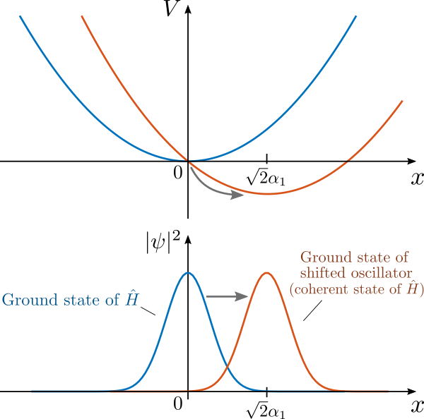

# Coherent States {#sec-appendix-e}

Coherent states are special states of bosonic systems (including the
quantum harmonic oscillator, whose excitation quanta can be regarded
as bosonic particles) whose dynamics are highly similar to classical
oscillator trajectories.  They provide an important link between
quantum and classical harmonic oscillators.

## Definition

The Hamiltonian of a simple harmonic oscillator (with $\hbar = m =
\omega_0 = 1$ for simplicity) is
$$\hat{H} = \frac{\hat{p}^2}{2} + \frac{\hat{x}^2}{2},$${#eq-appE-hsho}
where $\hat{x}$ and $\hat{p}$ are the position and momentum operators.
The ladder operators are
$$\begin{aligned}
  \hat{a} &= \frac{1}{\sqrt{2}} \left(\hat{x} + i\hat{p}\right) \\
  \hat{a}^\dagger &= \frac{1}{\sqrt{2}} \left(\hat{x} - i\hat{p}\right).
  \end{aligned}$${#eq-appE-ladder}
These obey the commutation relation
$$\left[\hat{a}, \hat{a}^\dagger\right] = 1.$${#eq-appE-commutator}
As a result, we can also regard these as the creation and annihilation
operators for a bosonic particle that has only one single-particle
state.

The Hamiltonian for the harmonic oscillator, @eq-appE-hsho, can be
written as
$$\hat{H} = \hat{a}^\dagger\hat{a} + 1/2.$$
The annihilation operator $\hat{a}$ kills off the ground state
$|\varnothing\rangle$:
$$\hat{a} |\varnothing\rangle = 0.$${#eq-appE-annihilation}
Thus, $|\varnothing\rangle$ is analogous to the "vacuum state" for a
bosonic particle.

Returning to the Hamiltonian @eq-appE-hsho, suppose we add a term
proportional to $\hat{x}$:
$$\hat{H}' = \frac{\hat{p}^2}{2} + \frac{\hat{x}^2}{2} - \sqrt{2}\alpha_1\hat{x}.$${#eq-appE-hshift}
The coefficient of $-\sqrt{2}\alpha_1$, where $\alpha_1 \in
\mathbb{R}$, is for later convenience.  By completing the square, we
see that this additional term corresponds to a shift in the center of
the potential, plus an energy shift:
$$\hat{H}' = \frac{\hat{p}^2}{2} + \frac{1}{2}\left(\hat{x} - \sqrt{2}\alpha_1\right)^2 - \alpha_1^2.$$
Let $|\alpha_1\rangle$ denote the ground state for the shifted
harmonic oscillator.

{fig-align="center" width="600" fig-alt="Plot of the harmonic oscillator potential energy function, along with the ground state wavefunction, before and after a shift in the center of the potential"}

By analogy with how we solved the original harmonic oscillator
problem, let us define a new annihilation operator with displaced $x$:
$$\hat{a}' = \frac{1}{\sqrt{2}}\left(\hat{x} - \sqrt{2}\alpha_1 + i \hat{p}\right).$$
This is related to the original annihilation operator by
$$\hat{a}' = \hat{a} - \alpha_1.$${#eq-appE-aprime}
We can easily show that $[\hat{a}',\hat{a}'^\dagger] = 1$, and that
$\hat{H}' = \hat{a}'^\dagger \hat{a}' + 1/2 - \alpha_1^2$.  Hence,
$$\hat{a}' \, |\alpha_1 \rangle = 0.$$
But @eq-appE-aprime implies that in terms of the *original*
annihilation operator,
$$\hat{a}\, |\alpha_1\rangle = \alpha_1 \,|\alpha_1\rangle.$${#eq-appE-aeigenv}
In other words, $|\alpha_1\rangle$ is an eigenstate of the original
harmonic oscillator's annihilation operator, with the displacement
parameter $\alpha_1$ as the corresponding eigenvalue!  For reasons
that will become clear later, we call $|\alpha_1\rangle$ a
**coherent state** of the original harmonic oscillator $\hat{H}$.

## Explicit expression for the coherent state

Let us derive an explicit expression for the coherent state in terms
of $\hat{a}$ and $\hat{a}^\dagger$, the creation and annihilation
operators of the original harmonic oscillator.  Consider the
translation operator
$$\hat{T}(\Delta x) = \exp(-i\hat{p}\Delta x).$$
Since $|\alpha_1\rangle$ is the ground state of a displaced harmonic
oscillator, it can be generated by performing a displacement of the
original oscillator's ground state $|\varnothing\rangle$.  The
displacement is $\Delta x = \sqrt{2}\alpha_1$:
$$\begin{aligned}
  |\alpha_1\rangle &= \hat{T}\big(\sqrt{2}\alpha_1\big)\; |\varnothing\rangle  \\
  &= \exp\left[\alpha_1\left(\hat{a}^\dagger - \hat{a}\right)\right] |\varnothing\rangle.
\end{aligned}$$
In deriving the second line, we have used
@eq-appE-ladder to express $\hat{p}$ in terms of
$\hat{a}$ and $\hat{a}^\dagger$.  We can further simplify the result
by using the Baker-Campbell-Hausdorff formula for operator
exponentials:
$$\mathrm{If} \;\; [[\hat{A},\hat{B}],\hat{A}] = [[\hat{A},\hat{B}],\hat{B}] = 0
  \;\;\Rightarrow \;\; e^{\hat{A}+\hat{B}}
  = e^{-[\hat{A},\hat{B}]/2}\, e^{\hat{A}} e^{\hat{B}}.$$
The result is
$$|\alpha_1\rangle = e^{-\alpha_1^2/2} \, e^{\alpha_1 \hat{a}^\dagger} |\varnothing\rangle.$$
If we write the exponential in its series form,
$$|\alpha_1\rangle = e^{-\alpha_1^2/2} \, \left(1 + \alpha_1 \hat{a}^\dagger
  + \frac{\alpha_1^2}{2} \left(\hat{a}^\dagger\right)^2 + \cdots\right)
 |\varnothing\rangle,$$
then we see that from the point of view of the bosonic excitations of
the original Hamiltonian $\hat{H}$, the state $|\alpha_1\,\rangle$ has
an *indeterminate number of bosons*.  It is a superposition of
the zero-boson (vacuum) state, a one-boson state, a two-boson state,
etc.

We can generalize the coherent state by performing a shift not just in
space, but also in momentum.  Instead of @eq-appE-hshift, let us
define
$$\begin{aligned}
  \hat{H}' &= \frac{1}{2}\left(\hat{p} - \sqrt{2}\alpha_2\right)^2
  + \frac{1}{2}\left(\hat{x} - \sqrt{2}\alpha_1\right)^2 \\
  &= \hat{H} - \left(\alpha \hat{a}^\dagger + \alpha^*\hat{a}\right)
  + \textrm{constant},
\end{aligned}$$
where
$$\alpha \equiv \alpha_1 + i \alpha_2 \;\in \;\mathbb{C}.$$
It can then be shown that the ground state of $\hat{H}'$, which we
denote by $|\alpha\rangle$, satisfies
$$\hat{a} \, |\alpha\rangle = \alpha \,|\alpha\rangle.$${#eq-appE-aaction}
(Note that $\hat{a}$ is not Hermitian, so its eigenvalue $\alpha$ need
not be real.)  In explicit terms,
$$|\alpha\rangle
  \,=\, \exp\left[\alpha\hat{a}^\dagger - \alpha^*\hat{a}\right] |\varnothing\rangle
  \,=\, e^{-|\alpha|^2/2} e^{\alpha\hat{a}^\dagger} |\varnothing\rangle.$${#eq-appE-alphaexp}

## Basic properties

There is one coherent state $|\alpha\rangle$ for each complex number
$\alpha \in \mathbb{C}$.  They have the following properties:

1. They are normalized:
   $$\langle\alpha|\alpha\rangle = 1.$${#eq-appE-normalization}
   This follows from the fact that they are ground states of displaced
   harmonic oscillators.

2. They form a complete set, meaning that the identity operator can
   be resolved as
   $$\hat{I} = C \int d^2\alpha |\alpha\rangle\langle\alpha|,$$
   where $C$ is some numerical constant and $\int d^2\alpha$ denotes an
   integral over the complex plane.  However, the coherent states do
   *not* form an orthonormal set, as they are over-complete:
   $\langle\alpha|\alpha'\rangle \ne 0$ for $\alpha \ne \alpha'$.

3. The expected number of particles in a coherent state is
   $$\langle\alpha| \hat{a}^\dagger\hat{a} | \alpha\rangle
    = |\alpha|^2.$$

4. The probability distribution of the number of particles follows
   a *Poisson distribution*:
   $$P(n) = |\langle n | \alpha\rangle|^2 = e^{-|\alpha|^2} \frac{|\alpha|^{2n}}{n!}.$$
   The mean and variance of this distribution are both $|\alpha|^2$.

5. The mean position and momentum are
   $$\begin{aligned}
    \langle \alpha | \hat{x}|\alpha\rangle &= \sqrt{2} \, \mathrm{Re}(\alpha) \\
    \langle \alpha | \hat{p}|\alpha\rangle &= \sqrt{2} \, \mathrm{Im}(\alpha).
    \end{aligned}$${#eq-appE-xp}

## Dynamical properties

Take the harmonic oscillator Hamiltonian with zero-point energy
omitted for convenience:
$$\hat{H} = \hat{a}^\dagger \hat{a}.$$
Suppose we initialize the system in a coherent state
$|\alpha_0\rangle$ for some $\alpha_0 \in \mathbb{C}$.  This is not an
energy eigenstate of $\hat{H}$, so how will it subsequently evolve?

It turns out that the dynamical state has the form
$$|\psi(t)\rangle = |\alpha(t)\rangle, \;\;\;\mathrm{where}\;\;\alpha(0) = \alpha_0.$$
In other words, the system is always in a coherent state, but the
complex parameter $\alpha(t)$ varies with time.  To find $\alpha(t)$,
plug the ansatz into the time-dependent Schrödinger equation:
$$\begin{aligned}
  i \frac{d}{dt} |\alpha(t)\rangle &= \hat{a}^\dagger \hat{a} |\alpha(t)\rangle\\
  i \,\Big\langle\alpha(t)\Big| \frac{d}{dt} \Big|\alpha(t)\Big\rangle &=
  |\alpha(t)|^2.
\end{aligned}$$
We can calculate the left-hand side using @eq-appE-aaction,
@eq-appE-alphaexp, and @eq-appE-normalization:
$$\begin{aligned}
  i \, \Big\langle\alpha(t)\Big| \frac{d}{dt} \Big|\alpha(t)\Big\rangle
  &= i\, \langle \alpha(t) | \; \frac{d}{dt}
  \left[ e^{-|\alpha|^2/2} e^{\alpha\hat{a}^\dagger} \right]
  |\varnothing\rangle \\
  &= i\, \langle \alpha(t) | \left(-\frac{1}{2} \frac{d}{dt}(\alpha\alpha^*)
  + \frac{d\alpha}{dt} \hat{a}^\dagger \right) |\alpha(t)\rangle \\
  &= i \left(-\frac{1}{2} \dot{\alpha}\alpha^*
  - \frac{1}{2}\alpha\dot{\alpha}^* + \dot{\alpha}\alpha^*\right).
\end{aligned}$$
Hence,
$$\frac{i}{2}\left(\dot{\alpha}\alpha^* - \alpha\dot{\alpha}^*\right) = |\alpha|^2.$${#eq-appE-eom}
This looks more complicated than it actually is.  Dividing both sides by
$\alpha \alpha^*$ gives
$$\frac{1}{2}\, \left(\frac{i\dot{\alpha}}{\alpha} + \left[\frac{i\dot{\alpha}}{\alpha}\right]^*\right) = \mathrm{Re}\left[\frac{i\dot{\alpha}}{\alpha}\right] = 1.$$
This reduces to
$$\dot{\alpha} = \big[-i + \gamma(t)\big] \alpha(t), \;\;\; \mathrm{\gamma}\in\mathbb{R},$$
which is the equation of motion for a complex harmonic oscillator with
an arbitrary damping or amplification factor $\gamma$.  For $\gamma =
0$, the oscillator is energy-conserving and the solutions are
$$\alpha(t) = \alpha_0 \; e^{-it}.$$
Referring back to @eq-appE-xp, this implies that the
mean position and momentum have the following time-dependence:
$$\begin{aligned}
  \langle x\rangle &=\, \;\;\sqrt{2} |\alpha_0| \cos\left[t - \mathrm{arg}(\alpha_0)\right] \\
  \langle p\rangle &= -\sqrt{2} |\alpha_0| \sin\left[t - \mathrm{arg}(\alpha_0)\right].
\end{aligned}$$
The dynamics of a coherent state therefore reproduces the motion of a
classical harmonic oscillator with $m = \omega_0 = 1$.
