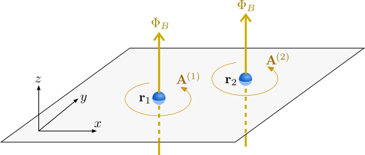
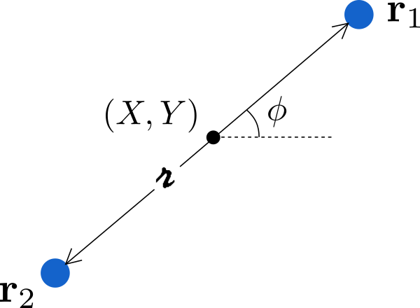

# Anyons {#sec-appendix-f}

One of the strangest consequences of magnetic vector potentials,
introduced in Chapter 5, is that they can influence the statistics of
identical particles.  In two spatial dimensions---and *only* in
2D---vector potentials can give rise to a class of identical particles
known as **anyons**, which act like neither the fermions nor
bosons discussed in Chapter 4.  Anyons have a form of particle
exchange symmetry intermediate between the fermionic and
bosonic cases.

## Bound Flux Tubes

The theory of anyons created by vector potentials was developed by
Wilczek (1982).  He considered a scenario
with set of identical particles moving in 2D (the $x$-$y$ plane), with
each particle carrying a "flux tube" pointing along $z$, as shown in
the figure below:

{fig-align="center" width="600" fig-alt="Two identical particles in 2D, each carrying a flux tube pointing out of the plane, and the vector potential it generates"}

Each flux tube is an infinitely thin concentration of magnetic flux
$\Phi_B$, which can be described by a singular vector potential (as
discussed in Chapter 5, Section I.C).  If $\mathbf{r}_n$ is the center
of the $n$-th particle, its vector potential is
$$\mathbf{A}^{(n)}(\mathbf{r}) = \frac{\Phi_B}{2\pi
    |\mathbf{r}-\mathbf{r}_n|} \; \mathbf{e}_\phi^{(n)}(\mathbf{r}),$${#eq-appF-Asolenoid}
where $\mathbf{e}_\phi^{(n)}(\mathbf{r})$ denotes the azimuthal unit
vector at position $\mathbf{r}$ relative to the origin $\mathbf{r}_n$.
The superscript $(n)$ denotes that this vector potential is centered
on the $n$-th flux tube.

Suppose the particles carrying these flux tubes also have electric
charge $-e$.  Each particle is acted upon by the vector potentials
from all the other particles, which appear in the Hamiltonian
according to the prescription
$$\hat{\mathbf{p}}_n \rightarrow \hat{\mathbf{p}}_n
  + e \sum_{m \ne n} \mathbf{A}^{(m)}(\hat{\mathbf{r}}_n),$$
where $\hat{\mathbf{p}}_n$ is the momentum operator for particle $n$.
The fact that each particle's flux tube does not act on itself is
similar to how electrostatic forces are handled (i.e., the electric
field generated by a particle does not act on the particle itself).
Assuming there are no other potentials and the particles are
non-relativistic, the Hamiltonian is
$$\hat{H} = \frac{1}{2m} \sum_m \Big| \,\hat{\mathbf{p}}_m
  + e \sum_{n \ne m} \mathbf{A}^{(n)}(\hat{\mathbf{r}}_m)\,\Big|^2.$$

We will focus on the case of two particles.  In the wavefunction
representation,
$$\hat{H} = \frac{1}{2m} \left( \left| \, -i\hbar \nabla_1
  + e\mathbf{A}^{(2)}(\mathbf{r}_1)\,\right|^2
  + \left| \, -i\hbar \nabla_2
  + e\mathbf{A}^{(1)}(\mathbf{r}_2)\,\right|^2\right),$${#eq-appF-HamA}
where $\nabla_n$ (for $n = 1,2$) is the gradient operator using
partial derivatives on $\mathbf{r}_n$.  The two-particle wavefunction
$\psi(\mathbf{r}_1, \mathbf{r}_2)$ obeys either fermionic or bosonic
exchange symmetry:
$$\psi(\mathbf{r}_1, \mathbf{r}_2) = \sigma \psi(\mathbf{r}_2, \mathbf{r}_1),$${#eq-appF-exchange}
where $\sigma = 1$ for bosons and $\sigma = -1$ for fermions.

## Gauge transformation

In Chapter 5, we discussed the gauge symmetry of a charged particle in
an electromagnetic field.  For simplicity, take a time-independent
vector potential $\mathbf{A}$ and zero scalar potential.  Given a
single-particle wavefunction $\psi(\mathbf{r})$ describing a particle
of charge $-e$, we know that the gauge transformed wavefunction
$$\psi'(\mathbf{r}) = \psi(\mathbf{r}) \,
  \exp\!\left(-\frac{ie\Lambda(\mathbf{r})}{\hbar}\right)$$
solves the Schrödinger equation with the gauge transformed vector
potential
$$\mathbf{A}'(\mathbf{r}) = \mathbf{A}(\mathbf{r}) + \nabla \Lambda(\mathbf{r}).$$

This symmetry can be generalized to the multi-particle case.  For
two-particle Hamiltonians of the form @eq-appF-HamA, one can show that
the gauge transformed two-particle wavefunction
$$\psi'(\mathbf{r}_1, \mathbf{r}_2) = \psi(\mathbf{r}_1, \mathbf{r}_2)
  \, \exp\!\left(-\frac{ie\Lambda(\mathbf{r}_1, \mathbf{r}_2)}{\hbar}\right)$$
solves the Schrödinger equaton for the Hamiltonian
$$\hat{H}' = \frac{1}{2m} \left( \left| \, -i\hbar \nabla_1
  + e\mathbf{A}^{(2)}(\mathbf{r}_1) + e \nabla_1 \Lambda\,\right|^2
  \;+\; \left| \, -i\hbar \nabla_2
  + e\mathbf{A}^{(1)}(\mathbf{r}_2) + e \nabla_2\Lambda\,\right|^2\right).$${#eq-appF-gaugedH}
The derivation is left to the reader, and almost exactly follows the
single-particle derivation from Chapter 5.  The main thing to note is
that $\Lambda$ is an arbitrary function of $\mathbf{r}_1$ and
$\mathbf{r}_2$; when calculating $\nabla_1\Lambda$, the partial
derivatives with respect to $\mathbf{r}_1$ are taken with
$\mathbf{r}_2$ fixed, and vice versa for $\nabla_2\Lambda$.

We are interested in the case where the $\mathbf{A}^{(1)}$ and
$\mathbf{A}^{(2)}$ fields in @eq-appF-gaugedH are the flux tube
potentials of @eq-appF-Asolenoid.  Remarkably, it turns out that
such potentials can be cancelled, or "gauged away", by a certain
choice of $\Lambda(\mathbf{r}_1, \mathbf{r}_2)$.  The resulting gauge
transformed Hamiltonian is
$$\hat{H}' = - \frac{\hbar^2}{2m} \left( \nabla_1^2 + \nabla_2^2\right),$${#eq-appF-gaugedH2}
describing a pair of free particles!

To find the $\Lambda(\mathbf{r}_1,\mathbf{r}_2)$ that achieves this,
let us take a closer look at how to express the two-particle
coordinates.  These can, of course, be written in the Cartesian form
$(x_1, y_1, x_2, y_2)$.  But we can also express them using a mix of
center-of-mass coordinates and relative polar coordinates, $(X, Y,
\mathscr{r}\,,\, \phi)$, as shown in this figure:

{fig-align="center" width="400" fig-alt="Diagram showing the center-of-mass coordinates (X, Y) and the relative polar coordinates (r, phi) of two particles"}

The two coordinate systems are related by
$$\begin{aligned}
    x_1 &= X + \frac{\mathscr{r}}{2} \,\cos\phi, \qquad
    & x_2 &= X - \frac{\mathscr{r}}{2} \,\cos\phi, \\
    y_1 &= Y + \frac{\mathscr{r}}{2} \,\sin\phi,
    & y_2 &= Y - \frac{\mathscr{r}}{2} \,\sin\phi.
  \end{aligned}$${#eq-appF-reparm}
From @eq-appF-reparm, we see that the transformation $\phi
\rightarrow \phi \pm \pi$, with $(X, Y, \mathscr{r}\,)$ constant,
is equivalent to exchanging $(x_1,y_1)$ and $(x_2,y_2)$.  In other
words, the particles can be exchanged by a rotation of $\pm \pi$
around their fixed center of mass.  The exchange symmetry condition
@eq-appF-exchange can therefore be written as
$$\psi(X, Y, \mathscr{r}\,,\, \phi \pm \pi) \,=\, \sigma \, \psi(X,
  Y, \mathscr{r}\,, \phi),$${#eq-appF-exchange2}
where $\sigma = 1$ for bosons and $\sigma = -1$ for fermions.  Note,
by the way, that this use of polar coordinates is specific to 2D
space.

Now consider the gauge field
$$\Lambda(X, Y, \mathscr{r}\,,\, \phi) = -\frac{\Phi_B \,\phi}{2\pi}.$${#eq-appF-Lambda}
We claim that
$$\begin{aligned}
  \nabla_1 \Lambda &= - \mathbf{A}^{(2)}(\mathbf{r}_1) \\
  \nabla_2 \Lambda &= - \mathbf{A}^{(1)}(\mathbf{r}_2), \end{aligned}$${#eq-appF-nablas}
which gauges away the vector potentials in @eq-appF-gaugedH.

To see why, first consider $\nabla_1\Lambda$.  We need to be careful
since $\nabla_1$ is performed with respect to $\mathbf{r}_1$ for fixed
$\mathbf{r}_2$, whereas $\Lambda$ is expressed in @eq-appF-Lambda
using the $(X, Y, \mathscr{r}\,, \phi)$ coordinates which are a
mix of $\mathbf{r}_1$ and $\mathbf{r}_2$.  Let us therefore define the
coordinates $(\mathscr{r}'\,, \phi', x_2', y_2')$, where
$(\mathscr{r}'\,,\,\phi')$ are the polar coordinates of
$\mathbf{r}_1$ *relative* to $\mathbf{r}_2$, and $(x_2', y_2')$
are the Cartesian coordinates of $\mathbf{r}_2$.  We use primes to
avoid mixing up the two sets of coordinates.  The unprimed and primed
coordinate systems are related by
$$\begin{aligned}
    X &= x_2' + \frac{\mathscr{r}'}{2} \cos\phi' \\
    Y &= y_2' + \frac{\mathscr{r}'}{2} \sin\phi' \\
    \mathscr{r} &= \mathscr{r}' \\
    \phi &= \phi'.
  \end{aligned}$${#eq-appF-primedcoords}
Using $(\mathscr{r}'\,, \phi', x_2', y_2')$, we can express the
gradient in polar form as
$$\nabla_1\Lambda =  \frac{\partial
    \Lambda}{\partial \mathscr{r}\,'} \, \mathbf{e}_{\mathscr{r}\,'}
  + \frac{1}{\mathscr{r}\,'} \,\frac{\partial \Lambda}{\partial \phi'}
  \, \mathbf{e}_{\phi'},$${#eq-appF-nabla1lambda}
where $\mathbf{e}_{\mathscr{r}\,'}$ and $\mathbf{e}_{\phi'}$ are
the radial and azimuthal unit vectors relative to the origin
$\mathbf{r}_2$.  Using the chain rule, @eq-appF-Lambda, and
@eq-appF-primedcoords,
$$\begin{aligned}
  \frac{\partial\Lambda}{\partial \mathscr{r}\,'} &=
  \frac{\partial\Lambda}{\partial X}
  \frac{\partial X}{\partial \mathscr{r}\,'}
  +
  \frac{\partial\Lambda}{\partial Y}
  \frac{\partial Y}{\partial \mathscr{r}\,'}
  +
  \frac{\partial\Lambda}{\partial \mathscr{r}}
  \frac{\partial\mathscr{r}}{\partial \mathscr{r}\,'}
  +
  \frac{\partial\Lambda}{\partial \phi}
  \frac{\partial\phi}{\partial \mathscr{r}\,'} = 0 \\
  \frac{\partial\Lambda}{\partial \phi'} &=
  \frac{\partial\Lambda}{\partial X}
  \frac{\partial X}{\partial \phi\,'}
  +
  \frac{\partial\Lambda}{\partial Y}
  \frac{\partial Y}{\partial \phi\,'}
  +
  \frac{\partial\Lambda}{\partial \mathscr{r}}
  \frac{\partial\mathscr{r}}{\partial \phi\,'}
  +
  \frac{\partial\Lambda}{\partial \phi}
  \frac{\partial\phi}{\partial \phi\,'} = 
  -\frac{\Phi_B}{2\pi}.
\end{aligned}$$
Plugging this back into @eq-appF-nabla1lambda and comparing it to
@eq-appF-Asolenoid, we obtain the claimed result
@eq-appF-nablas.  We can prove the second of @eq-appF-nablas in a similar way
by setting up polar coordinates with $\mathbf{r}_1$ as the origin.
Thus, we arrive at the gauge transformed Hamiltonian @eq-appF-gaugedH2.

The gauge transformed two-particle wavefunction is
$$\psi'(X, Y, \mathscr{r}\,, \phi)
  = \exp\!\left(\!-\,\frac{ie\Lambda}{\hbar}\right)\,
  \psi(X, Y, \mathscr{r}\,, \phi)
  = e^{i \, \xi \phi}\; \psi(X, Y, \mathscr{r}, \phi),$$
where
$$\xi \,=\, -\;\frac{e}{\hbar}\,\left(-\frac{\Phi_B}{2\pi}\right)
  \,=\, \frac{\Phi_B}{h/e}.$$
The quantity $h/e$ in the denominator is the magnetic flux quantum
(introduced and discussed in Chapter 5), so $\xi$ counts the number of
magnetic flux quanta carried by each flux tube.  Now, when the two
particles are exchanged,
$$\begin{aligned}
  \psi'(X, Y, \mathscr{r}\,,\, \phi \pm \pi) &=
  e^{i \, \xi (\phi\pm \pi)} \;
  \psi(X, Y, \mathscr{r}\,,\, \phi \pm \pi) \\
  &= \sigma \,e^{\pm i \, \xi\pi}\;
  \psi'(X, Y, \mathscr{r}\,,\, \phi).
\end{aligned}$$
Compared to @eq-appF-exchange2, the gauge transformed wavefunction
acquires an extra factor of $\exp(\pm i \xi \pi)$ under exchange.  But
notice that the value of $\Phi_B$ is arbitrary; if it is not an
integer multiple of $h/e$, then $\xi$ is not an integer, and the extra
factor is not $\pm 1$.  In that case, the particles described by the
wavefunction $\psi'$ do not behave like fermions or bosons.  Instead,
they are an intermediate class of identical particles called
*anyons*.

<!-- References -->
<!--
- F. Wilczek, *Quantum Mechanics of Fractional-Spin Particles*, Phys. Rev. Lett. **49**, 957 (1982).
-->
