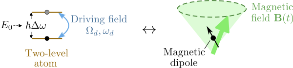
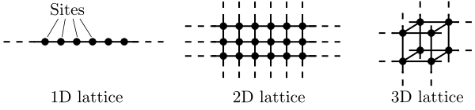
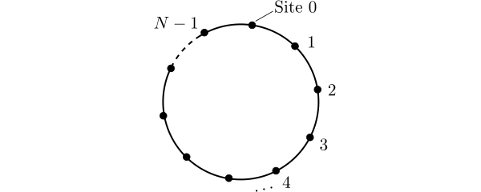
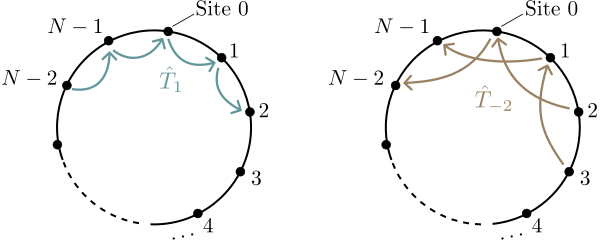

# Basics of Quantum Theory

Quantum theory, or quantum mechanics, is the fundamental physical
framework describing all objects of microscopic size (and, so far as
we know, larger objects too).  It was developed, in fits and starts,
over several decades in the first half of the 20th century, beginning
with [Max Planck's](https://en.wikipedia.org/wiki/Max_Planck) 1900
proposal that the energy in radiation is packaged into discrete
"quanta", and approaching its modern form with the formulation of wave
mechanics by
[Erwin Schrödinger](https://en.wikipedia.org/wiki/Erwin_Schr%C3%B6dinger) in
1926 and matrix mechanics by
[Werner Heisenberg](https://en.wikipedia.org/wiki/Werner_Heisenberg)
in 1928.

The mathematical formulation of quantum mechanics most physicists use
today is based on the **Dirac–von Neumann axioms**, put together in
the 1930s by [Paul Dirac](https://en.wikipedia.org/wiki/Paul_Dirac)
and [John von Neumann](https://en.wikipedia.org/wiki/John_von_Neumann), which
unifies and systematizes the Schrödinger and Heisenberg theories using
the mathematical language of linear algebra.

In this chapter, we review the basic principles of the theory.  This
is a summary, not a pedagogical introduction; the reader is assumed to
possess some familiarity with quantum mechanics from prior reading or
coursework.

## States and Observables

The central idea in quantum theory is the distinction between
**states** and **observables**.  A state describes *how a system
currently is*, while observables represent its *measurable
properties*.  In classical physics, a state is defined by a complete
set of observables: knowing the position and momentum of a point
particle of given mass, we know everything about it, including the
values of all other observables (energy, orbital angular momentum,
etc.).  Not so in quantum theory.

The Dirac–von Neumann axiomatization of quantum mechanics starts with
these postulates:

1.  **States**---A system's state is a vector $|\psi\rangle$ in a
    complex Hilbert space $\mathscr{H}$.^[A Hilbert space is a
    vector space with an inner product, plus the property of
    "completeness".  Completeness means, roughly, that infinite series
    are well-behaved: if we construct a convergent infinite sum of
    vectors from $\mathscr{H}$, the result remains in $\mathscr{H}$.
    To understand what this means, we can use an analogy with the theory of numbers.  Consider the Leibniz series for $\pi$: $$\pi =
    4\left(1-\frac{1}{3}+\frac{1}{5} - \frac{1}{7} + \cdots\right).$$ 
	The series on the right is formed from rational numbers,
    but the result of the infinite series is irrational; hence, the
    rationals do not form a complete number system.  By contrast, the
    real numbers ($\mathbb{R}$) are complete---every convergent
    infinite series of reals remains in $\mathbb{R}$.  The Hilbert
    space concept applies the same concept to vectors.]  The choice
    of Hilbert space, including its dimension, is system-specific.
    State vectors are customarily **normalized to unity**, i.e.,
    $$\langle \psi|\psi\rangle = 1.$$
    We normalize state vectors because the rest of the theory only
    cares about the "direction" of $|\psi\rangle$, not its overall
    magnitude or phase (see postulates 3 and 4 below).

2.  **Observables**---An observable is a linear operator, $\hat{A}$,
    acting on state vectors.^[We use hats, $\hat{\cdots}$, to denote
    operators---both Hermitian operators (observables) and
    non-Hermitian ones.] This operator is Hermitian or self-adjoint,
    $\hat{A} = \hat{A}^{\dagger}$, which
    [implies](https://en.wikipedia.org/wiki/Spectral_theorem) that its
    eigenvalues are real.  These eigenvalues correspond to the
    observable's possible measurement results, and the associated
    normalized eigenvectors are called **eigenstates**.

To operationalize these concepts, two more postulates are added:

3.  **The Schrödinger equation**---A system's state,
    $|\psi(t)\rangle$, varies with time $t$ according to
    $$i\hbar \frac{d}{dt}|\psi(t)\rangle = \hat{H}(t) \, |\psi(t)\rangle,$$
    where $\hat{H}(t)$ is an observable called the **Hamiltonian**
    (which also may be time-dependent).  The Schrödinger equation is
    norm-preserving, or "unitary": $\frac{d}{dt}\langle\psi(t)|\psi(t)\rangle = 0$.^[*Proof*: By
    the product rule of derivatives,
    $$\frac{d}{dt}\langle\psi(t)|\psi(t)\rangle = 
	\langle\psi(t)|\left(\frac{d}{dt}|\psi(t)\rangle\right)
	+\left(\frac{d}{dt}\langle\psi(t)|\right)|\psi(t)\rangle.$$
    The two terms are complex conjugates of each other.
    Using the Schrödinger equation, the first term becomes
    $$\frac{1}{i\hbar}\langle\psi(t)|\hat{H}(t)|\psi(t)\rangle.$$
    The second term, which is its complex conjugate, is
	$$- \frac{1}{i\hbar}\langle\psi(t)|\hat{H}^\dagger(t)|\psi(t)\rangle.$$
    If the Hamiltonian is Hermitian ($\hat{H} = \hat{H}^\dagger$), the
    two terms cancel. QED.]
	
    We interpret $\hat{H}$ as the observable corresponding to the
    total energy of the system.  Its eigenvalues are called
    **eigenenergies**.

4.  **The measurement postulate**---If an observable $\hat{A}$ is
    measured on a state $|\psi\rangle$, the result is drawn
    probabilistically from the eigenvalues of $\hat{A}$.  The
    probability to obtain any given result $a_n$, corresponding to a
    normalized eigenstate $|n\rangle$, is given by the **Born rule**:
    $$P_n = \left|\langle n|\psi\rangle\right|^2.$${#eq-measurement}
    After the measurement, the system's state abruptly switches to
    $|n\rangle$.  This is called **state collapse**.
	
	Note that @eq-measurement is insensitive to the overall phase of
    the initial state: $e^{i\phi}|\psi\rangle$, for any phase
    $\phi\in\mathbb{R}$, gives the same measurement probabilities as
    $|\psi\rangle$.  For the same reason, the choice of phase for the
    post-collapse eigenstate is also irrelevant.

From these postulates flow all the predictions of quantum mechanics,
which collectively represent the most accurate and successful set of
scientific results known to humanity.  Quantum mechanical calculations
form the basis for our modern understanding of chemistry, materials
science, nuclear physics, and many other fields; they are also crucial
to the functioning of many technological devices we rely on everyday,
including lasers, LEDs, and electronic computers.

But even at this early point, it is possible to spot some issues
lurking in the postulates:

* In postulate 3, the Schrödinger equation gives a privileged role to
  the time variable $t$.  This seems to run counter to
  [special relativity's](https://en.wikipedia.org/wiki/Special_relativity)
  demands that time and space be treated on equal footing, not to
  mention
  [general relativity's](https://en.wikipedia.org/wiki/General_relativity)
  demands that time (and space) be dynamical quantities, not just
  passive coordinates. The first conflict can be resolved by a class
  of quantum theories called relativistic quantum field theories.  The
  second, however, is a fundamental unsolved theoretical problem,
  referred to as the [problem of time](https://en.wikipedia.org/wiki/Problem_of_time).

* There is a tension between postulates 3 and 4.  Postulate 3
  describes the state evolving smoothly according to a *deterministic*
  differential equation (the Schrödinger equation).  However,
  postulate 4 describes a *probabilitic* jump to another state
  occurring abruptly when a measurement is done.  The special role of
  measurement in quantum mechanics has surprising and troubling
  consequences, as we shall see in @sec-chapter-entanglement.

These are not minor theoretical quirks, but foundational problems that
physicists have attempted (and failed) to resolve for decades.
However, their presence does not invalidate the power and utility of
quantum theory as a whole, so let us put aside our doubts for now.  In
the rest of this chapter, we will review how to use the quantum
postulates in calculations, as well as elementary models of two-level
systems, particles in discrete space, one-dimensional potentials, and
particles in continuous space.

### Expectation values

The **expectation value** for an observable $\hat{A}$ with a state
$|\psi\rangle$ refers to the mean result obtained by repeatedly
measuring $\hat{A}$ over a statistical ensemble of systems, each
prepared in state $|\psi\rangle$.  Using the Born rule, we derive
this as
$$\begin{aligned}\langle A\rangle &= \sum_n a_n\, P_n \\ &= \sum_n a_n\,\big|\langle n|\psi\rangle\big|^2 \\ &= \sum_n a_n \, \langle \psi| n \rangle \, \langle n|\psi_n\rangle \\ &= \sum_n \langle \psi| \hat{A} | n \rangle \, \langle n|\psi_n\rangle \\&= \langle\psi|\,\hat{A}\,|\psi\rangle.\end{aligned}$$
Since the eigenvalues $\{a_n\}$ and probabilities $P_n$ are real,
$\langle A\rangle$ is real.  Note that in the next-to-last step, we
used a common maneuver called the **resolution of the identity**,
whereby the identity operator is expressed as a sum of projectors
using the eigenstates of $\hat{A}$: $$\hat{I} = \sum_n
|n\rangle\, \langle n |.$$ This works because $\hat{A}$ is Hermitian, so by the [spectral theorem](https://en.wikipedia.org/wiki/Spectral_theorem) its eigenstates form an orthonormal basis for the Hilbert space.  Non-Hermitian operators need not satisfy this property.

## Time evolution and energy eigenstates

**[DRAFT — point form; expand into prose before finalizing]**

- Postulate 3 (the Schrödinger equation) says
  $i\hbar\,\frac{d}{dt}|\psi(t)\rangle=\hat{H}|\psi(t)\rangle$.  For a
  time-independent $\hat{H}$, its formal solution is
  $$|\psi(t)\rangle = \hat{U}(t)\,|\psi(0)\rangle, \qquad \hat{U}(t) \equiv \exp\!\left(-\frac{i}{\hbar}\hat{H}t\right),$$
  where $\hat{U}(t)$ is the unitary **time-evolution operator**.
- **Stationary states.** If $\hat{H}|n\rangle=E_n|n\rangle$ and
  $|\psi(0)\rangle=|n\rangle$, then
  $$|\psi(t)\rangle = e^{-iE_nt/\hbar}\,|n\rangle:$$
  the state merely accumulates a phase $e^{-iE_nt/\hbar}$, and every
  measurement probability stays constant in time.
- General state: expand $|\psi(0)\rangle=\sum_n c_n|n\rangle$; then
  $|\psi(t)\rangle=\sum_n c_n\,e^{-iE_nt/\hbar}|n\rangle$.  Relative
  phases evolve, producing interference (what the Rabi model below
  exhibits).
- **Time-independent Schrödinger equation (TISE):**
  $\hat{H}|\psi\rangle=E|\psi\rangle$.  Finding eigenstates and
  eigenenergies is the central task of the later chapters: bound vs.
  free states (@sec-bound-free-states), scattering states
  (@sec-scattering-theory), etc.
- Brief note: for a *time-dependent* $\hat{H}(t)$ (e.g. the driven
  two-level atom), $e^{-i\hat{H}t/\hbar}$ is replaced by a
  time-ordered exponential; we sidestep this by going to a rotating
  frame.

**[END DRAFT]**

## Two-level systems

Different quantum systems can have different state spaces.  The
simplest nontrivial complex Hilbert space is the space of
two-component complex vectors, denoted by $\mathbb{C}^2$.  Such
systems are generically called **two-level systems**.^[This is because
each observable (including the Hamiltonian) is a $2\times2$ matrix,
and has two eigenvalues.]

Let us choose an arbitrary basis for the Hilbert space, consisting of
the orthonormal basis vectors

$$|+\rangle \leftrightarrow \begin{pmatrix}1\\0\end{pmatrix}, \quad
|-\rangle \leftrightarrow \begin{pmatrix}0\\1\end{pmatrix}.$$

(Here, we use $\leftrightarrow$ to denote the representation of an
abstract vector in a given basis.)  Then any vector in $\mathbb{C}^2$
can be written as

$$|\psi\rangle = \psi_+ |+\rangle + \psi_-|-\rangle \;\;\;\leftrightarrow\;\;\;\begin{pmatrix}\psi_+ \\ \psi_-\end{pmatrix},$$

for some pair of coefficients $\psi_\pm \in \mathbb{C}.$ The basis
vectors can also be employed in the **resolution of the identity**, by
writing the identity operator as

$$\hat{I} = |+\rangle \, \langle +| \;+\; |-\rangle \, \langle -| \;\;\leftrightarrow \;\;
\begin{pmatrix}1&0\\0&1\end{pmatrix}.$$

### Pauli matrices {#sec-Pauli-matrices}

What observables can a two-level system have?  Observables for
$\mathbb{C}^2$ are represented by $2\times2$ Hermitian matrices, which
are characterized by four real parameters (the diagonal elements are
real, which gives two parameters, and the off-diagonal elements are
conjugates of each other, which gives another two).  We can write any
such matrix as the linear combination

$$\hat{A} = \alpha_0 \hat{I} + \alpha_1 \hat{\sigma}_1 + \alpha_2 \hat{\sigma}_2 + \alpha_3 \hat{\sigma}_3,\;\;\;\alpha_{n} \in \mathbb{R},$$ {#eq-pauli-superposition}

where $\hat{I}$ is the $2\times2$ identity matrix, and $\sigma_1,
\dots, \sigma_3$ are the **Pauli matrices**:

$$\hat{\sigma}_1 = \begin{pmatrix}0&1\\1&0\end{pmatrix}, \,
\hat{\sigma}_2 = \begin{pmatrix}0&-i\\ i&0\end{pmatrix}, \,
\hat{\sigma}_3 = \begin{pmatrix}1&0\\ 0&-1\end{pmatrix}.$$ {#eq-pauli}

In @eq-pauli-superposition, the identity and Pauli matrices serve as a
linear basis for observables; these matrices are Hermitian (i.e.,
observables), and linearly independent, meaning that each cannot be
written as a linear combination of the others.  In this way, $\alpha_0,
\dots, \alpha_3$ supply the four real parameters required to describe
a general observable in $\mathbb{C}^2$; since they are real, the
linear combination is guaranteed to be Hermitian.

This is not the only possible parameterization for observables of
$\mathbb{C}^2$, but it has some particularly nice properties:

* The leading term, $\alpha_0\hat{I}$, is the "trivial" part
  of the matrix.  We can always split off such a term from any
  $2\times2$ Hermitian matrix $\hat{A}$, using the coefficient
  $\alpha_0 = \mathrm{Tr}(\hat{A})/2$.  This term has the same trace
  as $\hat{A}$, so the remaining part of the matrix is traceless
  and satisfies a simplified eigenvalue equation:
  $$\begin{aligned}\hat{A} |\psi\rangle
  = \left(\alpha_0 \hat{I} + \alpha_1 \hat{\sigma}_1 + \alpha_2 \hat{\sigma}_2 + \alpha_3 \hat{\sigma}_3\right)|\psi\rangle &= \lambda |\psi\rangle \\
  \Rightarrow \qquad\qquad\qquad
  \left(\alpha_1 \hat{\sigma}_1 + \alpha_2 \hat{\sigma}_2 + \alpha_3 \hat{\sigma}_3\right)|\psi\rangle &= \left(\lambda - \alpha_0\right) |\psi\rangle.\end{aligned}$$
  In other words, the Pauli matrix terms determine the
  eigenstates of $\hat{A}$, while $\alpha_0$ merely shifts
  the eigenvalues.

* The three remaining matrices are $2\times2$, traceless, and
  Hermitian.  If we try to form an "orthonormal basis" of such
  matrices, a set of reasonable choices (see [Exercise 1](#sec-basics-exercises)) leads to the anticommutation and
  commutation relations
  
  $$\begin{aligned}
  \left\{\hat{\sigma}_i, \hat{\sigma}_j\right\} &= 2\delta_{ij} \hat{I}, \\
  \left[\hat{\sigma}_i, \hat{\sigma}_j\right] &= 2i \sum_{k=1}^3\epsilon_{ijk}\, \hat{\sigma}_k,\end{aligned}\qquad i,j,k\in\{1,2,3\},$$ {#eq-Lie-commutators}

  where, $\epsilon_{ijk}$ denotes the Levi-Civita symbol.  The Pauli
  matrices listed in @eq-pauli indeed satisfy these algebraic
  relations.  Often, when manipulating formulas containing Pauli
  matrices, it is advantageous to use these relations instead of
  working with the explicit matrices.

### Spin mapping

The commutation relation in the second line of @eq-Lie-commutators
defines a **Lie algebra** called $\mathfrak{su}(2)$.  Remarkably, this
Lie algebra also pops up in the quantum theory of angular momentum in three-dimensional space.

To properly understand the angular momentum story, we need to discuss
wavefunctions, which will be covered in @sec-wavefunctions, with the
theory of angular momentum being derived in
@sec-orbital-angular-momentum.  However, let us skip ahead and present
a summary:

When studying how wavefunctions transform under coordinate rotations,
we are led to define three observables $\hat{J}_1$, $\hat{J}_2$, and
$\hat{J}_3$, which correspond to the **angular momentum** around each
of the spatial coordinate axes.  Roughly speaking, these describe how
the wavefunction rotates, or orbits, around each axis, which is why
the observables are more precisely referred to as **orbital angular
momentum**.  They can be shown to satisfy the commutation relations

$$\left[\hat{J}_i, \hat{J}_j\right] = i\hbar \sum_{k=1}^3 \epsilon_{ijk} \, \hat{J}_k,\qquad i,j,k\in\{1,2,3\}.$$ {#eq-Lie-algebra}

We then take a conceptual leap by postulating that @eq-Lie-algebra
*defines* the set of angular momentum observables tied to 3D
rotations; in other words, it is the commutation relations that are
fundamental, not the specific operators we had used to derive them.
This opens the door to other, non-orbital forms of angular momentum!
In particular, there turns out to be a form of angular momentum called
**spin**, which can be possessed by particles like the electron (which
as far as we know is a "point particle" that has no internal
structure, and thus cannot be thought of as "rotating" in the usual
sense).

The Pauli matrices play a key role in describing this.  Comparing
@eq-Lie-algebra to @eq-Lie-commutators, we realize that Pauli matrices
form a 2D representation^[The dimension of the representation refers
the size of the matrices.  Thus, the Pauli matrices, which are
$2\times2$, form a 2D representation of the Lie algebra
$\mathfrak{su}(2)$.  The Lie algebra can have other representations as
well; for example, *orbital* angular momentum leads to a 3D
representation.  (By the way, that 3D representation is a
representation for $\mathfrak{su}(2)$ and *not* $\mathfrak{su}(3)$.
The latter refers to another Lie algebra with different commutation
relations.)] of $\mathfrak{su}(2)$, according to the mapping

$$\hat{S}_i = \frac{\hbar}{2}\, \hat{\sigma}_i.$$ {#eq-spin-map}

Here, we follow the standard convention of denoting spin angular
momentum operators as $\hat{S}_i \equiv \hat{J}_i$.  Based on this
mapping, the operator corresponding to the square of the total angular
momentum is

$$\begin{aligned}\hat{\mathbf{S}}^2 &\equiv \hat{S}_1^2 + \hat{S}_2^2 + \hat{S}_3^2 \\ &= \left(\frac{\hbar}{2}\right)^2 \big(\hat{\sigma_1}^2 + \hat{\sigma_2}^2 + \hat{\sigma_3}^2\big) \\&= \left(\frac{\hbar}{2}\right)^2 \cdot 3 \\&= \hbar^2 s(s+1), \;\;\textrm{for}\;s = \frac{1}{2},\end{aligned}$$

where $s = 1/2$ is called the total angular momentum quantum number.
By contrast, the corresponding quantum number for orbital angular
momentum is restricted to non-negative integers, $\ell = 0, 1, 2,
\dots$ (see @sec-orbital-angular-momentum).  Consequently, the Pauli
matrices are said to describe a **spin-1/2 degree of freedom**.

### Rabi oscillations

Due to the relationship between Pauli matrices and spin, it is common
for two-level quantum systems to be interpreted in terms of spin-1/2
degrees of freedom, *even if they aren't really spins*.  As an
example, consider a **two-level atom**, which has a ground state
$|g\rangle$ and an excited state $|e\rangle$ whose energies differ by
$\hbar\Delta \omega$.  The atom is illuminated by an electromagnetic
wave, or "driving field", that induces transitions between the ground
state and the excited state.  The Hamiltonian has the form

$$\hat{H} = \left(E_0 - \frac{\hbar\Delta \omega}{2}\right) |g\rangle\langle g|
+ \left(E_0 + \frac{\hbar\Delta \omega}{2}\right) |e\rangle\langle e| + \frac{\hbar \Omega_d}{2} \Big(e^{-i\omega_d t} |g\rangle\langle e| + e^{i\omega_d t} |e\rangle\langle g|\Big),$$

where $E_0$ is a baseline energy, $\Omega_d$ is the so-called Rabi
frequency (which quantifies the strength of the driving field), and
$\omega_d$ is the frequency of the driving field.  Using the basis
$\{|g\rangle, |e\rangle\}$, we can write $\hat{H}$ as

$$\hat{H} = E_0 - \frac{\hbar\Delta \omega}{2} \hat{\sigma}_3 + \frac{\hbar\Omega_d}{2}\left[\cos(\omega_d t) \hat{\sigma}_1 + \sin(\omega_d t) \hat{\sigma}_2\right].$$

Next, we can use @eq-spin-map to map $\hat{H}$ into

$$\hat{H} = E_0 - \lambda \mathbf{B}(t) \cdot \hat{\mathbf{S}}, \;\;\;
\lambda \mathbf{B}(t) = \begin{pmatrix}-\Omega_d\cos(\omega_dt)\\ -\Omega_d\sin(\omega_dt) \\ \Delta \omega\end{pmatrix},$$

where $\lambda \hat{\mathbf{S}}$ denotes a magnetic dipole moment
(which follows the spin).  Hence, the driven two-level atom maps to a
spin in a magnetic field $\mathbf{B}(t)$ consisting of (i) a static
magnetic along $z$, plus (ii) a rotating field in the $x$-$y$ plane.

{fig-align="center" width="500" fig-alt="Diagram of a two-level quantum system (left) and the corresponding magnetic dipole in a magnetic field (right)."}

Note how the spin model's parameters $\{E_0, B_1, B_2, B_3\}$ map
cleanly to the coefficients of the linear expansion in
@eq-pauli-superposition.

## Lattices

Lattice models are a useful class of quantum models describing
particles on discrete spatial grids.  They provide a useful way to
accommodate the concept of *spatial position* in quantum mechanics,
without the complications of continuous variables (which we will
handle in @sec-wavefunctions).  Lattice models are also commonly used
in condensed matter physics to describe electrons moving in
crystalline solids (i.e., materials whose atoms are arranged in
discrete, regularly-spaced patterns).

Let us consider a particle that can exist on certain discrete points,
or **sites**, arranged in a 1D or higher-dimensional grid called a
**lattice**:

{fig-align="center" width="500" fig-alt="Diagrams showing representative 1D, 2D, and 3D lattices, each consisting of interconnected discrete sites."}

Let us focus on the 1D lattice on the left.  As a further
simplification, we will roll the 1D lattice into a ring:

{fig-align="center" width="500" fig-alt="Diagram of a 1D rolled up into a ring, which contains N distinct sites sites."}

As a result, the number of sites is a finite integer $N$.  This lets
us postpone the mathematical complications that come with having an
infinite number of sites.

### Position eigenstates

The sites on the ring can be labeled by an integer $n \in [1, N]$.  We
wish to consider a *single* particle existing within the lattice.  Let
us define a set of **position eigenstates**, denoted by

$$\big\{|1\rangle,\; |2\rangle,\; \dots |N\rangle \big\},$$

such that a particle in state $|n\rangle$ is located entirely on site
$n$.  We postulate that these eigenstates are normalized to unity and
mutually orthogonal,

$$\langle m|n\rangle = \delta_{mn}, \;\;\; m,n\in [1,N],$$

and that they form a complete orthonormal basis for the particle's
Hilbert space.  Thus, the Hilbert space is $\mathscr{H} =
\mathbb{C}^N$ (the space of $N$-component complex vectors).
<!-- Thus, we can use them to resolve the identity: -->
<!-- $$\hat{I} = \sum_{n=1}^N |n\rangle\langle n|.$$ -->
We can also use the position eigenstates to construct a position
observable,

$$\begin{aligned}\hat{x} &\equiv \sum_{n=1}^N |n\rangle \,x_n\, \langle n|,
\;\;\;\mathrm{where}\;\;x_n \equiv na. \\
\Rightarrow\;\; \hat{x} |n\rangle &= x_n |n\rangle.\end{aligned}$$

Here, $a$ is a length unit representing the equal spacings between
lattice sites.  Strictly speaking, we can set $a = 1$, but it is nice
to retain it so that our formulas are dimensionally consistent.  Thus,
the position eigenvalues are $\{ x_1, x_2, \dots, x_N\}$ (which
explicitly have units of length).

A general state $|\psi\rangle \in \mathscr{H}$ can be written in the
position basis as

$$|\psi\rangle = \sum_{n=1}^N \psi_n |n\rangle, \;\;\;\psi_n \in \mathbb{C}.$$

This describes a particle (and remember, we are dealing with a
*single* particle) which occupies a superposition of different sites.
The complex numbers $\psi_n$ constitute a **discrete wavefunction**
for the particle (a discrete version of the wavefunctions to be
discussed in @sec-wavefunctions).  It follows that:

* The state $|\psi\rangle$ is normalized if and only if
    $$\sum_{n=1}^N \left|\psi_n\right|^2 = 1.$$
* The inner product between $|\psi\rangle$ and another state
    $|\varphi\rangle$ (with discrete wavefunction $\varphi_n$) is
    $$\langle\varphi|\psi\rangle = \sum_{n=1}^N \varphi^*_n\psi_n.$${#eq-discrete-wavefunction-product}

### Momentum eigenstates

Consider the following states on the ring lattice:

$$|k_n\rangle = \frac{1}{\sqrt{N}} \sum_{m=1}^N e^{ik_n x_m} |m\rangle.$$ {#eq-discrete-k-state}

As before, $x_m \equiv ma$ denotes positions along the ring.  These
states' discrete wavefunctions are familiar-looking 1D waves of the
form $e^{ikx}$, sampled at discrete points $x = x_m$.  But rather than
allowing arbitrary wavenumbers, let us take

$$k_n = \frac{2\pi n}{Na}, \;\; n \in [1,N].$$

This ensures that the waves satisfy the periodicity of the ring.  For
instance, putting $m = N+1$ into the wavefunction yields

$$\begin{aligned}\exp(ik_n x_{N+1}) &= \exp\left[i \left(\frac{2\pi n}{Na}\right) (N+1)a\right] \\ &= e^{2\pi i n}\, \exp(ik_n a) \\ &= \exp(ik_n x_1), \end{aligned}$$ {#eq-discrete-wave-periodicity}

which is consistent with the requirement that site $N+1$ is equivalent
to site 1 on the ring.  For the same reason, we see that the
wavenumber $k_n$ is defined modulo $2\pi/a$: i.e., shifting it by
multiples of $2\pi/a$ leaves @eq-discrete-k-state unchanged.

By the orthogonality of [Fourier series](https://en.wikipedia.org/wiki/Fourier_series), we can show that:^[*Proof*: Using the discrete wavefunction from
@eq-discrete-k-state, along with the inner product rule in
@eq-discrete-wavefunction-product,
$$\begin{aligned}\langle k_n | k_{n'} \rangle
&= \frac{1}{N} \sum_{m=1}^N e^{-ik_n x_m} \, e^{ik_{n'}x_m} \\
&= \frac{1}{N} \sum_{m=1}^N \exp\left[\frac{2\pi i (n'-n) m}{N}\right].
\end{aligned}$$
If $n \ne n'$, we can use the geometric series formula.  Writing $\Delta n = n'-n$,
$$\begin{aligned}\sum_{m=1}^N \exp\left[\frac{2\pi i \,\Delta n\, m}{N}\right]
&= \frac{e^{2\pi i \Delta n/N} \left[\left(e^{2\pi i \Delta n/N}\right)^N - 1\right]}{ e^{2\pi i \Delta n/N} - 1} \\
&= \frac{e^{2\pi i \Delta n/N} \left(1 - 1\right)}{ e^{2\pi i \Delta n/N} - 1} \;\;\;= \;\;\;0.
\end{aligned}$$
If $n = n'$, we cannot use the geometric series (since the numerator
and denominator in the formula are both zero).  In this case, though,
each term in the sum is $1$, so the result is $(1/N)\cdot N = 1$.
Combining the two cases, we arrive at
@eq-k-discrete-ortho.]

$$\langle k_n | k_{n'} \rangle = \delta_{nn'},\;\;\;\mathrm{where}\;\;n,n' \in [1,N].$$ {#eq-k-discrete-ortho}

Thus, the $N$ distinct states $\{|k_1\rangle,\dots,|k_N\rangle\}$ form an
orthonormal basis for $\mathscr{H}$.

What is the physical meaning of the $|k_n\rangle$ states?  To
understand this, let us look at translations on the ring lattice.  We
can define **translation operators** $\hat{T}_q$, where $q \in
\mathbb{Z}$, such that

$$\hat{T}_q |m\rangle = |(m+q)\rangle,$$

with the understanding that $(m+q)$ on the right-hand side is taken
modulo $N$, due to the periodicity of the ring.  In other words,
$\hat{T}_q$ shifts positions by $q$ sites along the ring:

{fig-align="center" width="500" fig-alt="Diagrams showing representative translations along a ring lattice, by +1 site (left) and -2 sites (right)."}

Evidently, such an operator is norm-preserving (i.e., unitary).
Applying it to a $|k_{n}\rangle$ state gives

$$\begin{aligned}\hat{T}_q |k_{n}\rangle
&= \frac{1}{\sqrt{N}} \sum_{m=1}^N e^{ik_{n} x_m} \hat{T}_q |m\rangle \\
&= \frac{1}{\sqrt{N}} \sum_{m=1}^N e^{ik_{n} x_m} |(m+q)\rangle \\
&= \frac{1}{\sqrt{N}} \sum_{m=1}^N e^{ik_{n} (m-q) a} |m\rangle \\
&= e^{-ik_{n} qa} \, |k_{n}\rangle.
\end{aligned}$$

In the third step, we made use of the discrete wavefunction's
periodicity (see @eq-discrete-wave-periodicity).  We thus obtain the
result that $\hat{T}_q$ leaves $|k_{n}\rangle$ unchanged except for a
phase factor $e^{-ik_{n} qa}$.  Note that this holds for every $q$ and
$n$.

In the context of classical mechanics,
[Noether's theorem](https://en.wikipedia.org/wiki/Noether%27s_theorem)
states that spatial translation symmmetry is associated with a
conserved physical quantity called momentum.  Drawing on this
association, we identify the $|k_{n}\rangle$ states as **momentum
eigenstates**.  We can also use them to construct a momentum
observable like this:

$$\hat{p} = \sum_{n=1}^N |k_{n}\rangle \, \hbar k_n \, \langle k_{n}|.$$

The factor of $\hbar$ is inserted simply so that $\hat{p}$ has units
of momentum (whereas $k_n$ has units of inverse length).  The momentum
eigenvalues are thus $\{\hbar k_1, \dots, \hbar k_N\}$.  However, as
noted above, $k_n$ is defined modulo $2\pi/a$, so the momentum is
likewise defined modulo $2\pi\hbar/a$.  In condensed-matter physics,
this kind of periodic momentum variable is sometimes called
**quasimomentum**, to distinguish it from the non-periodic momentum we
will study in @sec-wavefunctions.

### Quantum walks

**[DRAFT — point form; expand into prose before finalizing]**

- A **quantum walk** is time evolution on the lattice: the discrete
  counterpart of a moving particle (and of the continuous wavefunctions
  below).
- Hopping (tight-binding) Hamiltonian on the ring, with
  $|N{+}1\rangle\equiv|1\rangle$:
  $$\hat{H} = -J\sum_{n=1}^N\Big(|n\rangle\langle n{+}1| + |n{+}1\rangle\langle n|\Big),$$
  where $J>0$ is the hopping energy.
- The momentum states diagonalize it (translation symmetry,
  $[\hat{H},\hat{T}_q]=0$):
  $$\hat{H}|k_n\rangle = E(k_n)\,|k_n\rangle, \qquad E(k_n) = -2J\cos(k_n a).$$
- Time evolution (using the section above):
  $|\psi(t)\rangle=\sum_n c_n\,e^{-iE(k_n)t/\hbar}|k_n\rangle$.
- **Group velocity** of a wavepacket peaked near $k$:
  $v_g=\frac{1}{\hbar}\frac{dE}{dk}=\frac{2Ja}{\hbar}\sin(ka)$.  This
  is what makes the walk move.
- Optional hook: replace one site by a defect (a different on-site
  energy) and the ring becomes a 1D scatterer; transmission/reflection
  amplitudes are the subject of Chapter 2.

**[END DRAFT]**

### Probability conservation on the lattice

**[DRAFT — point form; expand into prose before finalizing]**

- Site probabilities $P_n(t)=|\psi_n(t)|^2$ sum to one:
  $\sum_n P_n=1$ at all $t$.
- With the hopping Hamiltonian, probability flows between neighboring
  sites.  Define the discrete current
  $$J_{n\to n+1} = \frac{2J}{\hbar}\,\mathrm{Im}\!\big[\psi_n^*\,\psi_{n+1}\big],$$
  then the Schrödinger equation implies the discrete continuity
  equation
  $$\frac{dP_n}{dt} = -\big(J_{n\to n+1} - J_{n-1\to n}\big).$$
- This is the lattice version of the continuous continuity equation in
  the next section.

**[END DRAFT]**

## Wavefunctions {#sec-wavefunctions}

A wavefunction is a particular type of quantum state defined as a
complex function of a continuous real variable (or variables).  Such
functions obey the usual axioms governing vectors.  For example, for
functions of a single continuous real variable $x\in\mathbb{R}$, we
can construct linear combinations

$$A_1 \psi_1(x) + A_2 \psi_2(x),$$

where $A_1, A_2 \in \mathbb{C}$.

### Position eigenstates

Before proceeding, let us review the properties of a quantum particle
in free space.  In a $d$-dimensional space, a coordinate vector
$\mathbf{r}$ is a real vector with $d$ components.  We suppose there
is a uncountably infinite set of position eigenstates,
$\{|\mathbf{r}\rangle\}$, where each $|\mathbf{r}\rangle$ describes a
particle with a definite position $\mathbf{r}$.  The position
eigenstates are assumed to span the state space, such that the
identity operator can be resolved as

$$\hat{I} = \int d^dr \, |\mathbf{r}\rangle \langle\mathbf{r}|,$$

with the integral is taken over all allowed $\mathbf{r}$ (e.g.,
$\mathbf{r} \in \mathbb{R}^d$).  It follows that

$$\langle \mathbf{r} | \mathbf{r}' \rangle = \delta^d(\mathbf{r}-\mathbf{r}').$$

Thus, we say that the position eigenstates are *delta-normalized*,
rather than being normalized to unity.  Here $\delta^d(\cdots)$
denotes the $d$-dimensional delta function; e.g., in 2D,

$$\langle x,y \,|\, x',y' \rangle = \delta(x-x') \, \delta(y-y').$$

Moreover, the position operator $\hat{\mathbf{r}}$ is defined such
that $\hat{\mathbf{r}} |\mathbf{r}\rangle \,=\, \mathbf{r}\,
|\mathbf{r}\rangle$.

### Momentum eigenstates{#sec-momentum-eigenstates}

Momentum eigenstates are constructed from position eigenstates via
Fourier transforms.  First, let us suppose $\mathbf{r}$ runs over a
finite box of length $L$ on each side, with periodic boundary
conditions.  For plane waves of the form
$\exp(i\mathbf{k}\cdot\mathbf{r})$, where $\mathbf{k} = (k_1, \dots,
k_d)$ is the wave-vector, the periodic boundary conditions are
satisfied if and only if

$$k_j = 2\pi m/L\;\;\mathrm{for} \;m\in\mathbb{Z}.$$

Note that the set of allowed wave-vectors is discrete (i.e.,
countable), with a discretization of $\Delta k = 2\pi/L$ in each
direction.  Next, define

$$|\mathbf{k}\rangle = \frac{1}{L^{d/2}} \, \int d^dr \; e^{i\mathbf{k}\cdot\mathbf{r}} |\mathbf{r}\rangle,$$

where the integral is taken over the box.  We identify
$|\mathbf{k}\rangle$ as a momentum eigenstate, i.e., a state with
definite momentum $\hbar \mathbf{k}$.  We can now show
that

$$\langle\mathbf{k}|\mathbf{k}'\rangle = \delta_{\mathbf{k},\mathbf{k}'}, \quad \langle\mathbf{r}|\mathbf{k}\rangle = \frac{1}{L^{d/2}} e^{i\mathbf{k}\cdot\mathbf{r}}, \quad I = \sum_{\mathbf{k}} |\mathbf{k}\rangle\,\langle\mathbf{k}|.$$

In particular, note that each momentum eigenstate is normalizable to
unity.

Now let us take $L \rightarrow \infty$.  In this limit, the
wave-vector discretization $\Delta k = 2\pi / L$ goes to zero, so the
momentum eigenvalues coalesce into a continuum.  To handle this, we
redefine the momentum eigenstates as

$$|\mathbf{k}\rangle^{(\textrm{new})} = \left(\frac{L}{2\pi}\right)^{d/2} |\mathbf{k}\rangle^{(\textrm{old})}.$$

Then, by using the formula

$$\int_{-\infty}^\infty dx\; \exp(ikx) \;=\; 2\pi\, \delta(k),$$

we can show that the new momentum eigenstates are related to the
position eigenstates by

$$\begin{aligned}
  |\mathbf{k}\rangle &= \frac{1}{(2\pi)^{d/2}} \, \int d^dr \; e^{i\mathbf{k}\cdot\mathbf{r}} |\mathbf{r}\rangle, \\
  |\mathbf{r}\rangle &= \frac{1}{(2\pi)^{d/2}} \, \int d^dk \; e^{-i\mathbf{k}\cdot\mathbf{r}} |\mathbf{k}\rangle. \end{aligned}$$
  
Position and momentum are now treated on similar footing, with the
integrals over $\mathbf{r}$ and $\mathbf{k}$ both taken over infinite
spaces.  Moreover, the momentum eigenstates now satisfy

$$\begin{aligned}
  I &= \int d^dk \;|\mathbf{k}\rangle\,\langle\mathbf{k}|, \label{Iresolk} \\
  \langle\mathbf{k}|\mathbf{k}'\rangle &= \delta^d(\mathbf{k}-\mathbf{k}'), \\
  \langle\mathbf{r}|\mathbf{k}\rangle &= \frac{e^{i\mathbf{k}\cdot\mathbf{r}}}{(2\pi)^{d/2}}.\end{aligned}$$
  
The first two equations are analogous to their position eigenstate
counterparts.  In particular, the new $|\mathbf{k}\rangle$'s are
delta-normalized.  The last equation can be interpreted as the
wavefunction of the delta-normalized momentum eigenstate.

The momentum operator $\hat{\mathbf{p}}$ is defined using the
$|\mathbf{k}\rangle$'s as the eigenbasis:

$$ \hat{\mathbf{p}} |\mathbf{k}\rangle \,=\, \hbar \mathbf{k}\,
|\mathbf{k}\rangle.$$

For any quantum state $|\psi\rangle$, whose wavefunction is
$\psi(\mathbf{r}) = \langle \mathbf{r}|\psi\rangle$, we can show that
the momentum operator acts on wavefunctions in the following way:

$$\begin{aligned}\langle \mathbf{r}|\hat{\mathbf{p}}|\psi\rangle
  &= \frac{1}{(2\pi)^{d/2}} \, \int d^dk \; e^{i\mathbf{k}\cdot\mathbf{r}} \langle \mathbf{k} | \hat{\mathbf{p}} | \psi\rangle \\
  &= \frac{1}{(2\pi)^{d/2}} \, \int d^dk \; \hbar\mathbf{k} \, e^{i\mathbf{k}\cdot\mathbf{r}} \langle \mathbf{k} | \psi\rangle \\
  &= -i \hbar\nabla \left[\frac{1}{(2\pi)^{d/2}} \, \int d^dk \, e^{i\mathbf{k}\cdot\mathbf{r}} \langle \mathbf{k} | \psi\rangle \right] \\
  &= -i\hbar \nabla\psi(\mathbf{r}).
  \end{aligned}$$

### Probability current and continuity

**[DRAFT — point form; expand into prose before finalizing]**

- Probability density $\rho(\mathbf{r},t)=|\psi(\mathbf{r},t)|^2$
  obeys the continuity equation
  $$\frac{\partial\rho}{\partial t} + \nabla\cdot\mathbf{J} = 0,$$
  with probability current density
  $$\mathbf{J} = \frac{\hbar}{m}\,\mathrm{Im}\big[\psi^*\nabla\psi\big] = \frac{\hbar}{2mi}\Big(\psi^*\nabla\psi - \psi\,\nabla\psi^*\Big).$$
- Derivation sketch: from the TDSE (with real $V$),
  $\partial_t|\psi|^2=\psi^*\partial_t\psi+\psi\,\partial_t\psi^*$;
  substitute
  $\partial_t\psi=\frac{i\hbar}{2m}\nabla^2\psi-\frac{i}{\hbar}V\psi$
  and identify the divergence.
- Consequence: $\int d^dr\,|\psi|^2=1$ is constant in time.
- Plane-wave check: $\psi=\Psi_i e^{ikx}$ gives
  $J=\frac{\hbar k}{m}|\Psi_i|^2$ — the incident flux used throughout
  Chapter 2 (cross sections).

**[END DRAFT]**

### Orbital angular momentum  {#sec-orbital-angular-momentum}

**[DRAFT — point form; expand into prose before finalizing]**

- The recap above hides the standard angular-momentum results we will
  lean on later.  Filling them in:
  - $\hat{\mathbf{J}}^2$ and $\hat{J}_z$ commute, with joint
    eigenstates $|j,m\rangle$:
    $$\hat{\mathbf{J}}^2|j,m\rangle = j(j+1)\hbar^2\,|j,m\rangle, \qquad \hat{J}_z|j,m\rangle = m\hbar\,|j,m\rangle,$$
    where $j\in\{0,\tfrac12,1,\tfrac32,\dots\}$ and
    $m\in\{-j,-j+1,\dots,+j\}$.
  - Ladder operators $\hat{J}_\pm=\hat{J}_x\pm i\hat{J}_y$ satisfy
    $\hat{J}_\pm|j,m\rangle=\hbar\sqrt{j(j+1)-m(m\pm1)}\,|j,m\pm1\rangle$.
  - *Orbital* angular momentum: $j=\ell\in\{0,1,2,\dots\}$; the
    eigenfunctions are spherical harmonics $Y_{\ell m}(\theta,\phi)$.
    The radial part and the special functions show up in partial-wave
    scattering (Appendix A).
  - *Spin*: $j=s=\tfrac12$ is the 2D representation here,
    $\hat{S}_i=\frac{\hbar}{2}\hat{\sigma}_i$, with $\hat{S}_z$
    eigenstates $|\!\uparrow\rangle,|\!\downarrow\rangle$ and
    eigenvalues $\pm\hbar/2$.
- **Rotation operators.** A rotation by angle $\theta$ about the unit
  axis $\mathbf{n}$ is generated by
  $$\hat{U}(\theta) = \exp\!\left(-\frac{i}{\hbar}\,\theta\,\mathbf{n}\cdot\hat{\mathbf{S}}\right).$$
  - For spin-1/2 this is $\hat{U}=\exp\!\left(-i\theta\,\mathbf{n}\cdot\hat{\boldsymbol{\sigma}}/2\right)$, a $2\times2$ unitary.
  - The spin component along $\mathbf{n}$ is
    $\hat{S}_n=\mathbf{n}\cdot\hat{\mathbf{S}}=\hat{U}^\dagger\hat{S}_z\hat{U}$,
    with eigenstates $|\pm n\rangle=\hat{U}^\dagger|\!\updownarrow\rangle$.
  - This is exactly the machinery used for Bell's theorem in @sec-bell:
    e.g. $\hat{S}_2=\hat{U}^\dagger\hat{S}_z\hat{U}$ with
    $\hat{U}=e^{(i\pi/3)\hat{\sigma}_2}$.

**[END DRAFT]**

## One-dimensional potentials

**[DRAFT — point form; expand into prose before finalizing]**

- Now we have the tools to solve the TISE for canonical 1D potentials;
  Chapters 2–3 take these solutions for granted.
- General facts for piecewise-constant $V(x)$:
  - $\psi$ and $\psi'$ are continuous at each interface (unless $V$
    contains a $\delta$-singularity, where $\psi'$ jumps; see Chapter 2).
  - Bound states ($E$ below the potential at infinity) are normalizable
    and discrete; scattering states are non-normalizable and continuous
    — this is developed in Chapter 3.

### Infinite square well

- $V=0$ for $0<x<L$, $V=\infty$ otherwise; $\psi(0)=\psi(L)=0$.
- Solutions: $\psi_n(x)=\sqrt{\frac2L}\,\sin\!\left(\frac{n\pi x}{L}\right)$, $\quad E_n=\frac{\pi^2\hbar^2n^2}{2mL^2}$, $\;n=1,2,3,\dots$.
- Discrete spectrum; the zero-point energy $E_1>0$ is a consequence of
  confinement (there is no $n=0$ state).

### Finite square well (recap only)

- $V(x)=-U$ for $|x|<a$, $V=0$ otherwise.  Bound states are even or odd,
  with tails $e^{\mp\kappa|x|}$ outside; matching $\psi,\psi'$ at
  $|x|=a$ fixes the discrete energies.
- Full treatment (bound vs. free spectra, counting, numerics) is in
  Chapter 3.

### Harmonic oscillator via ladder operators

- $\hat{H}=\frac{\hat{p}^2}{2m}+\frac12 m\omega^2\hat{x}^2$.
- Define $a=\sqrt{\frac{m\omega}{2\hbar}}\big(\hat{x}+\frac{i\hat{p}}{m\omega}\big)$, $a^\dagger=\sqrt{\frac{m\omega}{2\hbar}}\big(\hat{x}-\frac{i\hat{p}}{m\omega}\big)$; from $[\hat{x},\hat{p}]=i\hbar$ one gets $[a,a^\dagger]=1$.
- Invert: $\hat{x}=\sqrt{\frac{\hbar}{2m\omega}}(a+a^\dagger)$, $\hat{p}=-i\sqrt{\frac{m\omega\hbar}{2}}(a-a^\dagger)$.
- $\hat{H}=\hbar\omega\big(a^\dagger a+\frac12\big)$; number operator $\hat{N}=a^\dagger a$.
- Spectrum: $E_n=\hbar\omega(n+\frac12)$, $n=0,1,2,\dots$; ladder rules $a|n\rangle=\sqrt n\,|n{-}1\rangle$, $a^\dagger|n\rangle=\sqrt{n{+}1}\,|n{+}1\rangle$; the ground state $a|0\rangle=0$ gives the Gaussian $\psi_0(x)\propto e^{-m\omega x^2/2\hbar}$.
- This is the template for boson operators (Chapter 5) and coherent
  states (Appendix E).

### Tunneling

- Rectangular barrier with $E<V_0$: the wavefunction decays
  exponentially inside the barrier but is nonzero on the far side —
  transmission with no classical counterpart.
- The simplest solvable case (a $\delta$-potential) is worked out fully
  as a scattering problem in Chapter 2.

### Variational principle

- Statement: for any normalized trial state $\psi$,
  $$\langle\psi|\hat{H}|\psi\rangle \;\ge\; E_0,$$
  where $E_0$ is the ground-state energy; equality iff $\psi$ is
  proportional to the ground state.
- Proof sketch: expand $\psi=\sum_n c_n|n\rangle$ in the eigenbasis, so
  $\langle H\rangle=\sum_n|c_n|^2E_n\ge E_0\sum_n|c_n|^2=E_0$.
- Used in Chapter 3 to prove the existence of bound states and to
  estimate energies; e.g. a Gaussian trial for the oscillator recovers
  $\langle H\rangle\ge\frac12\hbar\omega$.

**[END DRAFT]**

## Exercises {#sec-basics-exercises}

1. In this exercise, we work through a line of reasoning that yields
   the Pauli algebra relations, @eq-Lie-commutators.  As discussed in
   @sec-Pauli-matrices, $2\times2$ Hermitian matrices are
   characterized by four real parameters, and we can always split off
   a term $\frac{1}{2}\mathrm{Tr}(\hat{A})\,\hat{I}$, which does not
   affect the eigenvectors.  This leaves three real
   parameters to characterize traceless $2\times2$ Hermitian matrices.
   
   We seek a linear decomposition
   $$\alpha_1 \hat{\sigma}_1 + \alpha_2 \hat{\sigma}_2 + \alpha_3 \hat{\sigma}_3,\;\; \alpha_i \in \mathbb{R},$$ {#eq-traceless-basis}
   where $\hat{\sigma}_1, \hat{\sigma}_2, \hat{\sigma}_3$ are traceless
   Hermitian matrices that we seek to find.

    A. Explain why we may choose each $\hat{\sigma}_i$ so that its
    eigenvalues are $\{1, -1\}$.  Hence, prove that each matrix
    squares to the identity: $$\hat{\sigma}_i^2 = \hat{I}.$$
    Note that this implies $\hat{\sigma}_i$ is unitary (not just
    Hermitian) and has determinant $-1$.

    B. Let us require that any two different matrices $\hat{\sigma}_i$
    and $\hat{\sigma}_j$ are orthogonal in the [Hilbert--Schmidt inner product](https://en.wikipedia.org/wiki/Hilbert%E2%80%93Schmidt_operator)
	(a natural way to take the inner product of two operators):
    $$\mathrm{Tr}(\hat{\sigma}_i\hat{\sigma}_j)=0\;\;\mathrm{for}\;\;i\ne j.$$
    Using this, along with the results of part A, prove that
    $$(\hat{\sigma}_i\hat{\sigma}_j)^2=-\hat{I}\;\;\mathrm{for}\;\;i\ne j.$$
	
	C. Using the results of A and B, derive the anticommutation relation
	$$\left\{\hat{\sigma}_i, \hat{\sigma}_j\right\} = 2\delta_{ij} \hat{I}.$$
	
	D. Consider $\hat{M} = i \sigma_1\sigma_2$.  Prove that this
    matrix is Hermitian and traceless.  Thus, it too can be expanded
    in the basis of @eq-traceless-basis:
	$$\hat{M} = \beta_1 \hat{\sigma}_1 + \beta_2 \hat{\sigma}_2 + \beta_3 \hat{\sigma}_3.$$
	Show that $\hat{M}$ anticommutes with both $\hat{\sigma}_1$ and
    $\hat{\sigma}_2$, and hence that
	$$\hat{M} = i \hat{\sigma}_1\hat{\sigma}_2 = \pm \hat{\sigma}_3.$$
	
	E. From the previous step, pick the sign choice $i
    \hat{\sigma}_1\hat{\sigma}_2 = - \hat{\sigma}_3.$ Hence, prove that
	$$\left[\hat{\sigma}_i, \hat{\sigma}_j\right] = 2i\epsilon_{ijk}\, \hat{\sigma}_k.$$
    You may also show that the other sign choice is nothing but a
    permutation of the matrix labels.
  
  <!-- From them, we can derive the multiplication table -->
  <!-- $$\begin{aligned} -->
  <!-- \hat{\sigma}_i^2 &= \hat{I}, \;\; i=1,2,3 \\ -->
  <!-- \hat{\sigma}_1 \hat{\sigma}_2 &= - \hat{\sigma}_2 \hat{\sigma}_2 = i\hat{\sigma}_3 \\ -->
  <!-- \hat{\sigma}_2 \hat{\sigma}_3 &= - \hat{\sigma}_3 \hat{\sigma}_2 = i\hat{\sigma}_1 \\ -->
  <!-- \hat{\sigma}_3 \hat{\sigma}_1 &= - \hat{\sigma}_1 \hat{\sigma}_3 = i\hat{\sigma}_2. -->
  <!-- \end{aligned}$$ {#eq-pauli-algebra} -->

2. In @sec-momentum-eigenstates, we derived the eigenstates of a
particle in an empty infinite space by considering a box of length
$L$ on each side, applying periodic boundary conditions, and taking
$L \rightarrow \infty$.  Suppose we instead use Dirichlet boundary
conditions (i.e., the wavefunction vanishes on the walls of the
box).  Show that this gives rise to the same set of momentum
eigenstates in the $L \rightarrow \infty$ limit.

**[DRAFT — point form; expand into prose before finalizing]**

3. (Time evolution) For a two-level system with
   $\hat{H}=\frac{\hbar\omega_0}{2}\hat{\sigma}_3$ and initial state
   $|\psi(0)\rangle=\frac{1}{\sqrt2}\big(|+\rangle+|-\rangle\big)$, find
   $|\psi(t)\rangle$, and compute
   $\langle\hat{\sigma}_1\rangle(t)$, $\langle\hat{\sigma}_2\rangle(t)$,
   $\langle\hat{\sigma}_3\rangle(t)$.  Interpret the result as
   precession.

4. (Probability current) Compute $J(x)$ for (a)
   $\psi=\Psi_i e^{ikx}$; (b) a standing wave
   $\psi=\sqrt{2/L}\,\sin(n\pi x/L)$.  Explain why a real wavefunction
   carries no net current.

5. (Harmonic oscillator) From $[x,p]=i\hbar$, prove $[a,a^\dagger]=1$,
   and re-derive $E_n=\hbar\omega(n+\tfrac12)$ from
   $\hat{H}=\hbar\omega(a^\dagger a+\tfrac12)$.  Find $\psi_0(x)$ from
   $a|0\rangle=0$.

6. (Variational principle) Use the normalized Gaussian trial state
   $\psi(x;\gamma)=\left(\frac{2\gamma}{\pi}\right)^{1/4}e^{-\gamma x^2}$
   for the oscillator; compute $\langle H\rangle$ as a function of
   $\gamma$ and minimize it.  (This is the same trick used in
   Chapter 3.)

7. (Quantum walk) Verify that $|k_n\rangle$ are eigenstates of the
   hopping Hamiltonian with $E(k_n)=-2J\cos(k_n a)$; compute the group
   velocity; and describe qualitatively how a state initially localized
   at a single site spreads in time.

**[END DRAFT]**
