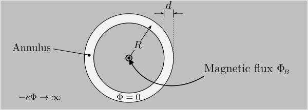
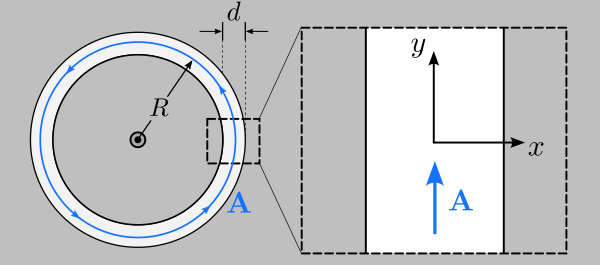
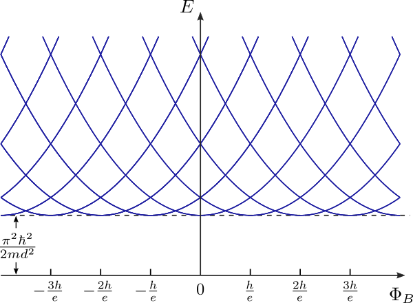
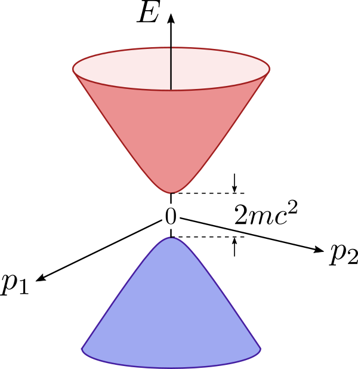
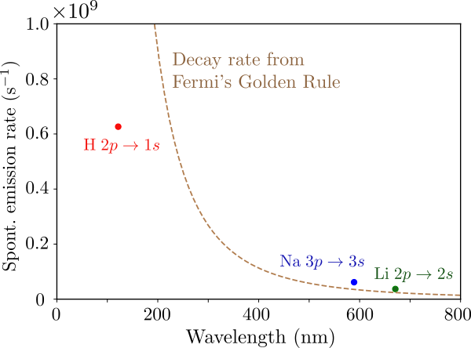

# Quantum Electrodynamics {#sec-qed}

This chapter gives an introduction to **quantum
  electrodynamics**, the quantum theory of the electromagnetic field
and its interactions with electrons and other charged particles.  We
begin by formulating a quantum Hamiltonian for an electron in a
classical electromagnetic field.  Then we study how to quantize
Maxwell's equations, arriving at a quantum field theory in which the
elementary excitations are photons---particles of light.  The final
step is to formulate a theory in which electrons and photons are
treated on the same quantum mechanical footing, as excitations of
underlying quantum fields.  Along the way, we will see how relativity
can be accommodated with quantum theory.

Quantum electrodynamics is an extremely rich and intricate theory, and
we will leave out many important topics.  Interested readers are
referred to Dyson's 1951 lecture notes on quantum electrodynamics [@dyson], and
Zee's textbook *Quantum Field Theory in a Nutshell* [@zee].

## Quantization of the Lorentz Force Law

### Classical Lagrangian and Hamiltonian {#sec-nonrel}

Consider a charged particle in an electromagnetic field.  As we are
mainly interested in the case where the particle in question is an
electron, we will henceforth take the electric charge to be $-e$,
where $e = 1.602\times10^{-19}\,\mathrm{C}$.  For particles with
charge $q$, simply perform the substitution $e \rightarrow -q$ in the
formulas appearing in this chapter.

Let us formulate the Hamiltonian governing the quantum dynamics of
such a particle, subject to some simplifying assumptions: (i) the
particle has charge and mass but no other relevant mechanical
properties (e.g., we ignore spin); (ii) the electromagnetic field is
treated as a classical field, meaning that the electric and magnetic
field vectors are classical field variables, not operators; and (iii)
the mechanics is non-relativistic.  We will later see how to go beyond
each of these simplifications.

Classically, the electromagnetic field acts on the particle via the
Lorentz force law,
$$\mathbf{F}(\mathbf{r},t) = -e\Big(\mathbf{E}(\mathbf{r},t)
  + \dot{\mathbf{r}}\times \mathbf{B}(\mathbf{r},t)\Big),$$
where $\mathbf{r}$ and $\dot{\mathbf{r}}$ denote the position and
velocity of the particle, $t$ is the time, and $\mathbf{E}$ and
$\mathbf{B}$ are the electric and magnetic fields.  With no other
forces present, and in the non-relativistic limit, the equation of
motion can be derived using Newton's second law:
$$m\ddot{\mathbf{r}} = -e\Big(\mathbf{E}(\mathbf{r},t)
  + \dot{\mathbf{r}} \times \mathbf{B}(\mathbf{r},t)\Big),$${#eq-qed-eom}
where $m$ is the particle's mass.

We assert that @eq-qed-eom can be derived from the Lagrangian
$$L(\mathbf{r},\dot{\mathbf{r}},t) = \frac{1}{2}m |\dot{\mathbf{r}}|^2
  + e \Big[\Phi(\mathbf{r},t) - \dot{\mathbf{r}} \cdot \mathbf{A}(\mathbf{r},t)
    \Big],$${#eq-qed-Lag}
where $\Phi$ and $\mathbf{A}$ are the scalar and vector potentials,
which are related to $\mathbf{E}$ and $\mathbf{B}$ by
$$\begin{aligned}
  \mathbf{E}(\mathbf{r},t) &= - \nabla \Phi(\mathbf{r},t) - \frac{\partial\mathbf{A}}{\partial t}, \\
  \mathbf{B}(\mathbf{r},t) &= \nabla \times \mathbf{A}(\mathbf{r},t).
  \end{aligned}$${#eq-qed-EBfield0}
Roughly speaking, @eq-qed-Lag follows the usual prescription that
the Lagrangian is "the kinetic energy minus the potential energy."
In this case, the "potential energy" consists of a term contributed
by the electric potential, $-e\Phi$, and a term $e\dot{\mathbf{r}}
\cdot \mathbf{A}$ that seems to describe a coupling between the
electron's velocity and the vector potential.

To show that this is the right Lagrangian, we want to verify that the
equation of motion @eq-qed-eom is equivalent to the Euler-Lagrange
equations
$$\frac{\partial L}{\partial r_i} = \frac{d}{dt}
  \frac{\partial L}{\partial \dot{r}_i},$${#eq-qed-EulerLagrange}
where $r_i$ denotes the $i$-th component of $\mathbf{r}$.  From
@eq-qed-Lag, the partial derivatives of $L$ are
$$\begin{aligned}
  \frac{\partial L}{\partial r_i} &=
  e\Big[\partial_i \Phi - \sum_j \dot{r}_j \,\partial_i A_j \Big],\\
  \frac{\partial L}{\partial \dot{r}_i} &= m\dot{r}_i - e A_i,
  \end{aligned}$${#eq-qed-dLdrdv}
where $\partial_i \equiv \partial/\partial r_i$.  Next, we want to
apply the total time derivative, $d/dt$, to the second of
@eq-qed-dLdrdv.  In
doing this, note that the $\mathbf{A}$ field felt by the particle
varies with $t$ via $\mathbf{r}(t)$, as well as the $t$-dependence of
the field itself.  By the chain rule of total derivatives,
$$\begin{aligned}
    \frac{d}{dt} \frac{\partial L}{\partial \dot{r}_i}
    &= m\ddot{r}_i - e\, \frac{d}{dt} A_i(\mathbf{r}(t),t) \\
    &= m\ddot{r}_i - e\, \frac{\partial A_i}{\partial t}
    - e\, \sum_j \dot{r}_j \partial_j A_i.
  \end{aligned}$${#eq-qed-dLdt}
Plugging @eq-qed-dLdrdv and @eq-qed-dLdt into
@eq-qed-EulerLagrange gives
$$m\ddot{r}_i =
  -e\left[\left(-\partial_i \Phi - \frac{\partial A_i}{\partial t}\right)
    + \sum_j \dot{r}_j \Big( \partial_i A_j - \partial_j A_i\Big) \right].$${#eq-qed-mvtmp}
We want to compare this to the equation of motion @eq-qed-eom.  The
latter is expressed in terms of $\mathbf{E}$ and $\mathbf{B}$, so we
first re-express it using $\Phi$ and $\mathbf{A}$ via
@eq-qed-EBfield0.  The $\mathbf{E}$ term then
matches the first term in the square brackets in @eq-qed-mvtmp.
The $\dot{\mathbf{r}}\times\mathbf{B}$ term, which produces the
magnetic force, needs a bit more manipulation.  Using the Levi–Civita
symbol,
$$\begin{aligned}
  (\dot{\mathbf{r}} \times \mathbf{B})_i &=
  \sum_{jk} \varepsilon_{ijk} \dot{r}_j B_k \\
  &= \sum_{jk} \varepsilon_{ijk} \dot{r}_j \left(\sum_{pq} \varepsilon_{kpq} \partial_p A_q  \right) \\
  &= \sum_{jpq} \left(\sum_k \varepsilon_{ijk} \varepsilon_{pqk}\right)
  \dot{r}_j  \partial_p A_q.
  \end{aligned}$${#eq-qed-vBtmp}
Next, we use the identity
$$\sum_k \varepsilon_{ijk} \varepsilon_{pqk}
  = \delta_{ip} \delta_{jq} - \delta_{iq} \delta_{jp}.$$
This allows us to simplify @eq-qed-vBtmp into
$$(\dot{\mathbf{r}} \times \mathbf{B})_i
  = \sum_{j} \left( \dot{r}_j  \partial_i A_j - \dot{r}_j  \partial_j A_i\right),$$
which matches the second term in the square brackets in
@eq-qed-mvtmp, as desired.

We now proceed to Hamiltonian mechanics.  Following the usual
procedure, we first define the canonical momentum, $p_i = \partial
L/\partial \dot{r}_i$.  Using the Lagrangian @eq-qed-Lag, we obtain
$$m \dot{\mathbf{r}} = \mathbf{p} + e \mathbf{A}(\mathbf{r},t).$${#eq-qed-canonp}
The Hamiltonian is then defined as
$$H(\mathbf{r},\mathbf{p}) = \mathbf{p} \cdot \dot{\mathbf{r}} - L.$${#eq-qed-Hdef}
We plug @eq-qed-Lag and @eq-qed-canonp into @eq-qed-Hdef, to
express $H$ in terms of $\mathbf{r}$ and $\mathbf{p}$, without
$\dot{\mathbf{r}}$:
$$\begin{aligned}
  H &= \mathbf{p}\cdot \left(\frac{\mathbf{p}+e\mathbf{A}}{m}\right)
  - \left(\frac{|\mathbf{p}+e\mathbf{A}|^2}{2m}
  + e\Phi - \frac{e}{m}(\mathbf{p}+e\mathbf{A})\cdot \mathbf{A}\right) \\
  &= \frac{|\mathbf{p}+e\mathbf{A}(\mathbf{r},t)|^2}{2m} - e\Phi(\mathbf{r},t).
  \end{aligned}$${#eq-qed-H0}
Let us compare the result @eq-qed-H0 to the Hamiltonian for a
non-relativistic particle in a scalar potential,
$$H = \frac{|\mathbf{p}|^2}{2m} + V(\mathbf{r},t).$$
The $-e\Phi$ term acts like a potential energy, which is no surprise.
More interestingly, the vector potential enters into the kinetic
energy term, through the substitution
$$\mathbf{p} \rightarrow \mathbf{p} + e\mathbf{A}(\mathbf{r},t).$$

Why does the vector potential manifest as some kind of momentum shift?
This can be traced back to @eq-qed-canonp, which says that in the
presence of a vector potential, the quantity
$m\dot{\mathbf{r}}$---which we normally think of as the "kinetic
momentum" giving rise to the particle's kinetic energy---differs from
the canonical momentum $\mathbf{p}$ by a shift of $e\mathbf{A}$.
Recall that the concept of canonical momentum is tied to Noether's
theorem, which states that any symmetry of a system is associated with
a conservation law.  For translational symmetry, the conserved
quantity is the canonical momentum.  Hamilton's equation,
$$\frac{dp_i}{dt} = - \frac{\partial H}{\partial r_i},$$
implies that if $H$ is $\mathbf{r}$-independent, $d\mathbf{p}/dt = 0$.
However, for a particle in a vector potential, even if $\mathbf{A}$ is
$\mathbf{r}$-independent (i.e., translationally symmetric),
$m\dot{\mathbf{r}}$ is *not* necessarily conserved!  For
example, consider the $\mathbf{r}$-independent potentials
$$\Phi(\mathbf{r}, t) = 0, \;\;\; \mathbf{A}(\mathbf{r}, t) = Ct \hat{z},$$
where $C$ is some constant.  Thanks to the $t$-dependence in the
$\mathbf{A}$ potential, plugging these potentials into
@eq-qed-EBfield0 gives a non-vanishing electric
field:
$$\mathbf{E}(\mathbf{r},t) = - C\hat{z}, \;\;\;\mathbf{B}(\mathbf{r},t) = 0.$$
Therefore, $m\dot{\mathbf{r}}$ is not conserved:
$$\frac{d}{dt}(m\dot{\mathbf{r}}) = eC\hat{z}.$$
On the other hand, the canonical momentum defined in
@eq-qed-canonp is conserved:
$$\frac{d\mathbf{p}}{dt} =
  \frac{d}{dt}(m\dot{\mathbf{r}} - e\mathbf{A}) =
  eC\hat{z} - eC\hat{z} = 0.$$

### Quantum Hamiltonian

From the classical Hamiltonian @eq-qed-H0, we can formulate the
Hamiltonian operator for a nonrelativistic quantum particle in an
electromagnetic field.  As usual, the quantization procedure merely
involves replacing the $\mathbf{r}$ and $\mathbf{p}$ variables with
$\hat{\mathbf{r}}$ and $\hat{\mathbf{p}}$ operators:
$$\hat{H} = \frac{|\hat{\mathbf{p}}+e\mathbf{A}(\hat{\mathbf{r}},t)|^2}{2m}
    - e\Phi(\hat{\mathbf{r}},t).$${#eq-qed-quantumH}
Both the scalar and vector potential terms are functions of the
position operator $\hat{\mathbf{r}}$, so if we want to expand the
square in the first term of @eq-qed-quantumH, it is important to
note that $\hat{\mathbf{p}}$ and $\mathbf{A}(\hat{\mathbf{r}},t)$ need
not commute:
$$\begin{aligned}
  \big|\hat{\mathbf{p}}+e\mathbf{A}(\hat{\mathbf{r}},t)\big|^2
  &= \sum_j \Big[\hat{p}_j + e A_j(\hat{\mathbf{r}},t)\Big] \,
  \Big[\hat{p}_j + e A_j(\hat{\mathbf{r}},t)\Big]\\
  &= \sum_j \Big( \hat{p}_j^2
  + e\, \big[\hat{p}_j A_j(\hat{\mathbf{r}},t) + A_j(\hat{\mathbf{r}},t) p_j\big]
  + e^2A_j^2(\hat{\mathbf{r}},t)^2 \Big).
  \end{aligned}$${#eq-qed-pexpansion}
For example, if we are working in the position representation (i.e.,
using wavefunctions), then $\hat{\mathbf{p}} = -i\hbar\nabla$.  When
dealing with $\hat{p}_j A_j(\mathbf{r},t)$, the gradient in the
momentum operator applies to everything on its right, i.e., both $A_j$
and the wavefunction.  By the product rule,
$$\hat{p}_j A_j(\mathbf{r},t) \psi(\mathbf{r},t)
  = -i\hbar \left[\frac{\partial A_j}{\partial r_j} + A_j \frac{\partial}{\partial r_j}\right] \psi(\mathbf{r},t).$$
Thus, in the position representation, @eq-qed-pexpansion can also
be written as
$$\big|\hat{\mathbf{p}}+e\mathbf{A}\big|^2
  = - \hbar^2 \nabla^2
  - 2 i \hbar e \mathbf{A} \cdot \nabla
  - i \hbar e \left(\nabla\cdot \mathbf{A}\right)
  + e^2|\mathbf{A}|^2.$$

### Gauge symmetry {#sec-gauge}

It is interesting that the Hamiltonian @eq-qed-quantumH is expressed
in terms of the scalar and vector potentials, $\Phi$ and $\mathbf{A}$.
In classical electromagnetism, it is known that $\Phi$ and
$\mathbf{A}$ do not uniquely define the $\mathbf{E}$ and $\mathbf{B}$
fields.  Suppose we perform a **gauge transformation** on the
potentials,
$$\begin{aligned}
  \Phi(\mathbf{r},t) &\rightarrow \Phi(\mathbf{r},t) - \dot{\Lambda}(\mathbf{r},t) \\
  \mathbf{A}(\mathbf{r},t) &\rightarrow
  \mathbf{A}(\mathbf{r},t) + \nabla{\Lambda}(\mathbf{r},t),
  \end{aligned}$${#eq-qed-gauge-subst}
where $\Lambda(\mathbf{r},t)$ is an arbitrary scalar field.  Plugging
these into @eq-qed-EBfield0, we find that the
$\mathbf{E}$ and $\mathbf{B}$ fields are unchanged; thus, the gauge
transformation has no effect on the dynamics of any charged particle
interacting with the electromagnetic field.

In the quantum theory, this feature manifests as a subtle symmetry of
the Hamiltonian, called **gauge symmetry**.  Let us insert the
gauge transformed potentials
@eq-qed-gauge-subst into the Hamiltonian
@eq-qed-quantumH.  This results in the transformed Hamiltonian
$$\hat{H}_\Lambda
  = \frac{|\hat{\mathbf{p}}+e\mathbf{A}(\hat{\mathbf{r}},t) + e\nabla\Lambda(\hat{\mathbf{r}},t)|^2}{2m}
  - e\Phi(\hat{\mathbf{r}},t) + e\dot{\Lambda}(\hat{\mathbf{r}},t).$${#eq-qed-Hlambda}
We will work in the position representation.  Suppose the wavefunction
$\psi(\mathbf{r},t)$ is a solution to the Schrödinger wave equation
under the original Hamiltonian,
$$i\hbar\frac{\partial\psi}{\partial t} =
  \hat{H} \psi(\mathbf{r},t).$${#eq-qed-origschrod}
Then we assert that there is a corresponding solution for the gauge
transformed Hamiltonian:
$$\begin{aligned}
  i\hbar\frac{\partial \psi_\Lambda}{\partial t} &=
  \hat{H}_\Lambda \psi_\Lambda(\mathbf{r},t), \\
  \psi_\Lambda(\mathbf{r},t) &=
  \psi(\mathbf{r}, t)\, \exp\left(-\frac{ie\Lambda(\mathbf{r}, t)}{\hbar}\right).
  \end{aligned}$${#eq-qed-gaugeschrod}

To prove this, observe how time and space derivatives act on $\psi_\Lambda$:
$$\begin{aligned}
    \frac{\partial}{\partial t} \left[\psi \, \exp\left(-\frac{ie\Lambda}{\hbar}\right)\right] &=
    \left[\frac{\partial\psi}{\partial t} \;-\; \frac{ie}{\hbar} \dot{\Lambda}\, \psi
      \,\, \right] \exp\left(\frac{ie\Lambda}{\hbar}\right)\\
    \nabla \left[\psi \, \exp\left(-\frac{ie\Lambda}{\hbar}\right)\right] &=
    \left[\nabla \psi - \frac{ie}{\hbar} \nabla \Lambda \,\psi \right] \exp\left(-\frac{ie\Lambda}{\hbar}\right).
  \end{aligned}$$
When the extra terms generated by the $\exp(-ie\Lambda/\hbar)$ factor
are slotted into the Schrödinger equation, they cancel the gauge
terms in the scalar and vector potentials.  For example,
$$\Big(-i\hbar\nabla + e\mathbf{A} + e\nabla\Lambda\Big)
  \left[\psi \, \exp\left(-\frac{ie\Lambda}{\hbar}\right)\right] =
  \Big[\left(-i\hbar\nabla + e\mathbf{A}\right)\psi\Big]\;
  \exp\left(-\frac{ie\Lambda}{\hbar}\right)$${#eq-qed-first-gauge-action}
If we apply $(-i\hbar\nabla + e\mathbf{A} + e\nabla\Lambda)$ another
time, it has a similar effect, but with the quantity in square
brackets on the right-hand side of @eq-qed-first-gauge-action
taking the place of $\psi$.  Hence,
$$\Big|-i\hbar\nabla + e\mathbf{A} + e\nabla\Lambda\;\Big|^2
  \left[\psi \, \exp\left(-\frac{ie\Lambda}{\hbar}\right)\right]  
  =   \Big[\left|-i\hbar\nabla + e\mathbf{A}\right|^2\psi\Big]\;
  \exp\left(-\frac{ie\Lambda}{\hbar}\right).$$
By applying this observation to the left and right sides of
@eq-qed-gaugeschrod, we find that it reduces to the original
Schrödinger equation @eq-qed-origschrod.

The above result can be stated in a simpler form if the potential
fields are static.  In this case, the time-independent electromagnetic
Hamiltonian is
$$\hat{H} = \frac{|\hat{\mathbf{p}}+e\mathbf{A}(\hat{\mathbf{r}})|^2}{2m}
  - e\Phi(\hat{\mathbf{r}}).$${#eq-qed-timeindep}
By a time-independent gauge transformation, we can define
$$\hat{H}_\Lambda = \frac{|\hat{\mathbf{p}}+e\mathbf{A}(\hat{\mathbf{r}}) + e\nabla\Lambda(\mathbf{r})|^2}{2m}
  - e\Phi(\hat{\mathbf{r}})$$
Then the gauge symmetry states that
$$\hat{H}\psi(\mathbf{r}) = E \psi(\mathbf{r})
  \quad \Leftrightarrow \quad
  \left\{
  \begin{aligned}
  \hat{H}_\Lambda \psi_\Lambda(\mathbf{r}) &= E \psi_\Lambda(\mathbf{r}), \\
  \psi_\Lambda(\mathbf{r}) &= \psi(\mathbf{r}) \exp\left(-\frac{ie\Lambda(\mathbf{r})}{\hbar}\right).
  \end{aligned}\right.$$
In other words, the gauge transformed Hamiltonian has the same energy
spectrum, and its eigenfunctions are the original eigenfunctions
modified by a phase factor involving $\Lambda(\mathbf{r})$.

### The Aharonov–Bohm effect

The Hamiltonian's gauge symmetry might tempt us to speculate that even
though $\hat{H}$ is expressed using $\Phi$ and $\mathbf{A}$, maybe
only $\mathbf{E}$ and $\mathbf{B}$ actually govern physical behavior,
as is the case in classical electrodynamics.  But this turns out to be
false: quantum electrodynamics depends on the potentials, not just
$\mathbf{E}$ and $\mathbf{B}$.  In particular, a charged particle can
experience $\mathbf{B} = 0$ and yet be affected by the $\mathbf{A}$
field, a phenomenon called the **Aharonov–Bohm effect**.

A setup for realizing the Aharonov–Bohm effect is depicted below.  We
place a particle on a ring, or "annulus," of radius $R$ and width $d
\ll R$.  Outside the annulus, in the regions shaded in gray, the
scalar potential is $\Phi\rightarrow -\infty$; this means the
potential energy is $-e\Phi \rightarrow \infty$, forcing the
wavefunction to vanish.  The wavefunction is thus confined to the
annulus, where we set the scalar potential to be $\Phi = 0$.

{fig-align="center" width="600" fig-alt="Cross-section of a ring-shaped region (annulus) of radius R and width d, with the wavefunction confined to the annulus"}

We assume all fields and wavefunctions to be independent of $z$ (the
out-of-plane direction).  The in-plane position can be expressed using
polar coordinates $(r,\phi)$, such that the annulus is centered at the
coordinate origin.

Suppose we use an infinitesimally thin solenoid to thread a magnetic
flux $\Phi_B$ through the origin.  This can be described by the vector
potential
$$\mathbf{A}(r,\phi) = \frac{\Phi_B}{2\pi r} \, \mathbf{e}_\phi,$${#eq-qed-Asolenoid}
where $\mathbf{e}_\phi$ is the unit vector pointing in the azimuthal
direction.  With this choice of $\mathbf{A}$ field, the magnetic flux
through a loop of radius $r$ around the origin is
$$\oint \mathbf{A} \cdot d\mathbf{r} = \left(\frac{\Phi_B}{2\pi r}\right)
  \cdot (2\pi r)
  = \Phi_B,$$
independent of $r$.  Thus, the magnetic flux density is entirely
concentrated at the origin.  Away from the origin, we have $\mathbf{A}
\ne 0$ and $\mathbf{B} = 0$.

Plugging this $\mathbf{A}$ field into the Hamiltonian
@eq-qed-timeindep, we arrive at the time-independent Schrödinger
wave equation
$$\frac{1}{2m}\left|-i\hbar\nabla+
  \frac{e\Phi_B}{2\pi r} \, \mathbf{e}_\phi\right|^2 \psi(r,\phi)
  = E\psi(r,\phi).$${#eq-qed-ABschrod}
Due to rotational symmetry, the eigenfunctions should have the form
$$\psi(r,\phi) = \psi_0 \, A(r)\, e^{in\phi}, \quad n \in \mathbb{Z}.$${#eq-qed-abansatz}

Since the annulus is very thin ($d \ll R$), let us zoom in on a
representative local segment at $\phi = 0$, as shown below:

{fig-align="center" width="600" fig-alt="Zoomed-in view of a local segment of the annulus, which locally resembles a straight waveguide"}

Locally, the annulus looks like a straight waveguide.  Let us adopt
local Cartesian coordinates $x = r - R$ and $y = R\phi$.  Now
$\mathbf{A}$ points in the $y$ direction, so @eq-qed-ABschrod
reduces to
$$\left[-\frac{\hbar^2}{2m} \frac{\partial^2}{\partial x^2}
    + \frac{1}{2m} \left(-i\hbar \frac{\partial}{\partial y} +
    \frac{e\Phi_B}{2\pi R} \right)^2 \right] \psi(x, y) \approx E \psi(x, y).$${#eq-qed-ABschrod2}
Meanwhile, the ansatz @eq-qed-abansatz reduces to
$$\psi(x,y) = A(x) e^{iny/R},$$
which is a waveguide mode with transverse profile $A(x)$ and
wavenumber $k_y = n/R$.  This allows us to substitute
$\partial/\partial y \rightarrow in/R$ in @eq-qed-ABschrod2,
giving
$$\left[-\frac{\hbar^2}{2m} \frac{\partial^2}{\partial x^2} +
    \frac{1}{2m} \left(\frac{n\hbar}{R} +
    \frac{e\Phi_B}{2\pi R} \right)^2 \right] A(x) = E A(x).$${#eq-qed-ABschrod3}
Since the wavefunction vanishes on the inner and outer walls of the
annulus, the transverse profile must satisfy
$$A(\pm d/2) = 0.$${#eq-qed-rboundcond}
We pick the solution $A(x) = \cos(\pi x / d)$, which corresponds to
the fundamental waveguide mode.  Applying this to
@eq-qed-ABschrod3 yields
$$\begin{aligned}
  E &= \frac{1}{2m} \left[
    \left(\frac{n\hbar}{R} + \frac{e\Phi_B}{2\pi R}\right)^2
    + \left(\frac{\pi\hbar}{d}\right)^2 \right] \\
  &= \frac{e^2}{8\pi^2mR^2} \left(\Phi_B + \frac{nh}{e} \right)^2
  + \frac{\pi^2\hbar^2}{2md^2}.
  \end{aligned}$${#eq-qed-abcurves}
There is an infinite set of solutions, indexed by $n \in \mathbb{Z}$.
For each $n$, the energy varies quadratically with the magnetic flux
$\Phi_B$, with an $n$-dependent $\Phi_B$ offset and a constant energy
offset.  The spectrum is plotted against $\Phi_B$ below:

{fig-align="center" width="600" fig-alt="Energy eigenvalues plotted against the magnetic flux Phi_B, showing a set of parabolas offset from each other"}

Evidently, varying $\Phi_B$ affects the energy eigenvalues, in spite
of the fact that the electron resides in the annulus where $\mathbf{B}
= 0$.  This is the Aharonov–Bohm effect.

A further noteworthy feature of this spectrum is that if $\Phi_B$
changes by a multiple of the constant $h/e$ (called the
**magnetic flux quantum**), the spectrum is left unchanged.  This
invariance property turns out to be tied to gauge symmetry.
@eq-qed-Asolenoid says that if an extra flux $nh/e$ (where
$n\in\mathbb{Z}$) is threaded through the annulus, the vector
potential changes by $\Delta \mathbf{A} = (n\hbar/ e r)
\mathbf{e}_\phi$.  But we can undo this via the following gauge
transformation:
$$\Lambda(r,\phi) = - \frac{n\hbar}{e} \, \phi \;\;\;\Rightarrow
  \begin{cases}\nabla \Lambda &= \displaystyle - (n\hbar/er) \, \mathbf{e}_\phi
    \\ \displaystyle e^{-ie\Lambda/\hbar} &= \displaystyle e^{in\phi}.
  \end{cases}$$
Note that $\Lambda$ is not single-valued, but that's not a problem, as
both $\nabla\Lambda$ and $\exp(-ie\Lambda/\hbar)$, which enter into
the gauge symmetry relations @eq-qed-Hlambda and @eq-qed-gaugeschrod, are
single-valued.

Remarkably, this gauge argument does not require the electron to live
on an annulus; we can consider a confinement region of any shape, so
long as it encircles the magnetic flux.  In general, the energy
spectrum need not be given by @eq-qed-abcurves, but the gauge
argument says that it must be invariant under a flux change of $\Delta
\Phi_B = n h/e$.

This invariance property is also closely related to a famous argument
by Dirac, showing that if there exists a magnetic monopole---a
hypothetical particle that produces a magnetic field $\mathbf{B} =
(\mu/4\pi r^2)\, \mathbf{e}_r$---then its magnetic charge $\mu$ must
be a multiple of $h/e$.  Conversely, if there exists a single magnetic
monopole of charge $\mu$ anywhere in the universe, electric charges
must come in multiples of $h/\mu$, which could be regarded as an
explanation for the quantization of electric charge [@monopole].

## Dirac's Theory of the Electron

### The Dirac Hamiltonian {#sec-DiracH}

So far, we have been using $p^2/2m$-type Hamiltonians, which are
limited to describing non-relativistic particles.  In 1928, Paul Dirac
formulated a Hamiltonian that can describe electrons moving close to
the speed of light, thus successfully combining quantum theory with
special relativity. Another triumph of Dirac's theory is that it
accurately predicts the magnetic moment of the electron.

Dirac's theory begins from the time-dependent Schrödinger wave
equation,
$$i\hbar\, \partial_t\, \psi(\mathbf{r},t)
  = \hat{H} \psi(\mathbf{r},t).$${#eq-qed-schrod}
Note that the left side has a first-order time derivative.  On the
right, the Hamiltonian $\hat{H}$ contains spatial derivatives in the
form of momentum operators.  We know that time and space derivatives
of the wavefunction are related to energy and momentum, respectively:
$$i\hbar\, \partial_t\; \leftrightarrow \;
    E, \qquad
    -i\hbar\, \partial_j \;\leftrightarrow \;
    p_j.$$
We also know that the energy and momentum of a relativistic particle
are related by
$$E^2 = m^2c^4 + \sum_{j=1}^3 p_j^2c^2,$${#eq-qed-Erelativistic}
where $m$ is the rest mass and $c$ is the speed of light.  (Following
the usual practice in relativity theory, we use Roman indices $j \in
\{1,2,3\}$ for the spatial coordinates $\{x,y,z\}$.)

Since the left side of @eq-qed-schrod has a first-order time
derivative, we guess that the Hamiltonian on the right should involve
first-order spatial derivatives.  Let us take
$$\hat{H} = \alpha_0 mc^2 + \sum_{j=1}^3 \alpha_j \hat{p}_j c,$${#eq-qed-Dirac0}
where $\hat{p}_j \equiv -i\hbar \partial_j$.  The $mc^2$ and $c$
factors are placed for later convenience.  To determine the
dimensionless "coefficients" $\alpha_0$, $\alpha_1$, $\alpha_2$, and
$\alpha_3$, consider a wavefunction with definite energy $E$ and
momentum $\mathbf{p}$:
$$\left\{\begin{aligned}\hat{H}\psi &= E \psi \\
  \hat{p}_i \psi &= p_i \psi
  \end{aligned}\right.
    \;\;\;\Rightarrow \;\;\;
  \left(\alpha_0mc^2 + \sum_{j=1}^3\alpha_j p_jc\right) \psi = E\,\psi.$$
If $\psi$ is a scalar, this would imply that
$$\alpha_0 mc^2 + \sum_{j}\alpha_j p_j c = E$$
for certain scalar coefficients $\{\alpha_0, \dots, \alpha_3\}$, which
does not match @eq-qed-Erelativistic at all!

But we can get things to work if $\psi(\mathbf{r},t)$ is a
multi-component wavefunction, rather than a scalar wavefunction, and
the $\alpha$'s are matrices acting on those components via the
matrix-vector product operation.  In that case,
$$\hat{H} = \hat{\alpha}_0 mc^2 + \sum_{j=1}^3 \hat{\alpha}_j \hat{p}_j c,
    \;\; \mathrm{where}\;\; \hat{p}_j \equiv -i\hbar\, \partial_j,$${#eq-qed-Dirac}
where the hats on $\{\hat{\alpha}_0, \dots, \hat{\alpha}_3\}$ indicate
that they are matrix-valued.  Applying the Hamiltonian twice gives
$$\Big(\hat{\alpha}_0mc^2 + \sum_{j}\hat{\alpha}_j p_j c\Big)^{\!2}\;
  \psi = E^2\,\psi.$$
This can be satisfied if
$$\Big(\hat{\alpha}_0 mc^2 + \sum_{j}\hat{\alpha}_j p_j c\Big)^2
  = E^2\, \hat{I},$$
where $\hat{I}$ is the identity matrix.  Expanding the square (and
taking care of the fact that the $\hat{\alpha}_\mu$ matrices need not
commute) yields
$$\hat{\alpha}_0^2 m^2c^4
  + \sum_j \left(\hat{\alpha}_0 \hat{\alpha}_j + \hat{\alpha}_j \hat{\alpha}_0\right) mc^3 p_j
  + \sum_{jj'} \hat{\alpha}_j \hat{\alpha}_{j'} \, p_j p_{j'} \,c^2 = E^2\hat{I}.$$
This reduces to @eq-qed-Erelativistic if the $\hat{\alpha}_\mu$
matrices satisfy
$$\begin{aligned}
    \hat{\alpha}_\mu^2 &= \hat{I} \;\;\; \textrm{for} \;\;\mu=0,1,2,3,
    \;\;\textrm{and} \\
    \hat{\alpha}_\mu \hat{\alpha}_\nu
    + \hat{\alpha}_\nu \hat{\alpha}_\mu &= 0
    \;\;\; \textrm{for} \;\;\mu \ne \nu.
  \end{aligned}$$
(We use Greek symbols for indices ranging over the four spacetime
coordinates $\{0,1,2,3\}$.)  The above can be written more concisely
using the anticommutator:
$$\{\hat{\alpha}_\mu, \hat{\alpha}_\nu\} = 2\delta_{\mu\nu},
  \;\;\; \textrm{for} \;\;\mu,\nu=0,1,2,3.$${#eq-qed-Dirac-anticomm}
Also, we need the $\hat{\alpha}_\mu$ matrices to be Hermitian, so that
$\hat{H}$ is Hermitian.

It turns out that the smallest possible Hermitian matrices that can
satisfy @eq-qed-Dirac-anticomm are $4\times4$ matrices.  The
choice of matrices (or "representation") is not uniquely determined.
One particularly useful choice is called the **Dirac
  representation**:
$$\begin{aligned}
    \hat{\alpha}_0 &= \begin{bmatrix}
      \hat{I}\, & \hat{0} \\ \hat{0} & -\hat{I}
    \end{bmatrix}, \;\;\;
    \hat{\alpha}_1 = \begin{bmatrix}
      \hat{0} & \hat{\sigma}_1 \\ \hat{\sigma}_1 & \hat{0}
    \end{bmatrix} \\
    \hat{\alpha}_2 &= \begin{bmatrix}
      \hat{0} & \hat{\sigma}_2 \\ \hat{\sigma}_2 & \hat{0}
    \end{bmatrix}, \;\;\;
    \hat{\alpha}_3 = \begin{bmatrix}
      \hat{0} & \hat{\sigma}_3 \\ \hat{\sigma}_3 & \hat{0}
    \end{bmatrix},
  \end{aligned}$${#eq-qed-alpha-matrices}
where $\{\hat{\sigma}_{1}, \hat{\sigma}_{2}, \hat{\sigma}_{3}\}$
denote the usual Pauli matrices.  Since the $\hat{\alpha}_\mu$'s are
$4\times4$ matrices, the field $\psi(\mathbf{r})$, at each point
$\mathbf{r}$, is a four-component object, called a **spinor**
(it's not a vector since its behaves differently under coordinate
transformations; we won't get into the details).

### Eigenstates of the Dirac Hamiltonian {#sec-deigenstates}

According to @eq-qed-Erelativistic, the energy eigenvalues of the
Dirac Hamiltonian are
$$E = \pm \sqrt{m^2c^4 + \sum_{j} p_j^2c^2}.$${#eq-qed-Edispdirac}
This is plotted below:

{fig-align="center" width="500" fig-alt="Energy versus momentum for the Dirac Hamiltonian, consisting of an upper hyperbola (positive energy) and a lower hyperbola (negative energy)"}

The energy spectrum forms two hyperbolas.  The upper hyperbola matches
the standard dispersion relation for a massive relativistic particle.
But what about the negative-energy hyperbola?  Nobody ordered that,
and we might be tempted to simply ignore the negative-energy states,
focusing only on the positive-energy states.  However, this becomes
untenable once we couple the electron to additional systems like the
electromagnetic field: even if the electron starts with $E > 0$, it
can hop to the negative-energy hyperbola by shedding energy into the
external system.  This seems like a glaring problem, but let us wait
till @sec-positrons to discuss how to resolve it.

Notice also that for each $\mathbf{p}$, the Dirac Hamiltonian reduces
to a $4\times4$ matrix, so there are four orthogonal eigenstates.
Hence, both energy hyperbolas are two-fold degenerate.  The four
degrees of freedom (two from the choice of positive/negative $E$, two
from the degeneracy) are related to the four spinor components in a
somewhat subtle way.  To help understand this, let us adopt the Dirac
representation @eq-qed-alpha-matrices, and divide the spinor as
follows:
$$\psi(\mathbf{r},t) = \begin{bmatrix}\psi_A(\mathbf{r},t)
    \\ \psi_B(\mathbf{r},t)
  \end{bmatrix},$${#eq-qed-diracdivision}
where $\psi_A$ and $\psi_B$ have two components each.  Using the Dirac
Hamiltonian @eq-qed-Dirac, we derive
$$\begin{aligned}
  \psi_A &= \frac{1}{E - mc^2} \sum_j \hat{\sigma}_j p_jc\, \psi_B, \\
  \psi_B &= \frac{1}{E + mc^2} \sum_j \hat{\sigma}_j p_jc\, \psi_A.
  \end{aligned}$${#eq-qed-dirac-nonrel}
For $|\mathbf{p}| \rightarrow 0$, $E$ approaches either $mc^2$ or
$-mc^2$.  On the upper hyperbola ($E \sim mc^2$), the vanishing of the
denominator in the first of @eq-qed-dirac-nonrel implies that $\psi_A$
dominates the wavefunction, with $\psi_B \sim 0$.  On the lower
hyperbola ($E \sim -mc^2$), $\psi_B$ dominates, with $\psi_A \sim 0$.
In the next section, we will develop this further and show that the
two-fold degree of freedom of each sub-spinor, $\psi_A$ and $\psi_B$,
corresponds to the electron's spin.

However, this association only holds in the non-relativistic limit!
In the relativistic regime, $|\mathbf{p}| \sim |E| \gg mc^2$,
@eq-qed-dirac-nonrel imply that
$|\psi_A| \sim |\psi_B|$ for both positive-energy and negative-energy
eigenstates.  (There does exist a way to make the upper/lower spinor
components correspond rigorously to positive/negative $E$, but this
requires adopting a more complicated matrix representation [@foldy].)

### Dirac electron in an electromagnetic field {#sec-diracem}

Let us next look at how Dirac's electron interacts with an
electromagnetic field.  To introduce the electromagnetic field into
the theory, we follow the same procedure as in the non-relativistic
theory (@sec-nonrel): add $-e\Phi(\mathbf{r},t)$ as a
scalar potential function, and add the vector potential via the
substitution
$$\hat{\mathbf{p}} \rightarrow \hat{\mathbf{p}}
  + e\mathbf{A}(\hat{\mathbf{r}},t).$$
Applying this recipe to the Dirac Hamiltonian @eq-qed-Dirac yields
$$i\hbar \, \partial_t \psi
  = \left\{\hat{\alpha}_0 mc^2 -e\Phi(\mathbf{r},t)
  + \sum_{j} \hat{\alpha}_j \Big[-i\hbar\,\partial_j
    +eA_j(\mathbf{r},t) \Big] c\right\}\psi(\mathbf{r},t).$${#eq-qed-DiracEM}
You can check that this has the same gauge symmetry properties as the
non-relativistic theory discussed in @sec-gauge.

We now take the Dirac representation @eq-qed-alpha-matrices.
Moreover, following @eq-qed-diracdivision, let $\psi_A$ and
$\psi_B$ denote the Dirac wavefunction's upper and lower
components (each having two components).  Then @eq-qed-DiracEM
reduces to
$$\begin{aligned}
  i\hbar\, \partial_t \, \psi_A
  &= \big(+mc^2 -e\Phi \big)\,
  \psi_A
  \,+\, \sum_{j} \hat{\sigma}_j \big(-i\hbar\partial_j
    +eA_j \big) \,c\;\psi_B \\
  i\hbar\, \partial_t \, \psi_B
  &= \big(- mc^2 -e\Phi\big)\,
  \psi_B \,+\, \sum_{j} \hat{\sigma}_j \big(-i\hbar\partial_j
    +eA_j \big)\, c\;\psi_A, \end{aligned}$${#eq-qed-Dirac2}
In the non-relativistic limit, we can seek solutions of the form
$$\begin{aligned}
  \psi_{A/B}(\mathbf{r},t) &= \Psi_{A/B}(\mathbf{r},t)\,
  \exp\left[-i\left(\frac{mc^2}{\hbar}\right)t\right].
  \end{aligned}$$
The phase factor on the right side comes from the rest energy $mc^2$.
This is assumed to be by far the largest energy scale in the problem,
corresponding to a fast oscillation.  (By using $mc^2$ rather than
$-mc^2$, we are focusing on the positive-energy states.)  The
functions $\Psi_A$ and $\Psi_B$ are "slowly-varying envelopes",
which have $t$-dependences much slower than the phase factor.  When
$\mathbf{p} = 0$ and $\Phi = \mathbf{A} = 0$, they reduce to
constants.

Plugging this ansatz into @eq-qed-Dirac2 gives
$$\begin{aligned}
  i\hbar\, \partial_t \, \Psi_A
  &= -e\Phi\; \Psi_A
  \,+\, \sum_{j} \hat{\sigma}_j \big(-i\hbar\partial_j
    +eA_j \big) c\;\Psi_B \\
  \big(i\hbar\, \partial_t \, + 2mc^2 + e\Phi\big)
  \Psi_B
  &= \sum_{j} \hat{\sigma}_j \big(-i\hbar\partial_j
    +eA_j \big) c\;\Psi_A. \end{aligned}$${#eq-qed-Dirac3}
On the left side of the second equation, the $2mc^2$ term dominates
over the other two, so
$$\Psi_B \;\approx\; \frac{1}{2mc}\, \sum_{j}
  \hat{\sigma}_j \big(-i\hbar\partial_j +eA_j \big) \;\Psi_A.$$
Plugging this into the first equation yields
$$i\hbar\, \partial_t \, \Psi_A
  = \left\{-e\Phi \,+\, \frac{1}{2m} \sum_{jk} \hat{\sigma}_j \hat{\sigma}_k
  \big(-i\hbar\partial_j +eA_j \big)
  \big(-i\hbar\partial_k +eA_k \big) \right\}\;\Psi_A.$$
Using the identity $\hat{\sigma}_j\hat{\sigma}_k = \delta_{jk}\hat{I}
+ i \sum_i \varepsilon_{ijk}\sigma_i$:
$$\begin{aligned}
  i\hbar\, \partial_t \, \Psi_A
  &= \Bigg\{-e\Phi
  \,+\, \frac{1}{2m} \big|-i\hbar\nabla +e\mathbf{A} \big|^2 \\
  &\qquad+\, \frac{i}{2m} \sum_{ijk} \varepsilon_{ijk} \hat{\sigma}_i
  \big(-i\hbar\partial_j +eA_j \big)
  \big(-i\hbar\partial_k +eA_k \big)
  \Bigg\} \Psi_A.
  \end{aligned}$$
Look carefully at the last term in the curly brackets.  Expanding the
square yields
$$\frac{i}{2m}\sum_{ijk}\varepsilon_{ijk}\hat{\sigma}_i
  \Big(- \hbar^2 \partial_j\partial_k -i\hbar e \partial_jA_k
  - i\hbar e \big[A_k\partial_j + A_j\partial_k \big]
  + e^2A_jA_k \Big).$$
Due to the antisymmetry of $\varepsilon_{ijk}$, all terms inside the
parentheses that are symmetric under $j$ and $k$ cancel out when
summed over.  The only survivor is the second term, which gives
$$\frac{\hbar e}{2m}\sum_{ijk}\varepsilon_{ijk}\hat{\sigma}_i
  \partial_jA_k = \frac{\hbar e}{2m} \hat{\boldsymbol{\sigma}}
  \,\cdot\, \mathbf{B}(\mathbf{r},t),$$
where $\mathbf{B} = \nabla\times\mathbf{A}$ is the magnetic field.
Hence,
$$i\hbar\, \partial_t \, \Psi_A
  = \left\{-e\Phi
  \,+\, \frac{1}{2m} \big|-i\hbar\nabla +e\mathbf{A} \big|^2
  \,-\, \left(-\frac{\hbar e}{2m}\, \hat{\boldsymbol{\sigma}}\right)
  \,\cdot\, \mathbf{B} \right\} \Psi_A.$$
On the right side, we see the Hamiltonian for a non-relativistic
electron in an electromagnetic field, @eq-qed-quantumH, but with
an additional term of the form $- \hat{\boldsymbol{\mu}} \cdot
\hat{\mathbf{B}}$.  This new term matches the potential energy of a
magnetic dipole of moment $\boldsymbol{\mu}$ in a magnetic field
$\mathbf{B}$.  Therefore, the theory predicts that the electron has a
magnetic dipole moment of
$$|\boldsymbol{\mu}| = \frac{\hbar e}{2m}.$${#eq-qed-Diracmu}
Remarkably, this matches the experimentally-observed magnetic dipole
moment to about one part in $10^3$.  The residual mismatch between
@eq-qed-Diracmu and the actual magnetic dipole moment of the
electron is understood to arise from quantum fluctuations of the
electronic and electromagnetic quantum fields.  Using the full theory
of quantum electrodynamics, that "anomalous magnetic moment" can
also be calculated and matches experiment to around one part in
$10^{12}$, making it one of the most precise theoretical predictions in
physics [@zee]!

It is noteworthy that we did not set out to include spin in the
theory, yet it arose, seemingly unavoidably, as a by-product of
formulating a relativistic theory of the electron.  This is a
manifestation of the principle that relativistic quantum theory is
more constrained than non-relativistic quantum theory [@dyson].  To satisfy the
relativistic symmetries,
spin cannot be an optional part of the theory---it must be built-in at
a fundamental level.

### Positrons and the Dirac Field {#sec-positrons}

As noted in @sec-deigenstates, the Dirac Hamiltonian has
both positive-energy and negative-energy eigenstates, and the presence
of the negative-energy states threatens to destabilize the
positive-energy states.  To get around this, Dirac suggested that the
"vacuum" might actually be a multi-particle state, called the
**Dirac sea**, in which all negative-energy states are occupied.
Since electrons are fermions, the Pauli exclusion principle forbids
decay into the negative-energy states, thus stabilizing the
positive-energy solutions.

At first blush, the idea seems ridiculous; how can the vacuum contain
an infinite number of particles?  However, we shall see that the idea
becomes more plausible if Dirac's single-particle Hamiltonian is
reinterpreted using quantum field theory.  After all, the Dirac sea
idea is an inherently multi-particle concept, and we know from Chapter
4 that quantum field theory is the natural framework for working with
such ideas.

For the single-particle Dirac Hamiltonian, let $|\mathbf{k}, +,
\sigma\rangle$ denote a positive-energy state of momentum $\hbar
\mathbf{k}$, where $\sigma = 1, 2$ indexes the spin degree of freedom
(i.e., the two-fold degeneracy of each hyperbola).  On the other hand,
let $|\mathbf{k}, -, \sigma\rangle$ denote a negative-energy state of
momentum $-\hbar\mathbf{k}$ (not $\hbar\mathbf{k}$; we will justify
this convention later).  Hence,
$$\hat{H} |\mathbf{k}, \pm, \sigma\rangle
  = \pm E_{\mathbf{k}}\, |\mathbf{k}, \pm, \sigma\rangle,$$
where $E_{\mathbf{k}} = E_{-\mathbf{k}} > 0$ comes from the
relativistic energy-mass-momentum relation @eq-qed-Erelativistic.

Following the second quantization procedure from Chapter 4, we
introduce a fermionic Fock space $\mathscr{H}^F_-$, and a set of
creation/annihilation operators.  We will use different labels for the
positive- and negative-energy states:
$$\begin{aligned}
  \hat{b}_{\mathbf{k}\sigma}^\dagger \;\; \mathrm{and} \;\; \hat{b}_{\mathbf{k}\sigma}
  &\;\;\mathrm{create/annihilate} \;\; |\mathbf{k}, +, \sigma\rangle\\
  \hat{d}_{\mathbf{k}\sigma}^\dagger \;\; \mathrm{and} \;\; \hat{d}_{\mathbf{k}\sigma}
  &\;\;\mathrm{create/annihilate} \;\; |\mathbf{k}, -, \sigma\rangle.
\end{aligned}$$
These obey the fermionic anticommutation relations
$$\begin{aligned}
    \{\hat{b}_{\mathbf{k}\sigma}, \hat{b}_{\mathbf{k}'\sigma'}^\dagger \}
    &= \delta^3(\mathbf{k}-\mathbf{k}') \, \delta_{\sigma\sigma'}, \quad
    \{\hat{d}_{\mathbf{k}\sigma}, \hat{d}_{\mathbf{k}'\sigma'}^\dagger \}
    = \delta^3(\mathbf{k}-\mathbf{k}') \, \delta_{\sigma\sigma'} \\
    \{\hat{b}_{\mathbf{k}\sigma}, \hat{b}_{\mathbf{k}'\sigma'} \} &= 
    \{\hat{b}_{\mathbf{k}\sigma}, \hat{d}_{\mathbf{k}'\sigma'} \} = 
    \{\hat{d}_{\mathbf{k}\sigma}, \hat{d}_{\mathbf{k}'\sigma'} \} = 0, \;\;\textrm{etc.}
  \end{aligned}$${#eq-qed-Diracanticommutation0}
We can then define the multi-particle Hamiltonian
$$\hat{H} = \int d^3k \sum_\sigma E_{\mathbf{k}} \left(
  \hat{b}^\dagger_{\mathbf{k}\sigma} \hat{b}_{\mathbf{k}\sigma}
  - \hat{d}^\dagger_{\mathbf{k}\sigma} \hat{d}_{\mathbf{k}\sigma}
  \right),$${#eq-qed-HDiracQFT0}
where the negative sign inside the integrand accounts for the negative
energy of the $d$-type electrons.  We also have the vacuum state
$|\varnothing\rangle$, which satisfies
$$\hat{b}_{\mathbf{k}\sigma} |\varnothing\rangle =
  \hat{d}_{\mathbf{k}\sigma} |\varnothing\rangle = 0.$${#eq-qed-oldvacuum}

Next, let us define
$$\begin{aligned}
  \hat{c}_{\mathbf{k}\sigma} &= \hat{d}^\dagger_{\mathbf{k}\sigma} \\
  \hat{c}_{\mathbf{k}\sigma}^\dagger &= \hat{d}_{\mathbf{k}\sigma}.
  \end{aligned}$${#eq-qed-positron-ops}
Using these, we can rewrite the anticommutation relations
@eq-qed-Diracanticommutation0 as
$$\begin{aligned}
    \{\hat{b}_{\mathbf{k}\sigma}, \hat{b}_{\mathbf{k}'\sigma'}^\dagger \}
    &= \delta^3(\mathbf{k}-\mathbf{k}') \, \delta_{\sigma\sigma'}, \quad
    \{\hat{c}_{\mathbf{k}\sigma}, \hat{c}_{\mathbf{k}'\sigma'}^\dagger \}
    = \delta^3(\mathbf{k}-\mathbf{k}') \, \delta_{\sigma\sigma'} \\
    \{\hat{b}_{\mathbf{k}\sigma}, \hat{b}_{\mathbf{k}'\sigma'} \} &= 
    \{\hat{b}_{\mathbf{k}\sigma}, \hat{c}_{\mathbf{k}'\sigma'} \} = 
    \{\hat{c}_{\mathbf{k}\sigma}, \hat{c}_{\mathbf{k}'\sigma'} \} = 0, \;\;\textrm{etc.}
  \end{aligned}$${#eq-qed-Diracanticommutators}
This implies that we can treat $\hat{c}^\dagger_{\mathbf{k}\sigma}$
and $\hat{c}_{\mathbf{k}\sigma}$ as creation and annihilation
operators in their own right, taking over from
$\hat{d}_{\mathbf{k}\sigma}$ and $\hat{d}_{\mathbf{k}\sigma}^\dagger$.
The particle created by $\hat{c}^\dagger_{\mathbf{k}\sigma}$ is called
a **positron**.  By definition, the *presence* of a
positron is equivalent to the *absence* of a negative-energy
electron; hence, the positron has *positive* energy.  Indeed,
by converting the $d$'s to $c$'s in @eq-qed-HDiracQFT0, we can
rewrite the Hamiltonian as
$$\begin{aligned}
  \hat{H}   &= \int d^3k \sum_\sigma E_{\mathbf{k}} \left(
  \hat{b}^\dagger_{\mathbf{k}\sigma} \hat{b}_{\mathbf{k}\sigma}
  - \hat{c}_{\mathbf{k}\sigma} \hat{c}^\dagger_{\mathbf{k}\sigma}
  \right) \\
  &= \int d^3k \sum_\sigma E_{\mathbf{k}} \left(
  \hat{b}^\dagger_{\mathbf{k}\sigma} \hat{b}_{\mathbf{k}\sigma}
  + \hat{c}^\dagger_{\mathbf{k}\sigma} \hat{c}_{\mathbf{k}\sigma}
  \right) \;\; + \;\; \textrm{constant}.\end{aligned}$${#eq-qed-HDiracQFT}
(The constant is infinite, but this can be dealt with by standard
regularization tricks.)  Now $\hat{H}$ describes two species of
fermions---$b$-type electrons, which we simply call "electrons", and
positrons---both carrying positive energy.  We can also deduce, via
similar reasoning, that the positron created by
$\hat{c}^\dagger_{\mathbf{k}\sigma}$ has momentum $\hbar \mathbf{k}$
(not $-\hbar \mathbf{k}$, due to how we defined $|\mathbf{k}, -,
\sigma\rangle$), and a positive electric charge $+e$.

The state $|\varnothing\rangle$, defined in @eq-qed-oldvacuum, no
longer serves as the vacuum for this reinterpreted Hamiltonian.  Its
vacuum state $|\varnothing'\rangle$ should satisfy
$$\hat{b}_{\mathbf{k}\sigma} |\varnothing'\rangle =
  \hat{c}_{\mathbf{k}\sigma} |\varnothing'\rangle = 0.$$
Such a state can be constructed from $|\varnothing\rangle$ (or vice
versa):
$$|\varnothing'\rangle
  = \prod_{\mathbf{k}\sigma} \hat{c}_{\mathbf{k}\sigma} |\varnothing\rangle
  = \prod_{\mathbf{k}\sigma} \hat{d}_{\mathbf{k}\sigma}^\dagger
  |\varnothing\rangle.$$
Thus, from the viewpoint of the $b$, $d$ operators,
$|\varnothing'\rangle$ is the "Dirac sea" state, formed by occupying
all the negative-energy states.  From the viewpoint of the $b$, $c$
operators, it is simply a state of no particles.

The next step is to interpret the multi-particle system as a quantum
field.  This must be done with some care, due to the peculiar
relationship between the electron and positron operators.  When
formulating bosonic field theory in Chapter 4, we defined a field
operator
$$\hat{\psi}(\mathbf{r})
  = \int d^3k \; \varphi_{\mathbf{k}}(\mathbf{r}) \, \hat{a}_{\mathbf{k}},$${#eq-qed-psidef-old}
where $\hat{a}_{\mathbf{k}}$ is a bosonic annihilation operator, and
$\varphi_{\mathbf{k}}(\mathbf{r})$ denotes the corresponding
single-particle wavefunction.  In our case, the single-particle
wavefunctions have the form
$$\begin{aligned}
  \langle \mathbf{r}, n | \mathbf{k}, +, \sigma\rangle
  &= \frac{e^{i\mathbf{k}\cdot \mathbf{r}}}{(2\pi)^{3/2}} \, u_{\mathbf{k}\sigma}^n \\
  \langle \mathbf{r}, n | \mathbf{k}, -, \sigma\rangle
  &= \frac{e^{-i\mathbf{k}\cdot \mathbf{r}}}{(2\pi)^{3/2}} \, v_{-\mathbf{k},\sigma}^n
  \end{aligned}$${#eq-qed-Diraces}
where $n = 1, \dots, 4$ indexes the spinor components.  In
the second equation, the sign of the exponent corresponds to momentum
$-\hbar\mathbf{k}$, matching our earlier definition.  For each
$\mathbf{k}$, $u_{\mathbf{k}\sigma}$ and $v_{\mathbf{k},\sigma}$ are
normalized eigenvectors of a single $4\times4$ Hamiltonian matrix, so
they are orthogonal,
$$\sum_n \left(u_{\mathbf{k}\sigma}^n\right)^* u_{\mathbf{k}\sigma'}^n
  = \delta_{\sigma\sigma'}, \quad
  \sum_n \left(v_{\mathbf{k}\sigma}^n\right)^* v_{\mathbf{k}\sigma'}^n
  = \delta_{\sigma\sigma'}, \quad
  \sum_n \left(u_{\mathbf{k}\sigma}^n\right)^* v_{\mathbf{k}\sigma'}^n
  = 0,$$
and satisfy the resolution of the identity,
$$\sum_\sigma \left[
    u_{\mathbf{k}\sigma}^n \big(u_{\mathbf{k}\sigma}^{n'}\big)^*
    + v_{\mathbf{k}\sigma}^n \big(v_{\mathbf{k}\sigma}^{n'}\big)^*\right]
  = \delta_{nn'}.$${#eq-qed-iresolv}

By analogy with @eq-qed-psidef-old, we can use
@eq-qed-Diraces to define the field operator
$$\hat{\psi}_n(\mathbf{r})
  = \int d^3k \sum_\sigma \;
  \left[
    \frac{e^{i\mathbf{k}\cdot \mathbf{r}}}{(2\pi)^{3/2}} \, u_{\mathbf{k}\sigma}^n
    \hat{b}_{\mathbf{k}\sigma}
    +
    \frac{e^{-i\mathbf{k}\cdot \mathbf{r}}}{(2\pi)^{3/2}} \, v_{-\mathbf{k},\sigma}^n
    \hat{d}_{\mathbf{k}\sigma}
    \right].$${#eq-qed-psin-d}
Like the single-particle wavefunctions, the field operator at each
point $\mathbf{r}$ has four components (i.e., it consists of four
distinct operators), indexed by $n$.  Next, in the second term of the
integrand, let us replace the $d$ operators with $c$ operators, and
change variables $k\rightarrow-k$:
$$\hat{\psi}_n(\mathbf{r})
  = \int \frac{d^3k}{(2\pi)^{3/2}} \sum_\sigma \;
  e^{i\mathbf{k}\cdot \mathbf{r}}
  \left( u_{\mathbf{k}\sigma}^n \hat{b}_{\mathbf{k}\sigma}
    + v_{\mathbf{k},\sigma}^n \hat{c}_{-\mathbf{k},\sigma}^\dagger
    \right).$${#eq-qed-psin-c}
Using the electron and positron anticommutation relations
@eq-qed-Diracanticommutators, and the spinor property @eq-qed-iresolv,
we can now prove that
$$\begin{aligned}
  \Big\{\, \hat{\psi}_n(\mathbf{r}) \,,\,
  \hat{\psi}_{n'}^{\dagger}(\mathbf{r}')\, \Big\}
  &= \delta_{nn'}\, \delta^3(\mathbf{r}-\mathbf{r}'), \\
  \Big\{\, \hat{\psi}_n(\mathbf{r}) \,,\, \hat{\psi}_{n'}(\mathbf{r}')\,\Big\}
  &= \Big\{\,\hat{\psi}_n^{\dagger}(\mathbf{r}) \,,\,
  \hat{\psi}_{n'}^{\dagger}(\mathbf{r}')\,\Big\} = 0.  
\end{aligned}$$
These imply that $\hat{\psi}_n(\mathbf{r})$ and
$\hat{\psi}_n^\dagger(\mathbf{r})$ act as creation/annihilation
operators at a local point $\mathbf{r}$.  However, neither field
operator acts on electrons or positrons alone:
$\hat{\psi}_n(\mathbf{r})$ annihilates an electron or creates a
positron [@eq-qed-psin-c], and conversely
$\hat{\psi}_n^\dagger(\mathbf{r})$ creates an electron or annihilates
a positron.

The fermionic quantum field theory can thus be interpreted in two
ways: (i) in terms of electrons and positrons carrying positive
energies, with $|\varnothing'\rangle$ referring to a vacuum state of
no particles, or (ii) in terms of electrons that can carry positive or
negative energies, with $|\varnothing'\rangle$ referring to a Dirac
sea in which all negative-energy states are filled.  The former
picture is arguably theoretically "cleaner", whereas the latter
picture has the advantage of mapping directly to Dirac's original
single-particle theory.

There are many more details about the Dirac field theory that we will
not discuss here, including the expression of the Hamiltonian in terms
of the field operators, and the issue of how the particles transform
under Lorentz boosts and other changes in coordinate system [@dyson].

## Quantizing the electromagnetic field {#sec-em-quantization}

Up to now, we have treated the electromagnetic field as a classical
entity not subject to quantum mechanics.  At a fundamental level,
however, the electromagnetic field must behave as a quantum field.  We
have already, in Chapter 4, discussed the quantization of a simple
scalar boson field: the classical field is decomposed into normal
modes, each mode is assigned a set of quantum mechanical creation and
annihilation operators, and these are used to construct quantum
observables (particularly the Hamiltonian and field variables).  We
can use the same approach, with only minor adjustments, to quantize
the electromagnetic field.

First, consider a "source-free" electromagnetic field---i.e., with
no electric charges and currents.  Without sources, Maxwell's
equations (in SI units, and in a vacuum) reduce to:
$$\begin{aligned}
  \nabla\cdot \mathbf{E} &= 0 \\
  \nabla\cdot \mathbf{B} &= 0\\
  \nabla\times \mathbf{E} &= -\frac{\partial \mathbf{B}}{\partial t}\\
  \nabla\times \mathbf{B} &= \frac{1}{c^2} \frac{\partial \mathbf{E}}{\partial t}.
  \end{aligned}$${#eq-qed-maxwell}
Once again, we introduce the scalar potential $\Phi$ and vector
potential $\mathbf{A}$:
$$\begin{aligned}
  \mathbf{E} &= - \nabla \Phi - \frac{\partial\mathbf{A}}{\partial t} \\
  \mathbf{B} &= \nabla \times \mathbf{A}.
  \end{aligned}$${#eq-qed-EBfield}
With these relations, the second and third of @eq-qed-maxwell are satisfied
automatically via vector identities.  The two remaining equations
become:
$$\begin{aligned}
  \nabla^2 \Phi &= -\frac{\partial}{\partial t} \nabla \cdot \mathbf{A} \\
  \left(\nabla^2 - \frac{1}{c^2}\frac{\partial^2}{\partial t^2}\right)
  \mathbf{A} &= \nabla\left[\frac{1}{c^2}\frac{\partial}{\partial t}  \Phi + \nabla\cdot\mathbf{A}\right]. \end{aligned}$${#eq-qed-max56}

In the next step, we choose a convenient gauge called the
**Coulomb gauge**:
$$\Phi = 0, \;\;\; \nabla \cdot \mathbf{A} = 0.$${#eq-qed-coulomb}
(To see that we can always make such a gauge choice, suppose we start
out with a scalar potential $\Phi_0$ and vector potential
$\mathbf{A}_0$ not satisfying @eq-qed-coulomb.  Perform a gauge
transformation with $\Lambda(\mathbf{r}, t) = \int^t dt'\;
\Phi_0(\mathbf{r}, t')$.  The new potentials satisfy
$$\begin{aligned}
  \Phi &= \Phi_0 - \dot{\Lambda} = \Phi_0 - \Phi_0 = 0 \\
  \nabla\cdot\mathbf{A} &= \nabla\cdot \mathbf{A}_0 + \nabla^2 \Lambda
  = \nabla\cdot \mathbf{A}_0 + \int^t dt'\; \nabla^2\Phi_0(\mathbf{r}, t').
  \end{aligned}$${#eq-qed-gauge2}
Plugging the first of @eq-qed-max56 into @eq-qed-gauge2, we find that
$\nabla\cdot\mathbf{A} = 0$.)

In the Coulomb gauge, the first of @eq-qed-max56 is automatically satisfied.
The sole remaining equation simplifies to
$$\left(\nabla^2 - \frac{1}{c^2}\frac{\partial^2}{\partial t^2}\right)
  \mathbf{A} = 0.$${#eq-qed-max8}
This has plane-wave solutions of the form
$$\mathbf{A}(\mathbf{r},t) = \Big(\mathcal{A}\, \,
  e^{i(\mathbf{k}\cdot\mathbf{r} - \omega t)} + \mathrm{c.c.}\Big)\,
  \mathbf{e},$${#eq-qed-lightplanewave}
where $\mathcal{A}$ is a complex number (the **mode amplitude**)
that specifies the magnitude and phase of the plane wave, $\mathbf{e}$
is a real unit vector (the **polarization vector**) that
specifies which direction the vector potential points along, and
"c.c."~denotes the complex conjugate of the first term.  Referring
to @eq-qed-max8, the angular frequency $\omega$ must satisfy
$$\omega = c|\mathbf{k}|.$$
Moreover, since $\nabla \cdot \mathbf{A} = 0$, it must be the case
that
$$\mathbf{k} \cdot \mathbf{e} = 0.$$
In other words, the polarization vector is perpendicular to the
propagation direction.  For any given $\mathbf{k}$, we can choose
(arbitrarily) two orthogonal polarization vectors.

Now suppose we put the electromagnetic field in a box of volume $V =
L^3$, with periodic boundary conditions (we will take $L \rightarrow
\infty$ at the end).  The $\mathbf{k}$ vectors form a discrete set:
$$k_j = \frac{2\pi n_j}{L}, \;\; n_j \in \mathbf{Z}, \;\;\mathrm{for}
  \;\; j = 1,2,3.$$
Then the vector potential field can be decomposed as a superposition
of plane waves,
$$\mathbf{A}(\mathbf{r},t) = \sum_{\mathbf{k}\lambda} 
  \Big(\mathcal{A}_{\mathbf{k}\lambda} \, e^{i(\mathbf{k}\cdot\mathbf{r} - \omega_{\mathbf{k}} t)}
  + \mathrm{c.c.}\Big)\, \mathbf{e}_{\mathbf{k}\lambda},
  \;\;\; \mathrm{where}
  \;\;\;\omega_{\mathbf{k}} = c|\mathbf{k}|.$$
Here, $\lambda$ is a two-fold polarization degree of freedom indexing
the two possible orthogonal polarization vectors for each
$\mathbf{k}$.  (We won't need to specify how exactly these
polarization vectors are defined, so long as the definition is used
consistently.)

To convert the classical field theory into a quantum field theory, for
each $(\mathbf{k},\lambda)$ we define an independent set of creation
and annihilation operators:
$$\big[\hat{a}_{\mathbf{k}\lambda}, \hat{a}_{\mathbf{k}'\lambda'}^\dagger\big]
  = \delta_{\mathbf{k}\mathbf{k}'} \delta_{\lambda\lambda'}, \;\;\;
  \big[\hat{a}_{\mathbf{k}\lambda}, \hat{a}_{\mathbf{k}'\lambda'}\big]
  = \big[\hat{a}_{\mathbf{k}\lambda}^\dagger, \hat{a}_{\mathbf{k}'\lambda'}^\dagger\big]
  = 0.$$
Then the Hamiltonian for the electromagnetic field is
$$\hat{H} = \sum_{\mathbf{k}\lambda} \hbar \omega_{\mathbf{k}} \,
  \hat{a}^\dagger_{\mathbf{k}\lambda} \hat{a}_{\mathbf{k}\lambda},
  \;\;\; \mathrm{where}
  \;\;\;\omega_{\mathbf{k}} = c|\mathbf{k}|.$$
The vector potential is now promoted into a Hermitian operator in the
Heisenberg picture:
$$\hat{\mathbf{A}}(\mathbf{r},t) = \sum_{\mathbf{k}\lambda} 
  \mathcal{C}_{\mathbf{k}\lambda}\,
  \Big(\hat{a}_{\mathbf{k}\lambda} \, e^{i(\mathbf{k}\cdot\mathbf{r} - \omega_{\mathbf{k}} t)}
  + \mathrm{h.c.}\Big)\, \mathbf{e}_{\mathbf{k}\lambda}.$${#eq-qed-Aquantum}
Here, $\mathcal{C}_{\mathbf{k}\lambda}$ is a constant to be
determined, and "h.c."~denotes the Hermitian conjugate.  The
creation and annihilation operators in this equation are Schrödinger
picture ($t = 0$) operators.  The particles they create/annihilate are
**photons**---elementary particles of light.

To find $\mathcal{C}_{\mathbf{k}\lambda}$, we compare the quantum and
classical energies.  Suppose the electromagnetic field is in a
coherent state $|\alpha\rangle$ such that for any $\mathbf{k}$ and
$\lambda$,
$$\hat{a}_{\mathbf{k}\lambda}|\alpha\rangle
  = \alpha_{\mathbf{k}\lambda}|\alpha\rangle$${#eq-qed-coherent}
for some $\alpha_{\mathbf{k}\lambda} \in \mathbb{C}$.  From this and
@eq-qed-Aquantum, we identify the corresponding classical field
$$\mathbf{A}(\mathbf{r},t) = \sum_{\mathbf{k}\lambda} 
    \Big(\mathcal{A}_{\mathbf{k}\lambda}\,
    e^{i(\mathbf{k}\cdot\mathbf{r} - \omega_{\mathbf{k}} t)}
    + \mathrm{c.c.}\Big)\, \mathbf{e}_{\mathbf{k}\lambda},
    \quad \mathrm{where}\;\;\;
    \mathcal{C}_{\mathbf{k}\lambda} \alpha_{\mathbf{k}\lambda}
    = \mathcal{A}_{\mathbf{k}\lambda}.$$
For each $\mathbf{k}$ and $\lambda$,
@eq-qed-EBfield give the electric and magnetic
fields
$$\begin{aligned}
  \mathbf{E}_{\mathbf{k}\lambda}  &=
  \Big(i\omega_{\mathbf{k}} \mathcal{A}_{\mathbf{k}\lambda}\,
    e^{i(\mathbf{k}\cdot\mathbf{r} - \omega_{\mathbf{k}} t)}
    + \mathrm{c.c.}\Big)\, \mathbf{e}_{\mathbf{k}\lambda} \\
    \mathbf{B}_{\mathbf{k}\lambda} &=
    \Big(i \mathcal{A}_{\mathbf{k}\lambda}\,
    e^{i(\mathbf{k}\cdot\mathbf{r} - \omega_{\mathbf{k}} t)}
    + \mathrm{c.c.}\Big) \; \mathbf{k} \times \mathbf{e}_{\mathbf{k}\lambda}.
\end{aligned}$$
In the classical theory of electromagnetism, Poynting's theorem tells
us that the total energy carried by a classical plane electromagnetic
wave is
$$\begin{aligned}
  E &= \int_V d^3\!r\; \frac{\epsilon_0}{2} \left(
  \big|\mathbf{E}_{\mathbf{k}\lambda}\big|^2
  + c^2 \big|\mathbf{B}_{\mathbf{k}\lambda}\big|^2 \right) \\
  &= 2 \, \epsilon_0\, \omega_{\mathbf{k}}^2 \;
  |\mathcal{A}_{\mathbf{k}\lambda}|^2 \,V.
  \end{aligned}$$
Here, $V$ is the volume of the enclosing box, and we have used the
fact that terms like $e^{2i\mathbf{k}\cdot\mathbf{r}}$ vanish when
integrated over $\mathbf{r}$.  Hence, we make the correspondence
$$2\,\epsilon_0\, \omega_{\mathbf{k}}^2 \,
  |\mathcal{C}_{\mathbf{k}\lambda}\alpha_{\mathbf{k}\lambda}|^2 \, V
  = \hbar \omega_{\mathbf{k}} |\alpha_{\mathbf{k}\lambda}|^2 \quad
  \Rightarrow\;\;\; \mathcal{C}_{\mathbf{k}\lambda} =
  \sqrt{\frac{\hbar}{2\epsilon_0\omega_{\mathbf{k}}V}}.$$

We thus arrive at the result
$$\begin{aligned}
    \hat{H} &= \sum_{\mathbf{k}\lambda} \hbar \omega_{\mathbf{k}} \,
    \hat{a}^\dagger_{\mathbf{k}\lambda} \hat{a}_{\mathbf{k}\lambda} \\
  \hat{\mathbf{A}}(\mathbf{r},t) &= \sum_{\mathbf{k}\lambda} 
  \sqrt{\frac{\hbar}{2\epsilon_0\omega_{\mathbf{k}}V}}\,
  \Big(\hat{a}_{\mathbf{k}\lambda} \, e^{i(\mathbf{k}\cdot\mathbf{r} - \omega_{\mathbf{k}} t)}
  + \mathrm{h.c.}\Big)\, \mathbf{e}_{\mathbf{k}\lambda} \\
  \omega_{\mathbf{k}} &= c|\mathbf{k}|,  \;\;\;
  \big[\hat{a}_{\mathbf{k}\lambda}, \hat{a}_{\mathbf{k}'\lambda'}^\dagger\big]
  = \delta_{\mathbf{k}\mathbf{k}'} \delta_{\lambda\lambda'}, \;\;\;
  \big[\hat{a}_{\mathbf{k}\lambda}, \hat{a}_{\mathbf{k}'\lambda'}\big]
  = 0.
  \end{aligned}$${#eq-qed-qed1}
To describe infinite free space rather than a finite-volume box, we
take the $L\rightarrow \infty$ limit and re-normalize the creation and
annihilation operators by the replacement
$$\hat{a}_{\mathbf{k}\lambda} \rightarrow \sqrt{\frac{(2\pi)^3}{V}} \;
  \hat{a}_{\mathbf{k}\lambda}.$$
Then the sums over $\mathbf{k}$ become integrals over the infinite
three-dimensional space:
$$\begin{aligned}
    \hat{H} &= \int d^3k\sum_{\lambda} \hbar \omega_{\mathbf{k}} \,
    \hat{a}^\dagger_{\mathbf{k}\lambda} \hat{a}_{\mathbf{k}\lambda} \\
  \hat{\mathbf{A}}(\mathbf{r},t) &= \int d^3k \sum_{\lambda} 
  \sqrt{\frac{\hbar}{16\pi^3\epsilon_0\omega_{\mathbf{k}}}}\,
  \Big(\hat{a}_{\mathbf{k}\lambda} \, e^{i(\mathbf{k}\cdot\mathbf{r} - \omega_{\mathbf{k}} t)}
  + \mathrm{h.c.}\Big)\, \mathbf{e}_{\mathbf{k}\lambda} \\
  \omega_{\mathbf{k}} &= c|\mathbf{k}|,  \;\;\;
  \big[\hat{a}_{\mathbf{k}\lambda}, \hat{a}_{\mathbf{k}'\lambda'}^\dagger\big]
  = \delta^3(\mathbf{k}-\mathbf{k}') \delta_{\lambda\lambda'}, \;\;\;
  \big[\hat{a}_{\mathbf{k}\lambda}, \hat{a}_{\mathbf{k}'\lambda'}\big]
  = 0.
  \end{aligned}$${#eq-qed-qed2}

## The electron-photon interaction {#sec-decay}

Having derived fully quantum mechanical theories for both the electron
and the electromagnetic field, we are now able to describe a range of
phenomena involving the absorption and/or emission of light by matter.
As an example, we will model how an excited atom decays by emitting a
photon.

Consider a single electron orbiting an atomic nucleus.  It is
described by a single-particle Hilbert space
$\mathscr{H}_{\mathrm{e}}$, while the electromagnetic field has
Hilbert space $\mathscr{H}_{\mathrm{EM}}$.  The combined system has
Hilbert space $\mathscr{H}_e \otimes \mathscr{H}_{\mathrm{EM}}$, and
is described by a Hamiltonian of the form
$$H = H_e + H_{\mathrm{EM}} + H_{\mathrm{int}}.$$
Here, $H_e$ is the electron's Hamiltonian in the absence of the
electromagnetic field, $H_{\mathrm{EM}}$ is the Hamiltonian for the
source-free electromagnetic field, and $H_{\mathrm{int}}$ is an
"interaction Hamiltonian" describing how the electron and
electromagnetic field affect each other.

We assume $\hat{H}_e$ has a ground state of energy $E_0$ and an
excited state of energy $E_1 > E_0$:
$$\begin{aligned}
    \hat{H}_e |1\rangle &= E_1|1\rangle \\
    \hat{H}_e |0\rangle &= E_0|0\rangle.
  \end{aligned}$$
We initialize the electron in the excited state $|1\rangle$, and the
electromagnetic field in the vacuum state $|\varnothing\rangle$.
Thus, the initial state of the combined system is
$$|\psi_i\rangle = |1\rangle \otimes |\varnothing\rangle.$$
If $\hat{H}_{\mathrm{int}} = 0$, then $|\psi_i\rangle$ is an energy
eigenstate, so the electron would remain in the excited state for all
time.  But if $\hat{H}_{\mathrm{int}}$ is a non-vanishing operator,
the electron can decay to $|0\rangle$ by emitting a photon.  The
post-decay state of the combined system has the form
$$| \psi_{\mathbf{k}\lambda} \rangle = |0\rangle \otimes
  \left( \hat{a}_{\mathbf{k}\lambda}^\dagger |\varnothing\rangle\right).$${#eq-qed-decaystate}
There are many such final states, of different photon wavevector
$\mathbf{k}$ and polarization $\lambda$.

The decay rate $\kappa$ can be estimated using Fermi's Golden Rule
(see Chapter 2):
$$\kappa = \frac{2\pi}{\hbar} \;
  \overline{|\mathcal{W}|^2}  \;
  \mathcal{D},$${#eq-qed-newfermi}
where
$$\begin{aligned}
  \mathcal{W} &= (2\pi)^{3/2}
  \langle \psi_{\mathbf{k}\lambda} | \hat{H}_{\mathrm{int}}|\psi_i\rangle \\
  \mathcal{D} &= 2 \int \frac{d^3k}{(2\pi)^3} \;
  \delta(\hbar \omega-\hbar c |\mathbf{k}|).
  \end{aligned}$${#eq-qed-fermiwd}
Here, we have set the spatial dimension to $d = 3$,
$\overline{(\cdots)}$ denotes the average over final states, and
$\mathcal{D}$ is the density of photon states, with the prefactor of 2
accounting for the polarization degree of freedom.
@eq-qed-fermiwd are to be evaluated at the
resonance energy:
$$\hbar \omega = \hbar c|\mathbf{k}| = E_1 - E_0.$$

To calculate the transition amplitude @eq-qed-fermiwd, we need the
interaction Hamiltonian $\hat{H}_{\mathrm{int}}$.  Let us adopt the
Coulomb gauge (see @sec-em-quantization), so that the
scalar potential vanishes, and the vector potential acts on the
electron via the substitution (see @sec-nonrel):
$$\hat{\mathbf{p}} \rightarrow \hat{\mathbf{p}} +
  e\mathbf{A}(\hat{\mathbf{r}},t).$${#eq-qed-peierls}
Previously, we have treated the $\mathbf{A}$ field in
@eq-qed-peierls as a classical entity; although the electron's
position operator $\hat{\mathbf{r}}$ slots into it, the field itself
lacks quantum dynamics.  Now, we make this a quantum field by
replacing $\mathbf{A}$ with the operator derived in
@sec-em-quantization:
$$\hat{\mathbf{A}}(\hat{\mathbf{r}}) =
  \int d^3k \sum_{\lambda} 
  \sqrt{\frac{\hbar}{16\pi^3\epsilon_0\omega_{\mathbf{k}}}}\,
  \Big(\hat{a}_{\mathbf{k}\lambda} \, e^{i\mathbf{k}\cdot\hat{\mathbf{r}}}
  + \mathrm{h.c.}\Big)\, \mathbf{e}_{\mathbf{k}\lambda}.$${#eq-qed-Aoperator}
Here, we are using the expression for infinite space and the
Schrodinger picture, equivalent to setting $t = 0$ in
@eq-qed-qed2.  Note that the position in @eq-qed-Aoperator is
not a vector, but the electron's position operator; hence,
$\hat{\mathbf{A}}(\hat{\mathbf{r}},t)$ acts nontrivially on both
$\mathscr{H}_e$ and $\mathscr{H}_{\mathrm{EM}}$.

For a non-relativistic electron, the Hamiltonian @eq-qed-quantumH
yields the interaction Hamiltonian
$$H_{\mathrm{int}} = \frac{e}{2m} \left( \hat{\mathbf{p}} \cdot \hat{\mathbf{A}}
  + \hat{\mathbf{A}} \cdot \hat{\mathbf{p}} \right).$$
Combining this with @eq-qed-Aoperator, we can calculate
$$\begin{aligned}
  \langle \psi_{\mathbf{k}\lambda}| \hat{H}_{\mathrm{int}}|\psi_i\rangle
  &= \frac{e}{2m} \int d^3 k' \sum_{j\lambda'}
  \sqrt{\frac{\hbar}{16\pi^3\epsilon_0 \omega_{\mathbf{k}'}}}
  \langle 0 | \{\hat{p}_j ,  e^{-i\mathbf{k}'\cdot\hat{\mathbf{r}}} \} | 1 \rangle
 \; e_{\mathbf{k}'\lambda'}^j \;
 \langle\varnothing|\hat{a}_{\mathbf{k}\lambda}
  \hat{a}_{\mathbf{k}'\lambda'}^\dagger|\varnothing\rangle \nonumber \\
  &= \frac{e}{2m} 
  \sqrt{\frac{\hbar}{16\pi^3\epsilon_0 \omega_{\mathbf{k}}}} \; \sum_{j}\,
  \langle 0 | \{\hat{p}_j ,  e^{-i\mathbf{k}\cdot\hat{\mathbf{r}}} \} | 1 \rangle
  \; e_{\mathbf{k}\lambda}^j
  \end{aligned}$${#eq-qed-psiktmp0}
We can make two further simplifications.  Firstly, note that for
atomic transitions in the visible light regime, the optical wavelength
is around $10^{-6}\,\textrm{m}$ (i.e., $|\mathbf{k}| \sim
10^{6}\,\textrm{m}^-1$), whereas the size of a typical atomic orbital
is around $10^{-9}\,\textrm{m}$.  Hence, we can take
$\exp(-i\mathbf{k}\cdot\hat{\mathbf{r}}) \approx 1$.  Secondly, note
that if the electron's Hamiltonian has the generic form
$$\hat{H}_e = |\hat{\mathbf{p}}|^2/2m + V(\mathbf{r}),$$
then $[\hat{H}_e, \hat{\mathbf{r}}] = -i\hbar\mathbf{p}/m$, and hence
$$\langle 0|\hat{p}_j|1\rangle = - \frac{im (E_1 - E_0) \mathbf{d}}{\hbar},
  \;\;\; \mathbf{d} = \langle 0 |\mathbf{r} | 1\rangle.$${#eq-qed-pbraket}
We call $\mathbf{d}$, which is easily calculated from the orbital
wavefunctions, the **transition dipole moment**.  Putting these
simplifications into @eq-qed-psiktmp0 yields
$$\langle \psi_{\mathbf{k}\lambda}| \hat{H}_{\mathrm{int}}|\psi_i\rangle
  \approx -i e
  \sqrt{\frac{\hbar \omega_{\mathbf{k}}}{16\pi^3\epsilon_0}} \;
  \mathbf{d} \cdot \mathbf{e}_{\mathbf{k}\lambda}.$${#eq-qed-psiktmp}
According to Fermi's Golden Rule, @eq-qed-newfermi, we need to
take the absolute square and average over photon states.  It can be
shown (via a standard angular integration) that
$$\overline{|\mathbf{d}\cdot \mathbf{e}_{\mathbf{k}\lambda}|^2}
  \,=\, \frac{|\mathbf{d}|^2}{3}.$$
Hence,
$$\begin{aligned}
  \overline{|\mathcal{W}|^2} &= (2\pi)^3
  \overline{|\langle \psi_{\mathbf{k}\lambda} | \hat{H}_{\mathrm{int}}|\psi_i\rangle|^2} \\
  &= \frac{e^2\hbar \omega}{6\epsilon_0} \; |\mathbf{d}|^2,
  \end{aligned}$${#eq-qed-Wresult}
where $\omega = (E_1 - E_0)/\hbar$ is the resonance frequency.

Finally, we calculate the density of states, which
results in (see [Exercise 3](#sec-qed-exercises)):
$$\mathcal{D}(\hbar \omega) = \frac{\omega^2}{\pi^2\hbar c^3}.$${#eq-qed-DE}

Plugging @eq-qed-Wresult and @eq-qed-DE into @eq-qed-newfermi,
we obtain
$$\kappa = \frac{e^2 \omega^3 |\mathbf{d}|^2}{3\pi \epsilon_0 \hbar c^3}$$
We can make this look nicer by defining the dimensionless
**fine-structure constant**
$$\alpha = \frac{e^2}{4\pi\epsilon_0\hbar c} \approx \frac{1}{137}.$${#eq-qed-alpha}
Hence,
$$\kappa = \frac{4}{3} \frac{\alpha \omega^3\, |\mathbf{d}|^2}{c^2}.$${#eq-qed-kapparesult}

This rate of spontaneous emission is called the **Einstein $A$
  coefficient**.  It can be observed directly in experiments, by
measuring the line-widths of atomic spectral lines.  In the figure
below, we present a comparison of the theoretical result,
@eq-qed-kapparesult, to the experimentally-observed decay rates of
the simplest excited states of hydrogen, lithium, and sodium.  In
theoretical result, we simply take the transition dipole moment to be
$|\mathbf{d}| \approx 10^{-10}\,\mathrm{m}$ (i.e., the length scale of
an atomic orbital), rather than doing a more precise calculation using
the actual orbital wavefunctions.  Despite this rather crude
approximation, it can be seen that the decay rates produced by Fermi's
Golden Rule are within striking distance of the experimental values.

{fig-align="center" width="600" fig-alt="Spontaneous emission rates (Einstein A coefficients) for the 2p to 1s transition in hydrogen, the 2p to 2s transition in lithium, and the 3p to 3s transition in sodium, compared to the prediction of Fermi's Golden Rule"}

## Exercises {#sec-qed-exercises}

1. In @sec-em-quantization, we derived the vector
   potential operator, in an infinite volume, to be
   $$\hat{\mathbf{A}}(\mathbf{r},t) = \int d^3k \sum_{\lambda} 
  \sqrt{\frac{\hbar}{16\pi^3\epsilon_0\omega_{\mathbf{k}}}}\,
  \Big(\hat{a}_{\mathbf{k}\lambda} \, e^{i(\mathbf{k}\cdot\mathbf{r} - \omega_{\mathbf{k}} t)}
  + \mathrm{h.c.}\Big)\, \mathbf{e}_{\mathbf{k}\lambda}.$$
   Since $[\hat{a}_{\mathbf{k}\lambda},
    \hat{a}^\dagger_{\mathbf{k}'\lambda'}] =
  \delta^3(\mathbf{k}-\mathbf{k}') \delta_{\lambda\lambda'}$, the
  creation and annihilation operators each have units of $[x^{3/2}]$.
  Prove that $\hat{\mathbf{A}}$ has the same units as the classical
  vector potential.

2. Repeat the spontaneous decay rate calculation from
   @sec-decay using the finite-volume versions of the
   creation/annihilation operators and the vector potential operator
   @eq-qed-Aoperator.  Show that it yields the same result
   @eq-qed-alpha.

3. The density of photon states at energy $E$ is defined as
   $$\mathcal{D}(E) = 2\int \frac{d^3k}{(2\pi)^3}\; \delta(E-E_{\mathbf{k}}),$$
   where $E_{\mathbf{k}} = \hbar c |\mathbf{k}|$.  Note the factor of 2
   accounting for the polarizations.  Prove that
   $$\mathcal{D}(E) = \frac{E^2}{\pi^2\hbar^3c^3}.$$

---
